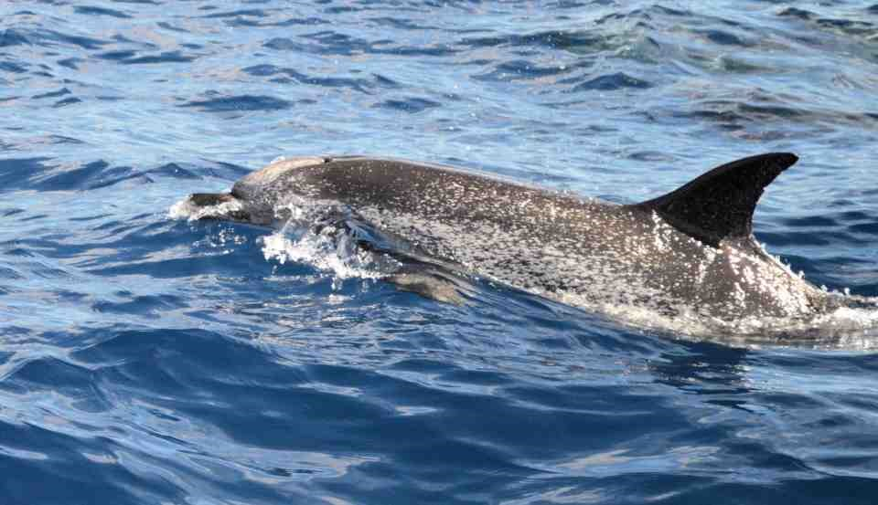
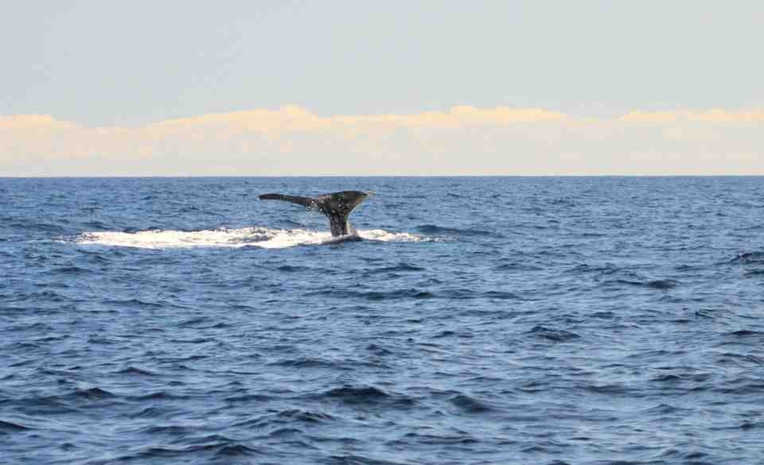
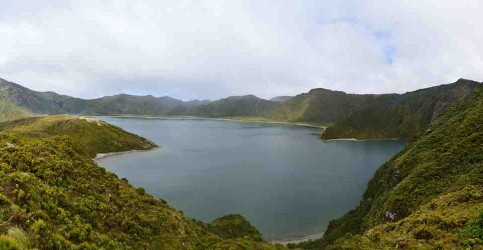
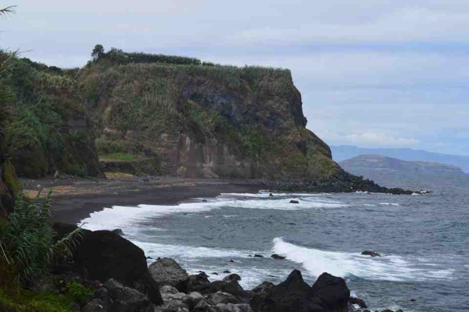
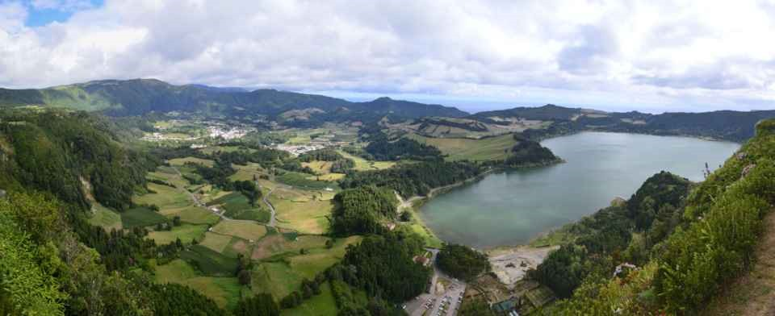
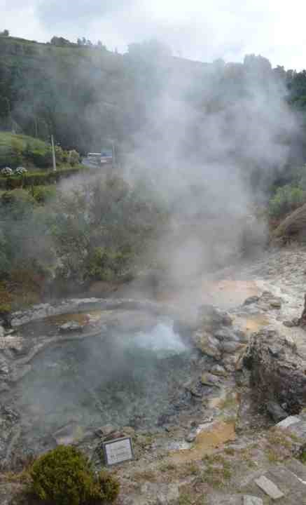
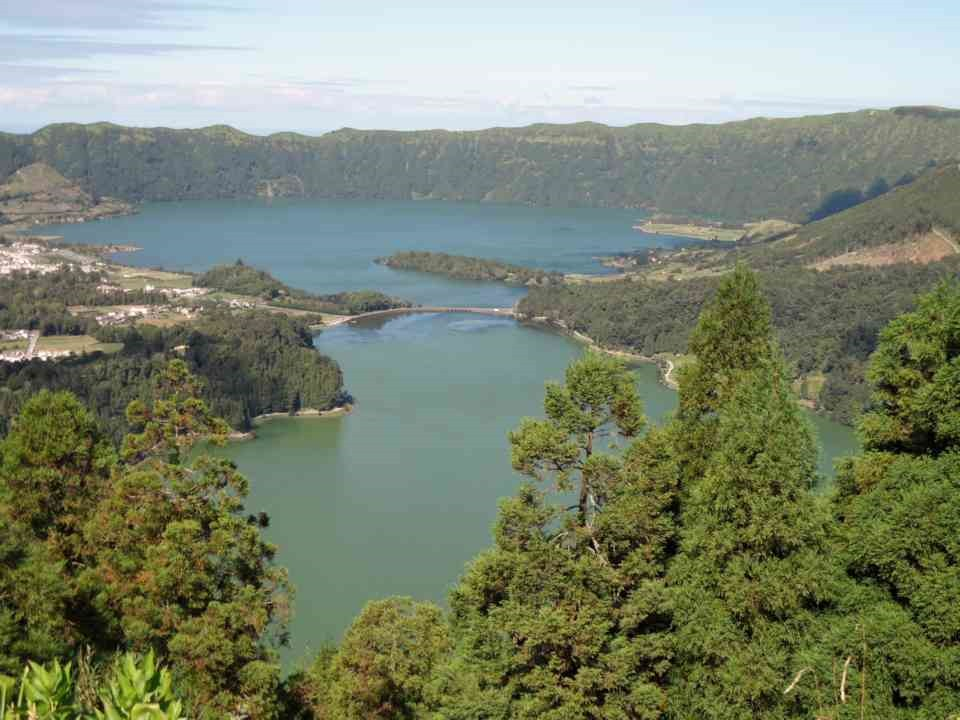
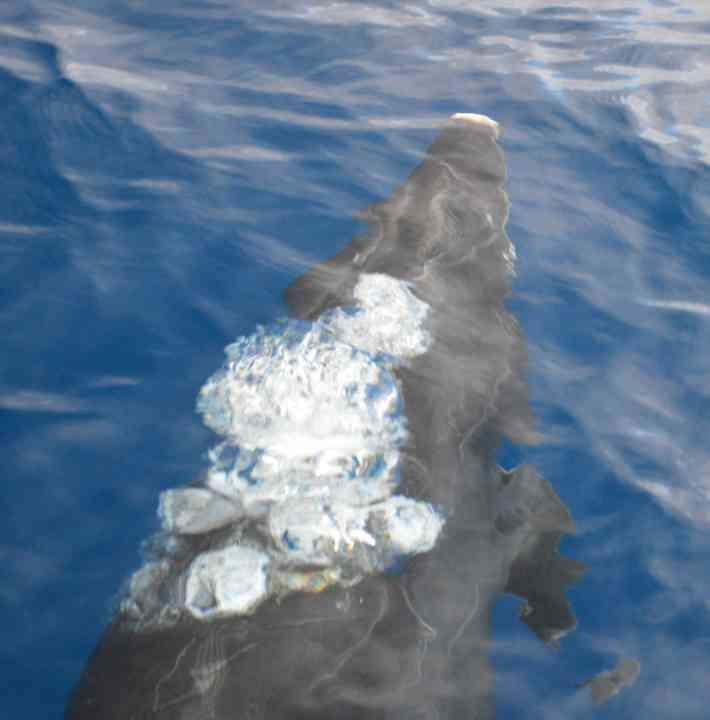
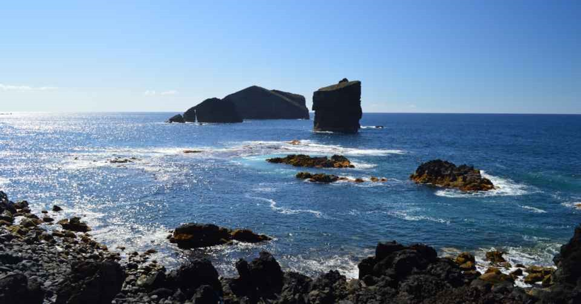
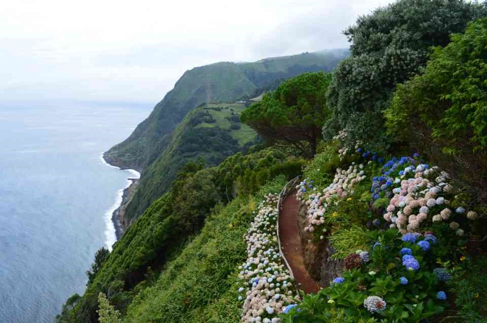

## 10 september | Ponta Delgada, Walvissen en dolfijnen spotten

Vandaag de eerste dag nadat we gisteravond laat aangekomen zijn op [Sao Miguel](https://nl.wikipedia.org/wiki/S%C3%A3o_Miguel_(eiland) "Sao Miguel"). Sao Miguel is het grootste eiland van de Azoren. Ons hotel, [Albergaría Matriz](https://www.tripadvisor.nl/Hotel_Review-g189135-d1557214-Reviews-Albergaria_Matriz-Ponta_Delgada_Sao_Miguel_Azores.html "Albergaría Matriz"), in [Ponta Delgada](https://nl.wikipedia.org/wiki/Ponta_Delgada_(S%C3%A3o_Miguel) "Ponta Delgada") is vlakbij het vliegveld. Gisteravond zijn we met de huurauto van het vliegveld naar het hotel gereden. Binnen een kwartier waren we bij het hotel. Deze ochtend staat er een kleine introductie op het programma waar we moeten aangeven welke [wandelingen](https://partnerprogramma.bol.com/click/click?p=1&t=url&s=48631&f=TXL&url=https%3A%2F%2Fwww.bol.com%2Fnl%2Fp%2Frother-wandelgidsen-azoren%2F9200000057515443%2F%3FsuggestionType%3Dtypedsearch&name=Azoren%20wandelgids&subid=bol2) we willen gaan doen en in de middag de eerste walvisspottocht. Vroeg in de ochtend maken we kennis met Ponta Delgada, een niet heel spectaculair mooi stadje. De boulevard kent twee gezichten. Onderaan het water is het lekker rustig en kun je langs de havens lopen. We zien dat we hier vanmiddag ook heen moeten om op te stappen. De boot waarmee we zullen gaan zien we ook liggen. Dat ziet er spannend uit, zo’n [zodiac](https://en.wikipedia.org/wiki/Rigid-hulled_inflatable_boat "zodiac") boot. Het andere gezicht van de boulevard is een drukke weg waarlangs veel auto’s rijden. Hier zitten ook wel een aantal restaurantjes. ‘s Middags gaan we dan naar de opstapplaats van [Futurismo](https://www.facebook.com/acoreswhalewatching "Futurismo"), onze eerste ‘whale watching’ tocht maken. Bij aankomst krijgen we uitleg over hoe we de walvissen gaan benaderen. Ze worden nooit van voren benaderd en de boot blijft ook op zo’n 100m afstand. Als de walvis zelf besluit dichterbij te komen dan zal de boot niet wegvaren en hebben we veel geluk. Met reddingsvest en regenjack in de hand gaan we de boot op. Het weer op het water ziet er mooi uit, dus nog snel even insmeren en we gaan. Op deze zodiac boot gaan we supersnel en moeten we ons goed vasthouden. We beuken al snel hard in op de golven. Met resultaat. we zien al snel de eerste walvis, een potvis. [Dit is een walvis die vaker gespot wordt](https://azoreswhales.blogspot.nl/2013/09/whale-friends.html "Azores whales"). hij heeft zelfs een naam, [Mr. Liable](https://www.youtube.com/watch?v=Fus09R10pIQ "Mr. Liable"). Dit omdat hij zich vaak laat zien voor de kust van Sao Miguel. Al snel volgt de duik naar beneden. Snel foto’s maken is hier wel nodig. Ook al kondigt de walvis zijn duik aan, moet je nog wel snel zijn met het maken van foto’s. Maar we zijn al blij, we hebben de eerste staart al gezien en we zijn nog maar net bezig. We varen verder en al snel komen we dolfijnen tegen. Dolfijnen zwemmen graag rond de boot. Ze maken er zelfs een mooi showtje van. Ze springen meters uit het water. Er wordt besloten om nog een keer een walvis te gaan zoeken. Er wordt gecommuniceerd met andere boten en mensen aan wal. Even later is het duidelijk dat er weer een gespot is. We gaan er weer op volle snelheid heen. Het gaat er ruig aan toe. In de verte zien we een staart hij gaat onder. Helaas waren we te laat. We proberen het opnieuw en weer is er een walvis gespot. We worden er maar even aan herinnerd dat we ons goed moeten vasthouden. Op volle snelheid gaan we weer. Al snel komen we uit bij een walvis die lekker ligt te dobberen. Aan de rug kunnen we al zien dat dit een grote is. Ook deze wordt weer herkend door onze gidsen. Het is Mancha Branca, te herkennen aan de witte plek op haar rug. Ze maakt even later ook een duik, weer is een mooie staart weer te zien! Gaaf! Als we weer terug varen naar Ponta Delgada komen we onderweg nog dolfijnen en springen tonijnen tegen. Als we terug aan wal zijn, besluiten we om aan de boulevard te gaan eten. Het eten is [hier](http://www.baiadosanjos.com/ "Baia dos Anjos") echt heel goedkoop. Voor 7,- krijgen we een vol bord met groenten, aardappelen en kibbeling. Deze dag was een mooi begin van de vakantie.

## 11 september | Wandeling Praia / Lagoa do Fogo

Vandaag staat de eerste wandeling van 14km op het programma. Het is een wandeling in de buurt van het [Lagoa do Fogo](https://www.tripadvisor.com/Attraction_Review-g189134-d3440962-Reviews-Lagoa_do_Fogo-Sao_Miguel_Azores.html "Lagoa do Fogo"). We vertrekken vanuit het Tourist Office in Ponta Delgada met een busje richting Lagao do Fogo. Als we afgezet worden, neemt onze gids ons mee. De wandeling begint meteen met een pittige klim. Het meer dat ontstaan is uit een vulkaankrater ligt dan ook boven op de heuvel die we gaan beklimmen. We wandelen zo’n 7km omhoog. Tijdens dit stuk lopen we grotendeels langs een aangelegd kanaal. Dit smalle (40cm) kanaal wordt gebruikt om energie uit op te wekken. Het is prachtig hier. Vervolgens komen aan bij het meer. Aan het Lagao do Fogo eten we onze lunch . Terwijl we onze zelf meegenomen lunch opeten veranderd het weer drie keer. Het is bewolkt als we aankomen. Al snel komen de bergen om het meer in de mist te hangen. Als we in mist zitten begint het zelfs te regenen. Na vijf minuten van regen begint het alweer op te klaren en komt er een flauw zonnetje doorheen. Dit is dan ook typisch voor het weer op de Azoren. De Azoren hebben een eigen mini-klimaat waarin alle weertypen op één dag kunnen voorkomen. Je kunt ook alles verwachten op een dag behalve sneeuw. Vanuit ons lunchplekje aan het water lopen we naar een mooi uitzichtpunt over het meer. Daarna dalen we weer af onderweg komen we ook weer de mooiste planten tegen. Ook hebben we soms uitzicht op Vila Franca do Campo, een plaats waar we later nog wel heen zullen gaan. Helaas zitten we op het einde van de zomer en zijn de meeste [hortensia's](https://nl.wikipedia.org/wiki/Hortensia_(geslacht) "Hortensia's") inmiddels uitgebloeid, maar her en der staan er nog wel bloei. Wat een mooie kleuren tussen al het groen op het eiland. Als we beneden zijn worden we weer opgewacht door ons busje en rijden we naar een relaxplek. Een klein uurtje later gaan we weer terug naar Ponta Delgada. Dat was een hele mooie wandeling vandaag.

## 12 september | Wandeling Ribeira Funda, Furnas

Met de spierpijn van gister nog in de benen beginnen we aan de tweede wandeling van deze vakantie. Dit is een kortere wandeling dan gister. We beginnen in Lomba da Maia en zal ongeveer 7km zijn langs de noordkust van het eiland. We komen al snel in een bos terecht. In dit bos komen we langs weer watermolen huisjes. Deze huisjes worden ook weer gebruikt in de energie voorziening. De meeste die we tegenkomen zijn erg verlaten en ook niet meer in gebruik. We lopen steeds verder naar beneden. Dit betekent dat we steeds dichterbij aan de kust komen. De bordjes van Praia da Viola zijn ook al zichtbaar. Praia da Viola wordt ook wel gezien als een van de mooiste stranden van Sao Miguel. Na nog een klein stukje wandelen zijn we dan ook op dit strand. Het is geen zandstrand zoals wij dat kennen, maar een strand van grind en stenen. Het is er wel prachtig. Er is ook een mooie waterval die uitkomt op het strand. Na een korte pauze op dit strand lopen we door naar onze eindbestemming van de wandeling, Maia. In dit plaatsje staat het busje weer klaar om ons mee te nemen. Het tweede deel van deze dag gaan we naar Furnas. Furnas ligt midden op het eiland en naast het plaatsje Furnas ligt ook een meer, Lagao das Furnas. We beginnen met het bezoeken van Pico do Ferro, een uitzichtpunt waar vanuit  we het meer en het plaatsje kunnen zien. Vanuit het uitzichtpunt kunnen we al de geisers al zien. Grote rookpluimen komen uit het stadje. Vanaf het uitzichtpunt rijden we naar het dorpje. Centraal in het dorp liggen de meeste geisers. Als we in de buurt komen, ruiken we de geur van rotte eieren oftewel de zwavellucht al in het busje. Op diverse plaatsen is er ook kokend water te zien. De plaatsen zijn ook allemaal afgezet met een muurtje. Uit de grootste geisers komen grote waterdampen. Er staat werkelijk kokend water in. Een heel opmerkelijk tafereel om te zien. Een stukje verderop zien we ook borrelend water. Er omheen ziet het er bruin en groen. Hier is het rottingsproces aan de gang wat we van ver konden ruiken. Na een ronde te hebben gelopen om de geisers vertrekken we weer richting Ponta Delgada. Hier eten we aan de boulevard een grote pizza.

## 13 september | Wandeling Cumeeiras, Sete Cidades

Alweer de laatste wandeling vandaag. Deze wandeling is in de beschrijving een van de mooiste en gaat langs [Sete Cidades](https://en.wikipedia.org/wiki/Sete_Cidades_(Ponta_Delgada) "Sete Cidades"). Hier zijn twee kratermeren naast elkaar, Lagao Azul en Lagao Verde, vrij vertaald het blauwe en het groene meer. We beginnen deze 14km wandeling in een bos ten zuid-oosten van de meren. De wandeling gaat ook alweer snel omhoog, naar een uitzichtpunt. Vanuit hier kunnen we alle meren in de buurt zien. Naast Lagao Verde en Lagao Azul hebben we hier ook zicht op Lagao Santiago en Lagao Rasa. Dit zijn twee kleinere meren die zijn ontstaan uit kraters. Na het uitzichtpunt gaat de wandeling verder over de kraterrand van het meer. Dit is een prachtig beeld. Zeker omdat aan de andere kant de oceaan ligt. Langs de kant staan vele mooie bloemen zoals de siergember. Ons wordt uitgelegd dat deze op het oog mooie plant ook meteen de grootste bedreiging is voor het eiland. Deze plant woekert heel erg en omdat het geen diepe wortels heeft worden er landverschuivingen door veroorzaakt. Oorspronkelijk komt deze plant uit de Himalaya. Het geeft ons nu in iedere geval mooi bergwanden vol met deze bloemen. Halverwege de kraterrond lunchen we. Dit is ook weer een mooi uitzichtpunt. Het is er ook vrij rustig. Je kunt er namelijk alleen wandelend of met een jeep komen. Vanuit dit punten hebben we uitzicht op het blauwe en het groene meer. Na de lunch lopen we verder en dalen we af naar Sete Cidades. In dit plaatsje hebben even een relax moment. Daarna rijden we met het busje door naar King Viewpoint . Dit is het uitzichtpunt die erg vaak te zien op reisfolders. We hebben veel geluk dat de zon vandaag al de hele dag schijnt. Hierdoor kunnen we het kleurverschil tussen de meren beter zien. Bij bewolkt weer is het kleurverschil veel minder te zien. De gids wist ons hier te vertellen dat het kleurverschil elk jaar al minder wordt vanwege de vervuiling en de algengroei. Bij dit uitzichtpunt staat ook een hotel. Het is echter al jaren verlaten en de planten hebben het in beslag genomen. Dit is erg triest om te zien. Vanuit dit punt rijden we weer in een half uur terug naar Ponta Delgada. Dit is een van de mooiste wandelingen geweest. ‘s Avonds eten we aan de boulevard. Deze keer aan de drukke weg waar ook een aantal snackbarachtige restaurantjes zitten. Deze opzet is vrij normaal hier. Je kunt er van alles eten, maar de manier van bediening heeft meer weg van een snackbar dan een restaurant.

## 14 september | Walvis en dolfijnen spotten, Mosteiros

In de ochtend gaan we na het ontbijt in het hotel, weer meteen door naar de supermarkt en bakker naast het hotel. In de bakkerij hebben ze heerlijke koffiebroodjes en aangezien het ontbijt in het hotel niet erg afwisselend is, is dit een mooie aanvulling. Daarna gaan we door naar het kantoor van [Picos de Aventura](https://www.facebook.com/picosdeaventura "Picos de Aventura"). Met hun gaan we vandaag onze tweede walvisspottocht maken. We krijgen eerst weer een uitleg over hoe en wat we gaan doen. Vervolgens krijgen we een regenjas en reddingsvest aan. De boot die voor ons klaar ligt is iets groter dan de vorige keer. We besluiten ook om voorin te gaan zitten in de hoop nog mooiere foto’s te kunnen maken. Als snel op zee komen we weer dolfijnen tegen.  Deze dolfijnen vinden het ook leuk om vlak langs de boot te zwemmen. Maar we komen natuurlijk ook voor de walvissen dus we gaan verder zoeken. Het is nog niet helemaal duidelijk waar de walvissen vandaag zijn. De kapitein vaart dan ook maar verder de zee op. De zee wordt daar wel steeds ruiger en aangezien we voorin zijn zitten, worden we ook bij elke golf gelanceerd. Vasthouden in deze boot is er ook niet bij. Een heel heftig boottochtje dus. Zonder dat ook al ergens heen aan het varen zijn. Na ruim drie kwartier tegen de golven inbeuken komt er een signaal dat er walvissen gespot zijn. We gaan er weer met volle vaart op af. Als we niet snel zijn, dan hebben ze hun duik alweer gemaakt en voor 30 tot 60 minuten onder water. Maar we zijn op tijd. We zien een walvis dobberen. Het is weer een potvis zoals we bij de eerste toch ook gezien hebben. Toch is dit een andere en even later maakt zij dan de duik. Weer zien we een staart! Was het dat dan? Nee er blijkt nog een jong te zwemmen. Het is moeder en kind geweest. Het jong is nog boven en dobbert nog wat rond. Het spuit wat en gaat daarna ook onder. Het is duidelijk te zien dat dit een jong was. De rug en de staart waren een stuk kleiner dan van de moeder. Dat was het dan. Beide zijn onder en onze tijd op het water zit er ook alweer op. We zijn inmiddels voorbij Vila Franca do Campo gevaren, een heel eind van Ponta Delgada. We blijken achteraf ook meer dan 70km gevaren te hebben. In de middag gaan we met de huurauto rijden. Als huurauto hebben we een vrij nieuwe Ford Focus stationwagen. We gaan eerst naar het noorden rijden. In het noorden gaan we opzoek naar de olifantenkop die aan de kust in de rotsen te herkennen is. Na even zoeken hebben we het gevonden. Hier vlakbij is ook weer een natuurlijk zwembad. Deze zijn overal op het eiland te vinden. Met wat muurtjes en rotsen is er een afscheiding gemaakt tussen de zee en het zwembad. We rijden vervolgens langs de noordkust naar het westen. Onderweg zijn verschillende uitzichtpunten waar we stoppen. De natuur is hier weer adembenemend. We rijden door en komen uit bij Mosteiros. Gister hadden we vanuit de kraterrand al uitzicht op dit plaatsje, maar nu zijn we er ook echt. Vanuit de kustweg is het nog een steile afdeling met de auto om in dit plaatsje terecht te komen. De golven slaan hier hard tegen rotskustlijn aan. Mannen zitten te vissen op de rotsen. In het centrum van dorpje zitten oude mannen op bankjes. Dit zijn we al in meerdere plaatsen tegengekomen en ook hier zitten ze weer. Na de mooie stop in [Mosteiros](https://en.wikipedia.org/wiki/Mosteiros_(Ponta_Delgada) "Mosteiros") rijden we verder langs de kustlijn om uiteindelijk weer uit te komen in Ponta Delgada. In de avond gaan we eten bij een echt restaurant, een vegetarisch restaurant in Ponta Delgada. Dit kleine restaurant waar we de dag ervoor ook heen waren gegaan, maar waar we toch echt moesten reserveren, is het heerlijk eten. Het restaurant lijkt gerund te worden door een stel met een paar hulpjes in de keuken. We hebben er een heerlijk sapje dat vers gemaakt wordt. De risotto die we er ook eten is ook heel goed. Zo goed hebben we tot nu toe nog niet gegeten.

## 15 september | Vila Franca do Campo, Nordeste, Povoação

Alweer de laatste volle dag van de vakantie. Als we buiten kijken ziet het er een stuk minder mooi uit dan de dagen hiervoor. Het is bewolkt. Vandaag gaan we de delen van het eiland verkennen die we nog niet gezien hebben. Dat is vooral het oostelijke deel van het eiland. Vanuit het ontbijt rijden we meteen oostwaarts richting Vila Franca do Campo. Het is vandaag zondag en het plaatsje lijkt zowat uitgestorven op wat kerkbezoekers na. We zijn hier op zoek naar [Nossa Senhora da Paz](http://www.tripadvisor.com/Attraction_Review-g1190889-d3905709-Reviews-Nossa_Senhora_da_Paz-Vila_Franca_do_Campo_Sao_Miguel_Azores.html "Nossa Senhora da Paz"). Dit kunnen we niet vinden in het stadje. We vragen een oude man, die zowaar engels spreekt om de weg. Hij stuurt ons uiteindelijk de juiste richting op. Nossa Senhora da Paz is een kapel die na steile klim vanuit Vila Franca do Campo is te bereiken. Vanuit hier hebben we ook weer een mooi uitzicht op Vila Franca do Campo. Er komt ook een flauw zonnetje door. De volgende stop die we gaan maken is in [Povoação](http://www.tripadvisor.nl/Tourism-g1114175-Povoacao_Sao_Miguel_Azores-Vacations.html "Povoação"). Na een mooi bergrit langs de kust en door kleine dorpjes komen we uit in Povoação. Het is hier ook weer erg rustig, waarschijnlijk omdat het zondag is. Nadat we even door het centrum hebben gelopen, gaan we weer verder. Volgende stop; [Nordeste](https://en.wikipedia.org/wiki/Nordeste_(Azores) "Nordeste"). Dit is het oostelijkste punt van Sao Miguel. Onderweg komen we langs [Ponta do Sossego](http://www.360cities.net/image/ponta-do-sossego-sao-miguel-azores#616.31,23.49,70.0 "Ponta do Sossego"). Dit is een aangelegd park dat ligt aan de kust. We komen hier ook lokale Azorianen tegen die aan het barbecueën zijn. Er zijn hier dan ook vaste barbecues en picknick tafels te vinden. Het uitzicht vanuit deze plek is ook weer heel mooi. We vinden hier ook nog veel hortensia’s die in bloei staan. We vervolgen onze weg en komen na uiteindelijk in Nordeste. Het weer is inmiddels een stuk minder geworden en rijden al regelmatig door de mist. Nordeste heeft een mooi centrum, met een pleintje met mooie bloemen en een wit kerkje. Het is er ook weer wel heel erg rustig. Zondag is duidelijk de rustdag hier. In een broodjeszaak vragen we naar de waterval die hier in de buurt zou moeten zijn. Deze zou volgende de bediende in Achada moeten zijn. Achada is nog een stuk verder op de route. We gaan deze richting dan ook in. We komen al snel aan in Achada. De waterval zou langs de weg moeten liggen, dus we zouden deze toch snel moeten kunnen zien. We rijden door en komen al in Achadinha. Dit zou al te ver zijn. Gemist dus! Achteraf blijkt dat er een nieuwe weg is aangelegd tussen Achada en Achadinha die hebben we genomen en daardoor hebben we de waterval, Ribeiro dos Caldeirões-Ilha, gemist. We rijden rijden door en bij Salga zetten we koers richting Furnas. We doorkruisen hier het eiland van noord naar zuid. De mist wordt hier met de minuut dichter. Er is amper nog een hand voor ogen te zien. Onderweg komen we nog langs een uitzichtpunt, Salto de Cavalo, maar met dit weer is er helemaal niets te zien. Vanuit Furnas gaan we richting Ponta Delgada. We rijden weer wel richting het noorden. Vlak voor Ribeira Grande komen we langs de Caldeiras van Ribeira Grande. Hier maken we nog even een korte stop voordat terug gaan naar Ponta Delgada. Deze geisers zijn een stuk minder indrukwekkend dan die in Furnas. Terug in Ponta Delgada komt er weer een flauw zonnetje door. Het weer is op dit eiland ook totaal onvoorspelbaar. ‘s Avonds eten we aan de boulevard en sluiten we onze vakantie af met een heerlijke cocktail.
