Een stedentrip in oktober 2005 naar Barcelona, een reisverslag.

## Vertrek naar Barcelona

[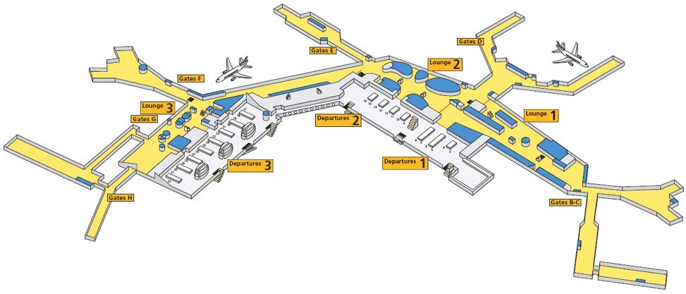](./plattegrond-schiphol.jpg)Het is mooi weer als we van huis gaan, we zijn met drieën op weg met de trein naar Schiphol, waar we aankomen direct onder de vertrekhal. Lopend naar de incheckbalie zien we al dat bij onze balie een lange rij staat. Dan blijkt ook nog dat we eerst met een computer onze tickets moeten regelen. Maar dat valt gelukkig mee. De rij waar we daarna plaats in nemen niet. Staand in deze rij gaan we steeds meer twijfelen of we wel op tijd zijn weggegaan (anderhalf uur[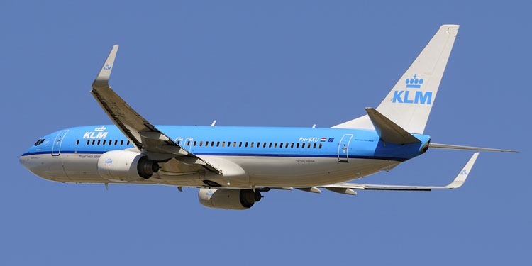](./klm-737-800.jpg) voor vertrek aankomen zou toch genoeg moeten zijn?). Maar dan eindelijk ingecheckt kunnen we op weg naar het KLM vliegtuig, lopend door de taxfree-zone neem ik nog even nieuwe powerball mee uit de gadgetshop, de vorige was immers stuk gegaan. Als we dan eenmaal in het vliegtuig zitten en vertrekken blijkt als snel dat we niet veel gaan zien, het is erg bewolkt. Als we gaan landen zien we pas weer iets: Barcelona. Eenmaal uit het vliegtuig nemen we Aerobus naar [Plaça de Catalunya](https://nl.wikipedia.org/wiki/Pla%C3%A7a_de_Catalunya "Plaça de Catalunya"), helaas konden we niet zoals we hadden verwacht ons openbaar vervoerpasje gebruiken. Deze Aerobus kost ons dan ons alsnog €3,45. Met deze bus maken we een eerste kennismaking van de stad, zo rijden we onder andere langs [Plaça d'España](https://nl.wikipedia.org/wiki/Pla%C3%A7a_d%27Espanya "Plaça d'España"). Eenmaal aangekomen op de Plaça de Catalunya na een ritje van 20 minuten zijn we ook vlot bij ons hotel. Het hotel, [Hotel Cortes](https://www.booking.com/hotel/es/cortes.nl.html?aid=1293335&no_rooms=1&group_adults=1&label=booking_barcelona_hotel), ligt in eerste zijstraatje van de [Ramblas](https://nl.wikipedia.org/wiki/Ramblas "Ramblas") vanuit Plaça de Catalunya gezien, is een simpel hotel met een uitzicht naar overburen :(. Maar dat wisten we bijna van te voren, we hadden immers om een simpel hotel gevraagd bij het reisbureau en we gingen ook niet voor het hotel naar Barcelona. Dus gingen we nadat we onze koffers hadden weggezet in onze kamer er maar meteen op uit opzoek naar het eerste restaurantje. [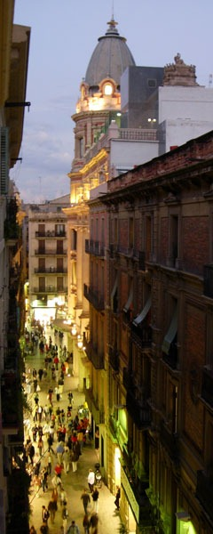](./Uitzicht-Hotel-Cortes.jpg)Na eerst wat rond te struinen over de Ramblas en in de [Barri Gotic](https://nl.wikipedia.org/wiki/Barri_Gotic "Barri Gotic"), komen we uiteindelijk uit bij de [Catedral](https://nl.wikipedia.org/wiki/Kathedraal_van_Barcelona "Catedral"). Deze oude kerk van Barcelona bestaat uit een soort van half overdekte binnentuin waarlangs je eerst komt voordat je de kerk zelf in gaat. Als we de Catedral gezien hebben komen we uit op een pleintje met aan de rand een restaurantje, we besluiten hier om maar meteen Spaans te gaan eten, door paella te bestellen. De bediening valt ons op is erg attent en laat ons eerst de paella zien voordat het wordt opgediend. Nadat we lekker hebben gegeten besluiten we om nog maar even lekker door de stad te lopen zonder echt te weten waar we precies naartoe lopen. Achteraf blijkt dat we alle drukke straatjes van de Barri Gotic hebben gezien.

## Dag 1 | Sagrada Familia, Casa Mila, La Pedrera

De eerste echte volle dag in Barcelona besluiten we om maar meteen naar de topattractie te gaan, de [Sagrada Familia](http://nl.wikipedia.org/wiki/Sagrada_Fam%C3%ADlia "Sagrada Familia"), om er te komen gaan we met de metro, we hebben toch niet voor niets die ov-pasjes voor 5-dagen genomen bij de reis. Eerst goed het metrostelsel bestudeerd, om vervolgens de metro te nemen vanuit Plaça de Catalunya, via de metrostations Passeig de Gracia en Verdaguer komen we aan bij het metrostation van de Sagrada Familia. We komen naar boven en staan meteen pal voor de immens grote 'kerk'. We komen aan de zijkant van de Sagrada uit, met het naar voren lopen zien we steeds meer dat dit dé toeristische trekpleister van Barcelona is. Er staan ontelbaar veel bussen voor de ingang en hordes mensen zij een foto aan het nemen. Wij nemen er dan ook maar een foto. Om binnen te komen moet er eerst entreegeld betaald worden. Hier kan gekozen worden voor een rondleiding met gids of zonder, wij kiezen voor zonder. Het entreegeld wordt gebruikt voor het afbouwen van de Sagrada, die niet gesponsord wordt door enig instantie of wat dan ook. [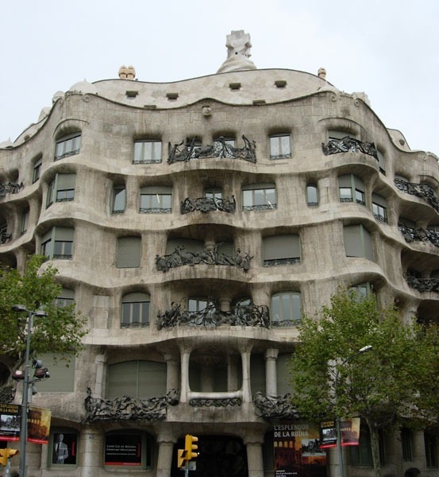](./La-Pedrera.jpg) Eenmaal binnen denk je waar ben ik beland, het is een en al bouwval, ergens weet je ook wel dat het dat is, maar toch verwacht je het niet. Van wat wel al mooi af is valt vooral het bladerendek op dat het plafond zal gaan vormen. In de kelder is een klein museumpje gemaakt met de historie van de Sagrada tot nu toe. Hier zijn de ontwerpen van [Antoni Gaudi](http://nl.wikipedia.org/wiki/Antoni_Gaudi "Antoni Gaudi") te zien, en hoe hij zijn berekeningen deed Verder is er ook een maquette van hoe het uiteindelijk moet worden (ca. 2025).Vervolgens kun je ook in twee toren omhoog met de trap, een hele klim, maar magnifiek uitzicht. [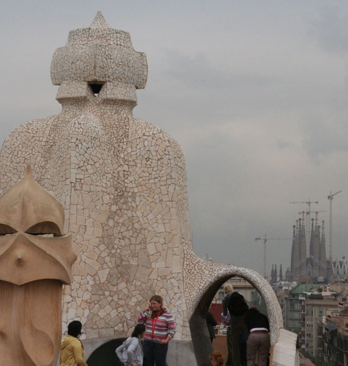](./Pedrera-dak.jpg) Nadat we weer naar beneden zijn gelopen, gaan we te voet verder, en wandelen we via de dwars door Barcelona lopende brede 'Diagonal' naar **[Casa Milà](http://nl.wikipedia.org/wiki/Casa_Mil%C3%A0 "Casa Milà")** ook wel **La Pedrera** genoemd. Dit is ook al zo'n prachtig staal architectuur van Antoni Gaudi. Als we hier naar binnen gaan blijkt dat we met een lift naar de bovenste verdieping worden gebracht. Hier is ook een klein museumpje ingericht van alle Gaudi gebouwen. De verdieping zelf is ook alweer zo'n mooi ontworpen. Eenmaal uitgekeken op de verdieping kunnen we ook naar het dak van dit gebouw. Hierop staan schoorstenen en zoals alles moesten ook deze objecten een mooie vorm krijgen. Ook op dit dak hebben we weer een mooi uitzicht, naar de Sagrada en andere hoge gebouwen van Barcelona. Vervolgens worden we geleid naar de 4e verdieping van La Padrera, Antoni Gaudi heeft hier een appartement inrichting ontworpen voor de familie Milà: een stel rijke mensen die daar hebben gewoond. Dit is leuk als je van meubels houdt maar niet heel interessant. Twee straten verder komen we dan nog uit bij [Casa Batlló](http://nl.wikipedia.org/wiki/Casa_Batll%C3%B3 "Casa Batlló"), een ander erg bekend bouwwerk van Antoni Gaudi. Maar omdat we ook hiervoor weer 8 euro moeten betalen en we eigenlijk wel genoeg in gebouwen hebben rondgelopen besluiten we hier meer niet in te gaan. Vanbuiten ziet ook dit huis er wel weer erg bijzonder uit.

## Dag 2 | Mont Juic, Olympisch Stadion

Nadat het gisteravond nogal laat is geworden in **Maremagnum** is het wakker worden niet zo eenvoudig als de eerste ochtend. Het ontbijt in het hotel is dan ook eigenlijk een beetje te vroeg. Het ontbijt begint om 8u en eindigt om 10u. Dit halen we maar net. Niet dat het ontbijt zo geweldig maar goed we hebben er immers toch ook voor betaald. Tijdens het ontbijt beslissen we wat we gaan doen. Het wordt [Montjuïc](http://nl.wikipedia.org/wiki/Montju%C3%AFc_(berg) "Montjuïc"). [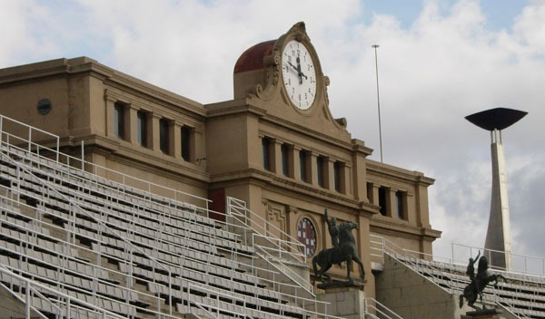](./Olympisch-Stadion-Barcelona.jpg) Mont Juic is een berg aan de zuid kant van Barcelona waar ook het vliegveld, **El Prat**, zich bevindt. We gaan weer met de metro naar Mont Juic, dit vervoermiddel is ons dusdanig goed bevallen, dat we al bijna niet meer zonder kunnen. Deze keer gaan we zelfs met een metro die omhoog de berg op gaat (de funicular), en continu pendelt vanaf station Paral-lel. Eenmaal boven kijken we eerst even rond welke kant we op lopen, maar zien dan een bord met daarop het [Olympisch Stadion](http://nl.wikipedia.org/wiki/Olympische_Zomerspelen_1992) aangegeven. Een mooie eerste bezienswaardigheid voor de dag. Bij het Olympisch Stadion van Barcelona aangekomen en o wat lijkt het klein van de buitenkant. Als we er een beetje omheen lopen zien we dat we zo zonder enige moeite kunnen binnenlopen. Het blijkt dat het stadion in een soort van kuil ligt. Meteen komen hier bij mij herinneringen boven van wat zich hier allemaal heeft afgespeeld. [Ellen van Langen](http://nl.wikipedia.org/wiki/Ellen_van_Langen) won hier goud op de 800m en [Linford Christie](http://nl.wikipedia.org/wiki/Linford_Christie) won hier de 100m. Het is hier gezellig druk met mensen die wat rondkijken. We kunnen maar door een klein stuk van het stadion lopen, maar eerst laten we dit historische stadion op ons inwerken. Eenmaal buiten komen we op een terrein met daaraan het **Palau Sant Jordi**, de sporthal van de Olympische Spelen. Ook in dit stadion kunnen we binnen, maar geeft een trieste blik als we binnenkomen. Het terrein is verder heel mooi, met pilaren langs en een kunstzinnige zendmast van Telefonica. [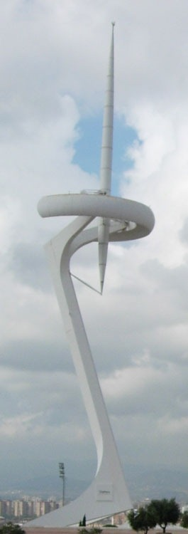](./Telefonica-toren-Barcelona.jpg)Ondertussen lopen we deze dag erg veel, Mont Juic is vrij groot, en zeker omdat we hier niet de metro kunnen nemen. Er gaat n lijn naar Mont Juic: de funicular waarmee we waren gekomen, maar op de berg is er verder geen metro. Vanaf de olympische stadions lopen we verder op de berg en komen we langs het **Joan Miro** museum, waar we niet naar toe gaan. Even verderop ligt er dan weer een soort van paleis, dit blijkt het [MNAC](http://nl.wikipedia.org/wiki/MNAC "MNAC") **(Museu Nacional d'Art de Catalunya)** te zijn. Hier is het echt gigantisch druk, of dat nou altijd zo is of omdat het toevallig een nationale feestdag (12 oktober) is in Spanje, weten we niet. Overigens merken we verder de hele dag totaal niks van deze feestdag. Vanwege de drukte en omdat het ons toch niet zo interessant lijkt gaan we het museum verder maar niet in. Wel kijk je vanaf de voorkant van dit gebouw erg mooi over de stad heen richting het Placa Espanya. We dalen hierna nog een stukje de berg af en zo komen we bij het **Poble Espanyol**. Dit is een nagebouwd dorpje voor een wereldtentoonstelling. Alle huizen in het dorpje zijn traditionele spaanse huizen uit alle gebieden van Spanje. Nu zit er vanalles in: restaurantjes, musea en zelfs discotheken. Tenslotte was er nog 1 ding op de Mont Juic dat we nog niet hadden gezien: het kasteel dat op de top staat. Wel lastig omdat we op het moment dat we dat bedachten zo ongeveer onderaan de berg stonden, dus dat werd een heel eindje lopen. Tja.. wie die handige route had bedacht weet ik ook niet! Het kasteel is een verdedigingsfort op een strategische plaats. Het uitzicht is als we boven zijn dan ook erg mooi, ondanks dat we boven de stad een enorme regenbui zien hangen. Boven op de berg blijft het gelukkig droog, we hebben geen paraplu meegenomen. In het kasteel is ook een heel oorlogsmuseum ingericht dit museum is immens groot, er zijn ontelbare oorlogattributen te vinden. Al lijken ze voor mij allemaal op elkaar. We dwalen wat rond in alle kamertjes die het kasteel heeft. Moe maar voldaan vertrekken we uiteindelijk weer terug naar de stad. Op zoek naar een restaurantje. Dit is een dagelijkse zoektocht, die aan de ene kant simpel is door de enorme hoeveelheid, maar aan de andere daardoor ook weer lastig wordt, want wat kies je. Deze dag komen we uit bij een klein restaurantje, met hardwerkende mensen, waar al snel duidelijk wordt dat het niet een erg sjiek restaurant is. In tegendeel zelfs, tafels worden hier provosorisch groter gemaakt met een inschuifbaar deel. De kwaliteit van het eten was er nogal wisselend. Zeker het net uit de diepvries gehaalde ijs was absoluut geen aanrader! Dit was jammerlijk genoeg een tegenvaller. Na het eten gaan we nog op een terras op de **Ramblas** zitten. Een geweldige plaats om te zitten en de prijs van de sangria viel ook nog mee €14,- voor een hele kan. Naast dat er overdag veel straatartiesten zijn, zijn er 's avonds ook veel, deze zijn wel van een ander assortiment. Zo ook toen wij op het terras zat, komt er ineens een kleine man in een apenpak achter mensen aanlopen om ze vervolgens te laten schrikken. De man was geweldig om te zien, duidelijk was te zien dat hij het vaker had gedaan. Al werd het steeds lastiger, want er kwamen steeds meer kijkers, waardoor voorbijgangers al een argwanend gevoel kregen bij het passeren.

## Dag 3 | Parc Güell

[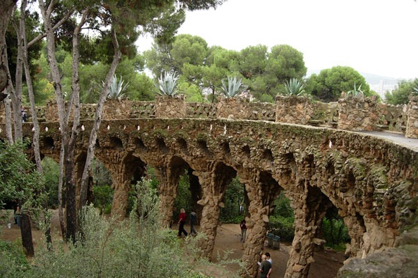](./Parc-Guell-Barcelona.jpg) Donderdags gaan we naar [Parc Güell](http://nl.wikipedia.org/wiki/Parc_G%C3%BCell "Parc Güell"). Het park dat ontworpen is door Antoni Gaudi. We gaan wederom met de metro, de kleuren van de lijnen kunnen we onderhand al dromen. Alleen merken we vandaag op dat de hoeveelheden regen die de afgelopen dag gevallen zijn, niet de normaal is, in het metrostelsel liggen hier en daar ineens grote plassen met water. Als we dan met de metro naar het dichtst bijzijnde metrostation Valcarca bij Parc Güell gaan, merken we dat het nog een hele klim naar boven zal zijn. Maar gelukkig hebben ze hier roltrappen. Jawel roltrappen in de buitenlucht, deze waren gister ook al een paar tegengekomen op de Mont Juic. Dit is er handig het zouden namelijk nog meer treden zijn geweest dan we in de Sagrada Familia hebben beklommen. We volgen de bordjes Parc Güell, en lopen via een zandpad, naar het park. Langzaam zien stukjes van het park komen. We huizen die lijken op het pannekoekenhuisje in de Efteling. Met net als La Pedrera enorme schoorstenen op dak. Eenmaal in het park zien de beroemde bank. Deze bank is veel groter dan ik had verwacht en ondanks het miezerige weer zijn er toch nog redelijk veel mensen. Na hier wat rond te hangen lopen we verder door het park, waar we hier en daar een muziekant tegenkomen. [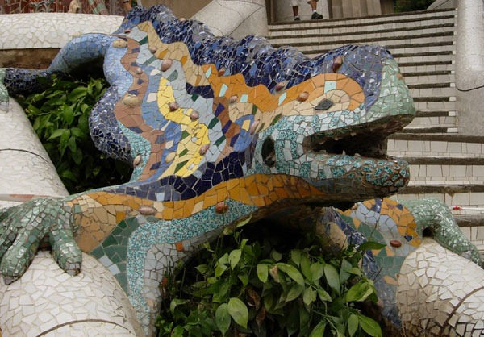](./Parc-Guell-Leguaan.jpg) Nu is het Efteling gevoel compleet, het ontbreekt alleen nog aan de paddestoelen langs de kant. Als we helemaal rond gelopen zijn lunchen we ook nog even in het park. Dit is echter geen aanrader hier wordt duidelijk rekening gehouden dat er veel toeristen komen, een simpel broodje met beleg kost dan ook €4,-. Als we weer uit Parc Güell zijn gaan we met de metro dwars door de stad naar het **Olympisch dorp** van 1992. Dit valt van veraf vooral op door de grote 'twin towers' die hier aan het water staan. In deze torens is echter niet zoveel te doen, in de ene zitten kantoren, de andere in een groot hotel. Omdat het echter niet al te mooi weer is, is er hier langs de kust niet veel te doen, toch hebben we hier een overheerlijk ijsje kunnen eten in een ijssalon onderin een van de torens. Voor het avondeten gaan we deze keer in de rij staan! voor Les Quinze Nits. Dit restaurant had ons eergister al verbaasd, omdat er zo'n enorme rij voor de deur staat. Het restaurant gaat pas om 20:30 open en om 19:30 staan de eerste mens en al in de rij! Iets wat wij dus eigenlijk niet wilde, maar omdat het restaurant toch wel als tip werd genoemd in ons boekje over Barcelona moesten we het gewoon een keer proberen. We besloten om 20u in de rij te gaan staan, dat was eigenlijk precies op tijd. Het was lang wachten, maar je wordt beziggehouden door een straatartiest. Het eten bij Les Quinze Nits is goed, en de prijs is nog beter. Je zit er voor een dubbeltje op de eerste rang zullen we maar zeggen

## Dag 4 | Camp Nou, Picasso Museum

We gaan vandaag naar Neerlands trots in den vreemde kijken, het [Camp Nou](http://nl.wikipedia.org/wiki/Camp_Nou "Camp Nou") stadion. [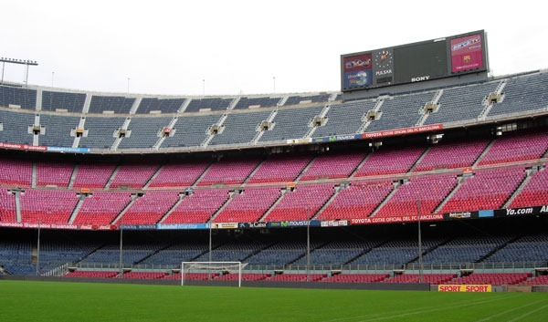](./Nou-Camp1.jpg) We gaan zoals inmiddels gebruikelijk met de metro naar het dichtstbijzijnde station, dit is station Maria Christina op de groene lijn. Helemaal duidelijk welk metrostation het dichtste bij is, is het niet. Het is dan ook nog best een eindje lopen vanaf daar. We zien het stadion pas als we bijna helemaal zijn. Het is geen gebouw dat van verre opvalt. Het net zoals het Olympisch stadion een beetje in een kuil. Eenmaal kaartjes gekocht om binnen te komen, kunnen we door het stadion lopen, volgens een met lint afgezette route. Deze route leidt ons langs mooi stukken zoals, de kleedkamer van de bezoekers, het veld voor de dug-out, perstribune, en de eretribune. Een ontzettend groot stadion. Aan het einde van de route door het stadion komen we uit in het museum van de [FC Barcelona](http://nl.wikipedia.org/wiki/FC_Barcelona "FC Barcelona"), dit houdt in dat er naast de voetbal attributen ook van de basketbal, handbal en ijshockey dingen te vinden zijn. Maar voetbal heeft de overhand en dan vooral de aanwezigheid van _Johan Cruijff_. Op ongeveer een kwart van alle foto's is de beste man aanwezig. Logisch want bij grootste hoogtepunten van de club was hij de inspirator, de 0-5 overwinning op _Real Madrid_ en het winnen van de Champions League. Maar ook _Ronald Koeman_ is prominent aanwezig, hij staat er vereeuwigd in een bronzen beeld, met de houding van het nemen van de vrije trap die FC Barcelona de Champions League bracht. Als we buiten komen eten we nog wat bij het Camp Nou waar het weer eens hard gaat regenen, en gaan daarna verder naar het Picasso museum. In dit museum waar we niets mee naar binnen mogen nemen, maar waar kluisjes voor zijn. Lopen we rustig langs allerlei werken van [Pablo Picasso](http://nl.wikipedia.org/wiki/Pablo_Picasso "Pablo Picasso"). Vooral zijn vroege jaren hangen hier in Barcelona, maar ook werken uit zijn blauwe en roze (in Nederland) periode hangen hier. Het topstuk(ken) van dit museum is de interpretatie van Picasso van het werk **Las Meninas** van _Velasquez_. Niet iedereen zal dat werk misschien kennen, maar de hond op het schilderij dan toch wel. Dit is namelijk de hond die ook door het tv-programma '_Man bijt hond_' wordt gebruikt. We lopen in dit museum chronologisch door de tijd, met als laatste de ceramiek stukken van Picasso. 's Avonds eten we bij _Caruso_, een Italiaans restaurant aan de Ramblas. Het is hier prima toeven en een straatartiest mag hier zelfs binnen komen optreden. Naast Italiaans gerechten serveert dit restaurant ook de typische Catalaanse lekkernijen zoals een crem Catalan. Na het eten willen we toch nog een keertje gaan kijken bij de Sagrada Familia, maar nu dus 's avonds in het donker. Daar aangekomen is de Sagrada verlicht. Na een paar foto's gaan we al snel weer terug.

## Dag 5 | Aquarium, **Plaça Reial**

Het is vandaag alweer een regenachtige dag en we hebben daarom een echte binnen activiteit gepland, het **Aquarium**. Dit is naast Maremagnum op het uiteinde van de Ramblas. De Aquarium is in feite een soort vissententoonstelling, met allerlei verschillende aquariums van vissen in verschillende diepten en zeeen. Uiteindelijk kom je dan uit bij een groot aquarium (ze zeggen dat het de grootste van europa is) waar je onderdoor gaat met een lopende band. In dit grote aquarium zitten onder andere haaien, roggen en andere grote vissen. Al met al is het aquarium niet heel bijzonder, dus alleen doen op een regenachtige dag! [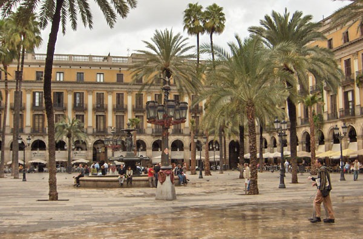](./Place-Reial-Barcelona.jpg) 's Avonds om 20u gaan we vervolgens voor de tweede keer in de rij staan bij Les Quinze Nits. We gaan nu wel in tegenstelling tot vorige keer binnen zitten. We komen boven terecht en dat geeft ons een mooi uitzicht over het [Plaça Reial](http://nl.wikipedia.org/wiki/Pla%C3%A7a_Reial "Plaça Reial"). Dit is een prachtig pleintje dat vooral bol staat van de restaurantjes. Later op de avond gaan we nog even kijken bij Goldeneye een discotheek in Maremagnum. Het is hier weer niet super druk maar er is maar genoeg te beleven.

## Dag 6 | Mirador de Colom, **Barceloneta**

De laatste volle dag van deze vakantie zijn we van plan om richting strand te gaan (ja, het is eindelijk een dagje mooi weer!). [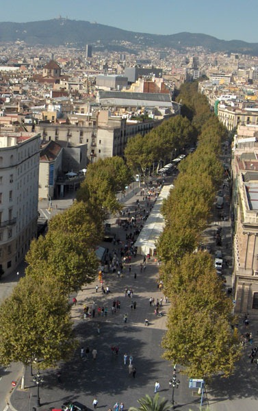](./Ramblas.jpg) Maar op het uiteinde van de Ramblas staat de [Mirador de Colom](http://www.barcelonaturisme.com/ECV2TBCN/Front/BCNShop/Sales/Disponibilitat-Producte/_vf-SMlY1yItM-U_l9RgLJgsyU0uRJi84ADMp1rsdO55mdrb5fZPL9lKJSF9LBH_6rKGdLP3_GVopqWvYbrjjDIZ2VGzwlsxWV7FQ3H0xW_aZJeQDen7Io0qS9o9PhGVw "Mirador de Colom"). Hier zouden we ook in moeten kunnen, als we er een rondje omheen lopen zien we een trapje naar beneden met een open deur. We gaan naar binnen en zien dat we tegen een klein bedrag naar boven kunnen in dit standbeeld. Eenmaal boven hebben we een prachtig uitzicht, vooral ook omdat dit de zonnigste dag is van de hele week is. Eenmaal beneden lopen we door richting het strand bij [Barceloneta](http://nl.wikipedia.org/wiki/La_Barceloneta "Barceloneta"). Vanwege het mooie weer is het hier nu een gezellige drukte. Het strand zit redelijk vol en over de boulevard lopen ook veel mensen. Verder is er een skate wedstrijd aan de gang en wordt er volop gesurft. We komen uit bij het terras van de Baja Beach Club. Het valt hier op dat dit echt het gedeelte is voor de rijkere inwoners van Barcelona. Naast de Baja Beach Club zit nog een ander terras dat zelfs helemaal afgesloten is. We vermoedden dat hier de echte VIPS zitten. Wij zien helaas geen bekende Barcelona-ers voorbij lopen. [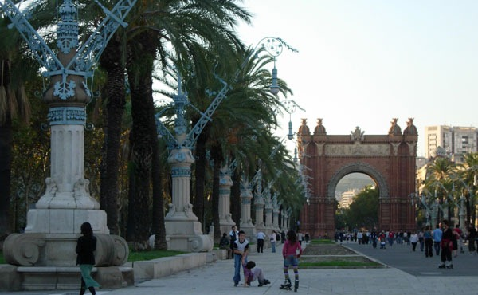](./Arc-Les-Triomph-Barcelona.jpg) Vanaf het strand bij het Olympisch dorp lopen we terug via het Parc Citadella. Ook hier is het gezellig druk: Barcelona by mooi weer is toch wel heel wat gezelliger dan steeds met al die regen! We komen langs de Arc de Triomph en gaan zo terug richting hotel. De dagelijkse zoektocht naar een restaurantje hadden we vandaag al redelijk vroeg beslist. Op weg naar het strand bij Barceloneta zagen we al een serie van gezellige restaurantjes zitten aan de haven. We besluiten dus weer hier naar terug te gaan om te gaan eten. We komen uit bij restaurant _Emperador_ (spaans voor zwaardvis). Hier zijn vooral veel vis gerechten te eten. Het eten beviel hier goed, wat minder was het dat de bediening ons zowat negeerde en dat het er op leek dat ze ons snel weg wilden hebben om plaats te maken voor de volgende mensen.

## Dag 7 | **La Boqueria**

De laatste dag alweer. En de laatste dag is natuurlijk maar een halve dag, want om 3 uur vertrekt het vliegtuig al. Erg veel doen kunnen we dus ook niet meer. We besluiten na het ontbijt een rondje over de Ramblas te lopen. We komen hier weer langs de overdekte markt [La Boqueria](http://nl.wikipedia.org/wiki/Mercat_de_la_Boqueria "La Boqueria") en besluiten daar nog even te kijken. Uiteindelijk komen we bij het gigantische warenhuis [El Corte Ingles](http://nl.wikipedia.org/wiki/El_Corte_Ingles "El Corte Ingles") aan. Dit warenhuis staat aan het Plaça Catalunya en is vele verdiepingen hoog. Behalve alle standaard dingen was er in dit gebouw bijvoorbeeld ook een kunsttentoonstelling. En alle schilderijen en beelden die daar stonden waren natuurlijk ook te koop. Vanaf El Corte Ingles was het een korte weg terug naar het hotel. Daar halen we de bagage op en met deze bagage gaan we terug naar het Plaça Catalunya om te wachten op de Aerobus die ons terug naar het vliegveld moet brengen.

* * *

Restaurant gegevens 
* **Les Quinze Nits** wijk: Barri Gotic Plaça Reial 6 08002 - Barcelona tel: +34 933 173 075 
* **Caruso** wijk: Barri Gotic Ramblas 96 08002 - Barcelona tel: +34 933 018 179 
* **Emperador** wijk: Barceloneta Edificio Palau de Mar, Pau Vila 1 08003 - Barcelona tel: +34 932 210 220
* **Ambos Mundos** wijk: Barri Gotic Plaça Reial 10 tel: +34 93 317 01 66