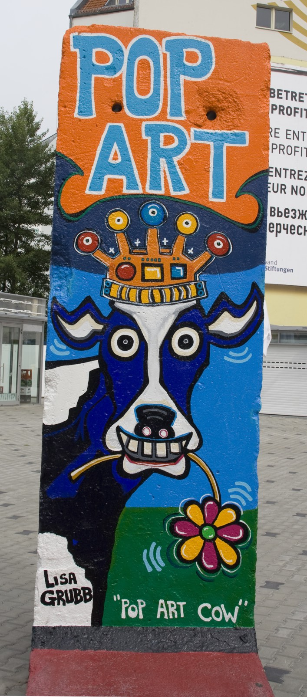

Een reisverslag van mijn stedentrip naar Berlijn. Na inmiddels al een heel aantal stedentrips gemaakt te hebben. [Barcelona](./barcelona "Reisverslag Barcelona"), Parijs, Bratislava, Wenen, Madrid en [New York](/new-york "Reisverslag New York") is het deze keer Berlijn geworden. De reis gaat deze keer per trein.

## Dag 1 - De treinreis

Eindelijk is het dan zover. Vandaag gaan we naar Berlijn. De reis gaat per trein vanuit Amersfoort direct naar Berlijn Hbf. De treinreis hebben we geboekt via de site van [NSHispeed](http://www.nshispeed.nl/nl/onze-bestemmingen/trein-duitsland/trein-naar-berlijn "NSHispeed") en duurt 6 uur. De trein stopt onderweg een aantal keer. Zo stoppen we in Apeldoorn, Deventer, Almelo, Hengelo, Bad Bentheim, Rheine, Osnabruck Hbf, Bad Oeynhausen, Minden, Hannover Hbf, Wolfsburg, Stendal en Berlin-Spandau. Voordat we aankomen om 17:30 in Berlin Hbf. Daar aangekomen kopen we een [Berlin welcome card](http://www.visitberlin.de/de/welcomecard "Berlin welcome card"). Hiermee kunnen de hele week met het openbaar vervoer rondreizen door de stad en geeft ons korting op bijna alle bezienswaardigheden. De eerste avond maken we alvast een eerste verkenningsronde door de stad. We nemen de [U-Bahn](https://nl.wikipedia.org/wiki/Metro_van_Berlijn "U-Bahn") naar [Potzdamer platz](https://nl.wikipedia.org/wiki/Potsdamer_Platz "Potsdamer Platz"). Van daaruit lopen we richting de [Brandenburgertor](https://nl.wikipedia.org/wiki/Brandenburger_Tor_(Berlijn) "Brandenburger Tor"), onderweg komen we langs het [holocaust monument](https://nl.wikipedia.org/wiki/Holocaust-Mahnmal "Holocaust monument"). Bij de Brandenburgertor lopen over Unter der Linden richting de [Friedrichstraße](https://nl.wikipedia.org/wiki/Friedrichstrasse "Friedrichstrasse"). Daar komen we uit bij [Checkpoint Charlie](https://nl.wikipedia.org/wiki/Checkpoint_Charlie "Checkpoint Charlie"). Vervolgens keren we weer langzaam terug en gaan we eten op [Wittenbergplatz](https://nl.wikipedia.org/wiki/Wittenbergplatz "Wittenbergplatz") bij [Mola](http://www.restaurant-mola.de/ "Restaurant Mola"). Een Italiaan waar de pizza in een steenoven die middenin in restaurant staat wordt gebakken.

## Dag 2 - Checkpoint Charlie, Reichstag

Deze ochtend in Berlijn bezoeken we opnieuw Checkpoint Charlie, deze keer wel gewapend met foto camera. Vanuit Checkpoint Charlie lopen we naar de [Reichstag](https://nl.wikipedia.org/wiki/Rijksdaggebouw "Reichstag"). Het begint te regenen en we moeten in de rij staan. Gelukkig heb ik mijn paraplu meegenomen, maar aangenaam is anders. Bijna aan de beurt komt er een meisje van de informatie langs de rij met de vraag of we binnen willen. Ja, waar anders zouden we voor in de rij staan. Ze geeft ons een blauwe sticker vraagt mee te komen. Totaal verbaasd kijken we op, maar gaan mee met een hele groep die een blauwe heeft gekregen. Hebben we daar nu een uur voor in de rij gestaan. In de Reichstag gaan we meteen naar boven, waar een dakterras is en de koepel waar je in kunt. In koepel heb je uitzicht over de stad. Helaas is het regenachtig en is er niet heel veel te zien. Vanuit de Reichstag is de hoogste tijd om wat te eten. We gaan friet met curry worst eten. Na deze Duitse maaltijd kunnen we er weer tegenaan en gaan we richting de [Niederkirchnerstraße](https://en.wikipedia.org/wiki/Niederkirchnerstra%C3%9Fe "Niederkirchnerstraße"). Hier staat nog een stuk van de muur en is te zien hoe het komen en gaan van de Nazi's is verlopen. Er naast is het [Topographe des Terrors](http://www.topographie.de/ "Topographe des Terrors") te zien. Dit gaat verder in op de gebeurtenissen in de tweede wereld oorlog.  Na een stukje lopen kwamen we weer uit op de Potzdamer platz. Hier hebben we metro richting [Alexanderplatz](https://nl.wikipedia.org/wiki/Alexanderplatz "Alexanderplatz") genomen. Op dit plein zijn vooral winkels aanwezig. We lopen wat verder en gaan wat drinken bij de [Balzac Coffee](https://nl.wikipedia.org/wiki/Balzac_Coffee "Balzac Coffee"). Dit is een 1 op 1 kloon van de Starbucks. Terwijl we binnen zitten begint het ontzettend hard te regenen. Als de bui voorbij getrokken is, nemen we de metro terug naar het hotel. We gaan vanavond eten in de wijk [Kreuzberg](https://nl.wikipedia.org/wiki/Berlin-Kreuzberg "Kreuzberg"). De Lonely Planet geeft de tip om naar een Koreaans restaurant te gaan. Daar aangekomen ziet het Koreaanse restaurant er niet zo aantrekkelijk uit. Aan de overkant is en Mexicaans restaurant ([Que Pasa](http://www.quepasa.at/ "Que Pasa")) dat er wel leuk uitziet. De keuze is snel gemaakt. De cocktails zijn hier voor schappelijke prijzen te krijgen. Daarna gaan we nog even door. We komen terecht in de club Magnet.

## Dag 3 - Fernsehturm, Berliner Dom

Vandaag is het mooi weer. Een goed moment om naar het hoogste gebouw in Berlijn te gaan. We gaan dus naar de [Fernsehturm](https://nl.wikipedia.org/wiki/Fernsehturm "Fernsehturm"). Deze toren is 368 meter hoog. Je kunt met een lift naar de bol in de toren. Deze is op zo'n 200 meter hoogte en geeft een mooi beeld van de stad. Als we weer beneden zijn gaan we naar de [Berliner dom](https://nl.wikipedia.org/wiki/Berliner_Dom "Berliner Dom") dit is vlakbij de Fernsehturm. 's Avonds eten op [Hackesche Höfe](https://nl.wikipedia.org/wiki/Hackesche_H%C3%B6fe "Hackesche Höfe") dit is een gezellig pleintje met veel restaurants. We eten bij [Berlin 1840](http://www.berlin-1840.de/ "Berlin 1840"). Na het eten gaan we nog het uitgaansgedeelte in het oostelijke gedeelte. Dit is in de buurt van de [Warschauerstraße](https://nl.wikipedia.org/wiki/Warschauer_Stra%C3%9Fe "Warschauer Straße"). Met de metro gaan we nog naar [+-0](http://plusminusnull-berlin.de/ "+-0") aan de Grunbergerstraße.

## Dag 4 - East side gallery, Charlottenburg Schlöss

Vandaag gaan we in de ochtend naar de [East side gallery](https://nl.wikipedia.org/wiki/East_Side_Gallery "East side gallery"). Dit doen we via de S-Bahn naar Warschauerstraße. Hier staat nog een deel van de muur van ongeveer 700m met graffiti. De muur is in 1990 gemaakt en in 2009 overgeschilderd. Dit is het meest oostelijkste dat we tot nu toe geweest zijn. We nemen de S-Bahn weer naar het westen. Om te gaan lunchen op [Savignyplatz](http://de.wikipedia.org/wiki/Savignyplatz "Savignyplatz") bij [Café Brel](http://www.cafebrel.de "Brel"). Dit is leuk pleintje waar een aantal restaurants zijn. Na de lunch gaan we verder westelijk naar [Schloss](https://nl.wikipedia.org/wiki/Slot_Charlottenburg "Charlottenburg Schloss") [Charlottenburg](https://nl.wikipedia.org/wiki/Slot_Charlottenburg "Charlottenburg Schloss"). Dit dateert uit de tijd van de Pruissen. We nemen binnen een kijkje en lopen daarna nog wat door de tuin van dit Slot. We gaan 's avonds eten bij een [Indiër](http://www.maharadscha2.de/ "Maharadscha 2"). Deze hebben we gevonden via [tripadvisor](http://www.tripadvisor.nl/ "Trip advisor"). Het ligt in een wijk waar we nog niet eerder geweest zijn, [Prenzlauer berg](https://nl.wikipedia.org/wiki/Prenzlauer_Berg "Prenzlauer berg"). Het eten bij deze Indiër is heerlijk en heel goedkoop. Zeker als blijkt dat het tweede gratis is op zondag. Met drie personen we voor nog geen 60,- inclusief wijn en dessert. Van hier uit lopen we nog naar het Mauerpark. Dwars door dit park liep de muur. Een stukje verderop is ook nog een stuk niemandsland te vinden als herdenking. Dit is bij de Mauergedenkstate. Het is deze avond mooi weer en we gaan nog langs Alexanderplatz om een foto te nemen van de Fernsehturm. Deze is helaas niet heel mooi verlicht. We lopen door naar de Brandenburger tor. Deze is wel heel mooi verlicht. Daarna keren we terug naar het hotel.

## Dag 5 - Gendarmenmarkt, Trabi Safari

Vandaag begint rustig. We gaan eerst naar de [Gendarmenmarkt](https://nl.wikipedia.org/wiki/Gendarmenmarkt "Gendarmenmarkt"). Hier is een concert hal en twee kerken tegenover elkaar. Deze [Französische](https://nl.wikipedia.org/wiki/Franz%C3%B6sischer_Dom "Französische Dom") en Berliner dom, lijken op elkaar maar wel verschillend. Hier na gaan we wat eten in buurt van Checkpoint Charlie. 's Middags gaan rijden met een [trabant](https://nl.wikipedia.org/wiki/Trabant "Trabant"). Dit hebben we al geregeld in Nederland. Dit hebben we gedaan bij [trabi-safari](http://www.trabi-safari.de "Trabi Safari"). De tocht die we geboekt hebben is de Wall ride. Voordat we vertrekken gaan we nog ruimte binnen waar we nog een visum krijgen, omdat we de grens tussen oost en west over gaan. Dit hoort natuurlijk bij de experience. We krijgen uitleg hoe de trabant werkt en daarna is het gaan met de banaan. Het valt nog niet om te schakelen met trabant. Stil vallen is ook een van de sterke punten van deze auto. We rijden langs allerlei plaatsen waar de muur stond. Onderweg stoppen we ook een paar keer. We krijgen koffie met koek bij de East Side Gallery. In het laatste stuk dat we rijden worden we ook nog aangehouden door de polizei. Deze polizei rijdt ook in een trabant en hoort ook bij de tour. Als we na twee uur rijden terug zijn krijgen we DDR rijbewijs en een stukje van de Berlijnse muur.

## Dag 6 - Terugreis

Vandaag reizen we weer terug naar huis met de trein. Berlijn was erg leuk, maar voordat we naar huis gaan, gaan we eerst nog langs de [KaDeWe](https://nl.wikipedia.org/wiki/KaDeWe "Kaufhaus Des Westens"), na Harrods in Londen het grootste warenhuis van Europa. De treinreis verloopt weer soepel. Berlijn was een leuke stedentrip.
