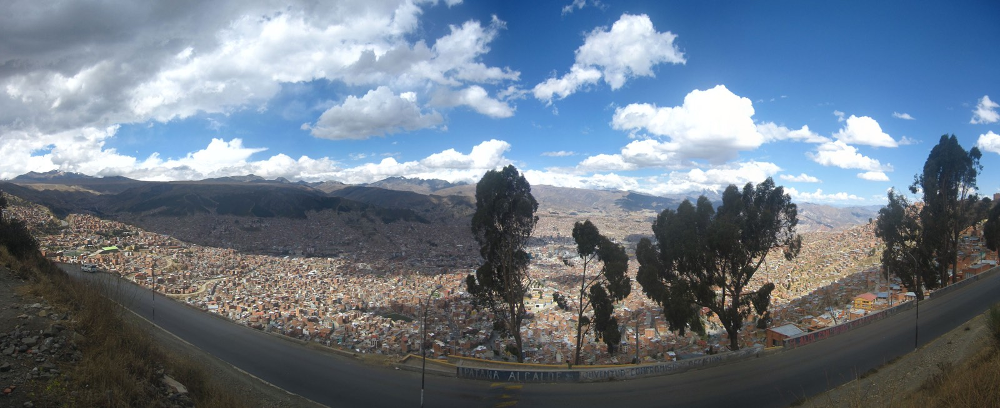
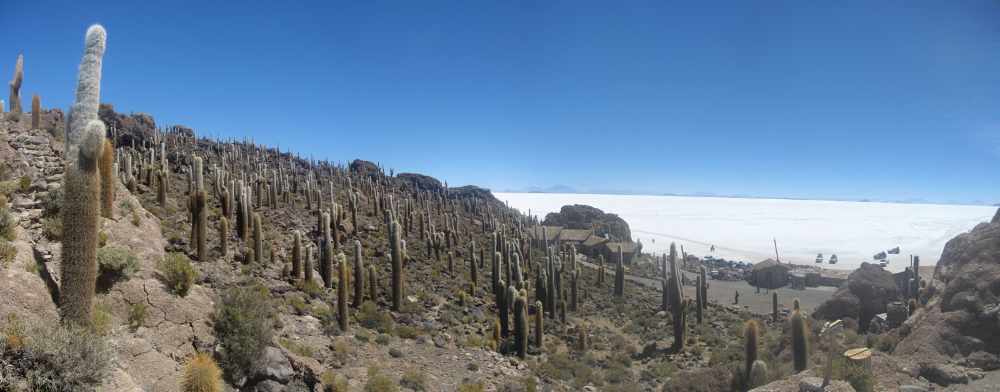
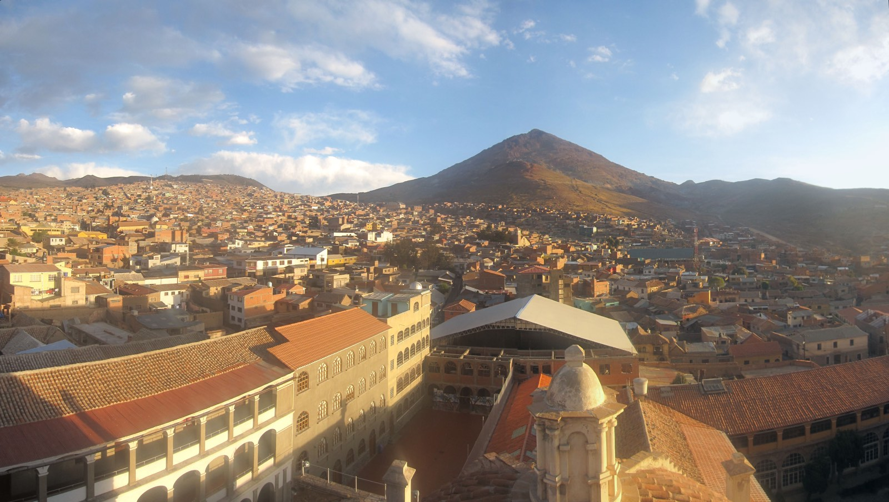

# Reisverslag Bolivia

De reis door Bolivia is onderdeel van een rondreis door Peru en Bolivia. Op de route liggen hoogtepunten als de Colca Canyon, Machu Picchu (Inca Trail), La Paz, Potosí, Cuzco en Nazca lijnen. Lees het begin van het [reisverslag](./peru).

## Dag 9 Puno - La Paz

We reizen vandaag naar Bolivia. Vanuit Puno zijn we snel bij de grens. Bolivia is volgens onze Peruaanse reisleider een heel ander land dan Peru. Dat begint al met het feit dat hij niet samen met ons de grens over gaat. Hij heeft geen vergunning om te werken in Bolivia en mag dus niet gezien worden als reisleider bij de grensovergang. De overgang zelf loopt vrij soepel. Eenmaal aan de andere kant stappen we een andere bus in, de Peruaanse bus kon namelijk ook niet mee de grens over. De nieuwe bus is duidelijk meer een all-terrain-verhicle dan onze vorige bus. Blijkbaar hebben we dat dus nodig in Bolivia. Als we [La Paz](https://nl.wikipedia.org/wiki/La_Paz_(stad_in_Bolivia) "La Paz") naderen hebben we een prachtig uitzicht over de stad. La Paz vormt zich als een soort trechter in het dal met de bergen er omheen. Aangekomen in het hotel, gaan we eten in, [Sol y Luna](http://www.solyluna-lapaz.com/ "Sol y Luna"), een Nederlands restaurant dat een aantal straten verderop zit. Het wordt niet laat deze avond. Ik voel me weer niet helemaal lekker. 

## Dag 10 La Paz

Een volledige dag in La Paz. Maar ik kan niet van mijn hotelkamer af. Ik ben namelijk ziek en zie vandaag een dokter. Deze besluit dat ik naar het laboratorium moet om bloed af te laten nemen en ontlasting af te geven. Het resultaat: salmonella en een parasiet. Daar ben ik dus mooi klaar mee. Ik krijg een hele lading medicijnen voorschreven die ik de komende dagen mag gaan innemen. ‘s Avonds ga ik weer wel mee naar Sol y Luna, maar meer dan een kop thee eet en drink ik niet.

## Dag 11 La Paz – Uyuni

Een lange reisdag naar Uyuni (3670m) voor de boeg vandaag. Gelukkig gaat het weer een stuk beter met me dan gister. Deze 11 uur durende reis gaat de eerste 6 uur over geasfalteerde wegen, de 5 uur erna gaat over onverharde wegen en dat is even ontwennen na alle goede wegen die we tot nu toe gehad hebben. Onderweg krijgen we te maken een staking. Onze bus die hoog op z’n wielen staat komt nu wel van pas. Onze bus chauffeur besluit om off-road de staking te omzeilen. Na enige moeite komen we ook weer terug op de hoofdweg. Hier hebben hooguit een uur verloren, maar dat valt nog heel mee. Met een een gewone bus hadden we dit nooit kunnen doen en hadden we veel meer tijd verloren. Uynuni is een klein plaatsje, waar amper 10.000 mensen wonen. Opvallend is wel dat zelfs hier ons hotel WiFi heeft.

## Dag 12 Uyuni | Salar de Uyuni (Zoutvlakte)

Vandaag gaan we naar de zoutvlakte, [Salar de Uyuni](https://nl.wikipedia.org/wiki/Salar_de_Uyuni "Salar de Uyuni"). Dit is de op een na grootste zoutvlakte ter wereld. Als we naar de zoutvlakte rijden krijgen we aan de rand uitleg over hoe de lokale bevolking zout wint uit de zoutvlakte. Dat is net iets meer alleen maar het zout opscheppen.  Daarna rijden we de zoutvlakte op naar [Isla Incahuasi](https://en.wikipedia.org/wiki/Isla_Incahuasi "Isla Incahuasi"). Dit is een bizar eiland. Het eiland van ongeveer 2km2 bestaat uit rotsen en hele [grote cactussen](https://en.wikipedia.org/wiki/Echinopsis_atacamensis "Echinopsis atacamensis"). En groot zijn ze. Gemiddeld zo’n 8m hoog. Hier krijgen we ook een heerlijke lunch van onze excusieleiders, waarna we nog tijd krijgen om gave foto’s te maken op de zoutvlakte.

## Dag 13 Uyuni – Potosi

Vandaag een korte reisdag naar [Potosí](https://nl.wikipedia.org/wiki/Potos%C3%AD_(stad) "Potosí") (4090m). Potosí is de hoogste stad ter wereld. Aangekomen in Potosí gaan we door de stad wandelen en gaan we naar een aantal uitzicht punten. Waaronder de San Fransisco. Na een uitgebreide rondleiding door deze tempel gaan we naar het dak. Hier lopen we als een soort Sinterklaas over het dak naar het torentje van waar uit we een prachtig uitzicht hebben over de stad met een ondergaande zon.

## Dag 14 Potosí | Cerro Rico mijnen

Deze ochtend gaan we de Cerro Rico mijnen van Potosí bezoeken. Het bijzondere van deze mijnen is dat hier nog steeds gewerkt wordt. Dat is ook wel te merken als we de mijnen in gaan. Regelmatig moeten aan de kant springen als er mijnwerkers voorbij komen met een hun karretje met grondstoffen. We gaan tot zo’n 400 meter onder de grond tijdens deze excursie. We komen een aantal mijnwerkers tegen die we een tas met spullen geven. Deze spullen hebben we van te voren gekocht op een mijnwerkers markt samen met de excursieleider. De inhoud is voor ons niet echt bijzonder, maar de mijnwerkers worden er wel blij van, cocablaadjes, sigaretten, alcohol (69%) en frisdrank.  In de middag dwalen we lekker rond in het centrum. Rondom het politiebureau is het opvallend druk. Als we ‘s avonds willen gaan eten kunnen we het plein rondom het politiebureau niet eens meer op en gaan we voorzichtig als we zijn, maar dichterbij het hotel eten. We eten uiteindelijk bij een Italiaan, waar we net met z’n 14-en binnen kunnen. Het restaurant heeft ook precies 14 stoelen. Net als we zitten te eten, krijgen een aantal mensen last van hun neus en moeten niezen, buiten rennen mensen voorbij. Buiten is een traangasgranaat afgeschoten door de politie op 10 meter van ons restaurant. Wij sluiten snel de deuren van het restaurant. De situatie van eerder op de dag is helemaal uit de hand gelopen. Als alles buiten weer rustig is, openen we de deuren en kunnen we ook weer rustig naar ons hotel.

## Dag 15 Potosí – La Paz

Een lange reisdag naar La Paz. We vertrekken echter vroeg, zodat we ook nog tijd hebben in La Paz. Hier ben ik blij mee, want van mijn vorige bezoek aan La Paz heb ik niet veel gezien. Aangekomen in La Paz gaan we rondlopen in La Paz, over de heksenmarkt en andere markten uiteindelijk zijn we zo ver afgedwaald dat we de taxi nemen naar de Burger King, deze bevindt zich achter ons hotel, maar is wel zo makkelijk om weer in de buurt van het hotel te komen. Eenmaal in de taxi rijdt de chauffeur als een idioot een rotonde op. Om vervolgens vol op de rem te gaan staan met als gevolg dat de achterop komende auto achterop onze taxi botst. Onze taxichauffeur springt vervolgens uit z’n plaat tegen de bestuurder die achterop geknald is. Uiteindelijk zijn we maar uitgestapt en gaan lopen naar de Burger King.

## Dag 16 La Paz – Copacabana

Vandaag een korte reisdag naar Copacabana (3820m). Copacabana ligt weer aan het Titicacameer. Het is vandaag een echte relaxdag. Zeker met de Inca Trail voor de deur. Deze reis gaat verder in Peru met de [Inca Trail](./inca-trail "Reisverslag Inca Trail").
