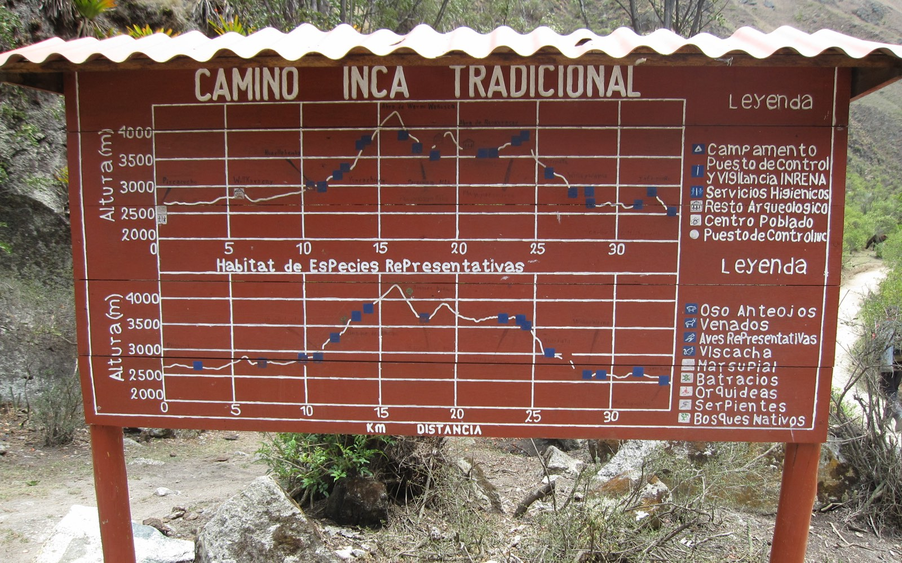
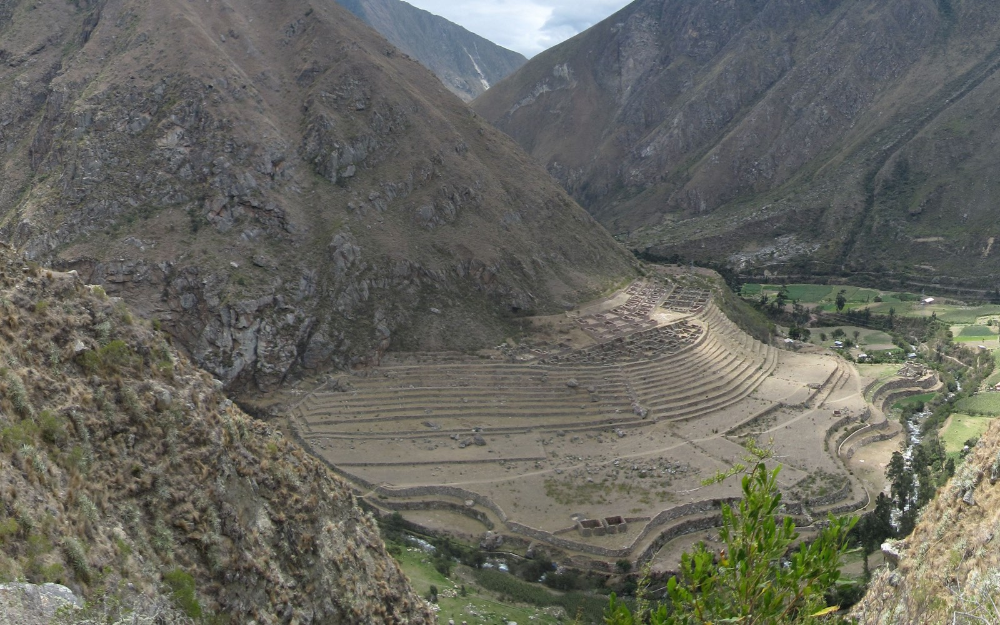
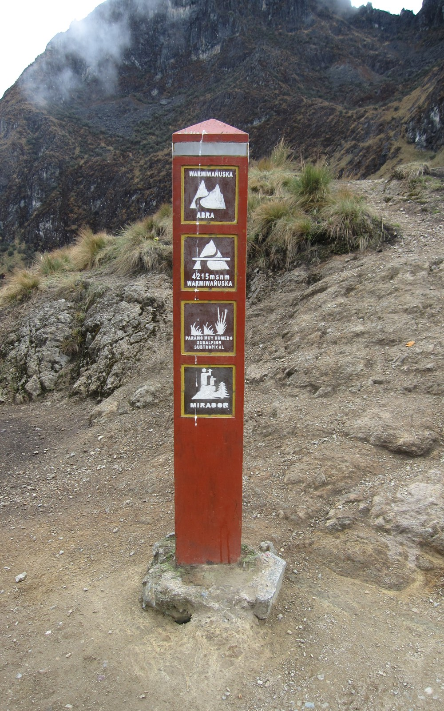
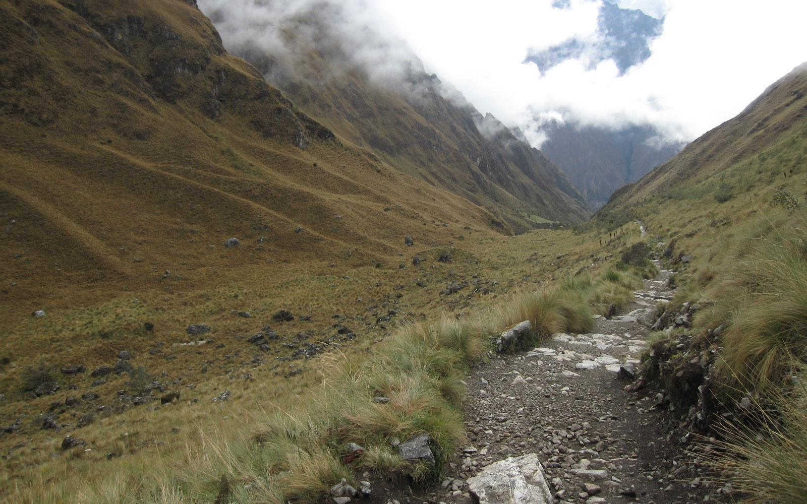
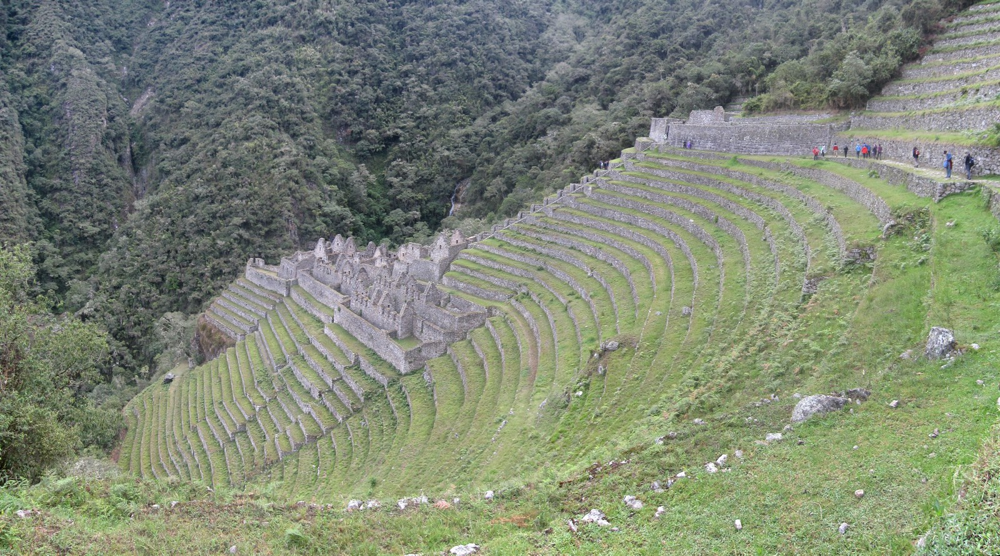
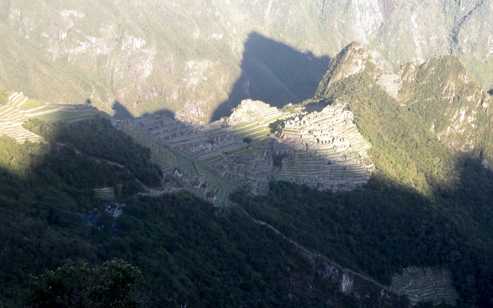
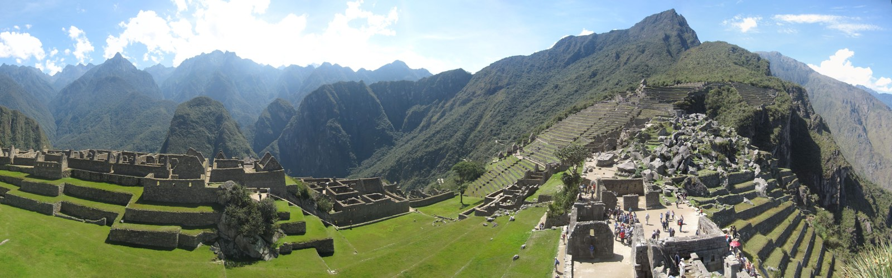

# Reisverslag Inca Trail

Een verslag van de [Inca Trail](https://en.wikipedia.org/wiki/Inca_Trail_to_Machu_Picchu "Inca Trail") die ik als onderdeel van een drie-weekse reis door [Peru](./peru) en [Bolivia](./bolivia) heb gedaan. De Inca Trail is in de derde week van de reis. Hierdoor is de hoogte waarop de Inca Trail zich bevindt, tussen de 2600 en 4200 meter, geen probleem meer.

## Dag 1 Wayllabamba – Yuncachimpa

De eerste dag van Inca Trail worden we al vroeg in ons hotel in Cuzco opgehaald, 5 uur. Na een uur rijden gaan we ontbijten. Hier probeer ik maar zoveel mogelijk te eten aangezien ik nog genoeg energie de komende dagen nodig zal hebben. Na het ontbijt rijden we nog een uur om vervolgens aan te komen bij kilometerpaaltje 82 van de treinrails tussen Cuzco en Machu Picchu. Hier zal onze tocht gaan beginnen. Nadat we helemaal klaar zijn voor de tocht gaan we door een checkpoint. Hier wordt je registratie gecontroleerd met je paspoort. Zo’n strenge controle had ik niet verwacht, maar je komt er dus echt niet in als je niet van te voren geboekt hebt. De tocht kan beginnen, het begin is heerlijk rustig wandelen langs de Urubamba rivier en mooie planten. De reisleiders voor de Inca Trail geven regelmatig uitleg bij wat we allemaal zien. Al snel komen we ook langs de eerste Inca-site, [Patallacta](https://en.wikipedia.org/wiki/Patallacta "Patallacta"). Het laatste deel van de eerste dag gaat hard omhoog. De eerste dag wordt hierdoor toch zwaarder dan eerst gedacht. Uiteindelijk komen we aan op onze eerste camping in Wayllabamba. De porters hebben de tenten al opgezet en er is zelfs een tent waarin we zullen eten. Het eten begint met een happy-hour, popcorn met koffie, thee of chocomel. Hierna volgt een uitgebreid avondeten en gaan we daarna snel naar bed, want we zijn doodop.

## Dag 2 Yuncachimpa – Llulluchapampa – Warmihuanusca pass (Dead woman’s pass) – Pacaymayu – Runkurakay pass – Chaquicocha

Het is vroeg opstaan, 5 uur. Het is daarna ontbijten en inpakken, zodat we kunnen vertrekken. Om 6u30 vertrekken we uiteindelijk, na 50 meter vertelt onze gids dat we het pad kunnen blijven volgen voor de komende 4 uur en dat we dan aankomen op het hoogste punt, ‘je zal het wel herkennen’. Een lekker vooruitzicht, 4 uur omhoog lopen, maar we gaan toch vol goede moed onderweg. Al snel loop ik alleen, wat op zich niet vervelend is. Iedereen heeft toch z’n eigen tempo. Na een uur en drie kwartier kom ik aan op wat lijkt op een top. Er is nog helemaal niemand, maar ik stop toch maar. Na zo’n 10 minuten komt er een porter, hij stopt ook. Het is het hoogste punt! Na nog eens 10 minuten wachten komen ook de eerst volgende uit onze groep boven.

## Dag 3 Chaquicohca – Phuyupatamarca - Winayhuayna

De derde dag is een relatieve relax dag. We vertrekken vanuit ons kamp in Chaquiqocha. Het gaat meteen weer omlaag met trappen. We komen langs de Inca-site, Phuyupatamarca en de Inca-tunnel. We komen als snel aan op de camping van Winayhuayna. Na een goede lunch en middagdutje gaan we naar de Winaywayna. Deze Inca-site is groter dan ik had verwacht. Aangezien dit op slechts vijf minuten lopen is van onze camping mogen we hier zolang blijven als we willen. Na ruim een uur rondgestruind te hebben in de deze ruïne besluiten we terug te gaan naar de camping, waar ons weer een heerlijk avondeten staat te wachten.

## Dag 4 Winayhuayna - Machu Picchu | Intipunku

De laatste dag staan we op om half drie! We willen namelijk zo ver mogelijk vooraan staan bij het laatste checkpoint. Vanuit dit checkpoint is het nog maar een wandeling naar [Machu Picchu](https://en.wikipedia.org/wiki/Machu_Picchu "Machu Picchu") via de zonnepoort. Iedereen wil zo snel mogelijk bij de zonnepoort (Intipunku) zijn. We mogen uiteindelijk pas gaan lopen rond half zes. Het lopen is bizar en gevaarlijk in dit stuk. Er zijn nog een aantal groepen ons voor geweest, maar deze mensen zijn niet allemaal even snel. Inhalen op dit stuk van de Inca Trail is bijna niet te doen. Als je wilt inhalen, dan zal dit aan de afgrond kant moeten. De klim naar Intipunku is lang genoeg om uiteindelijk toch iedereen te kunnen inhalen (op een paar idioten die in hun onderbroek naar boven rennen na). Aangekomen bij de zonnepoort hebben we voor het eerst uitzicht op Machu Picchu. Hier hebben we het uiteindelijk allemaal voor gedaan. Machu Picchu begint langzaam in de zon te komen. Het uitzicht is prachtig.  Lees ook: [Reisverslag Peru](./peru "Reisverslag Peru") [Reisverslag Bolivia](./bolivia "Reisverslag Bolivia")