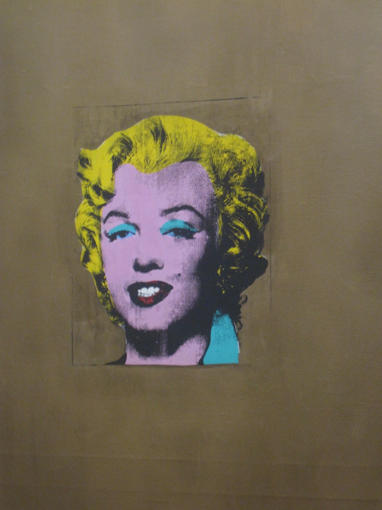
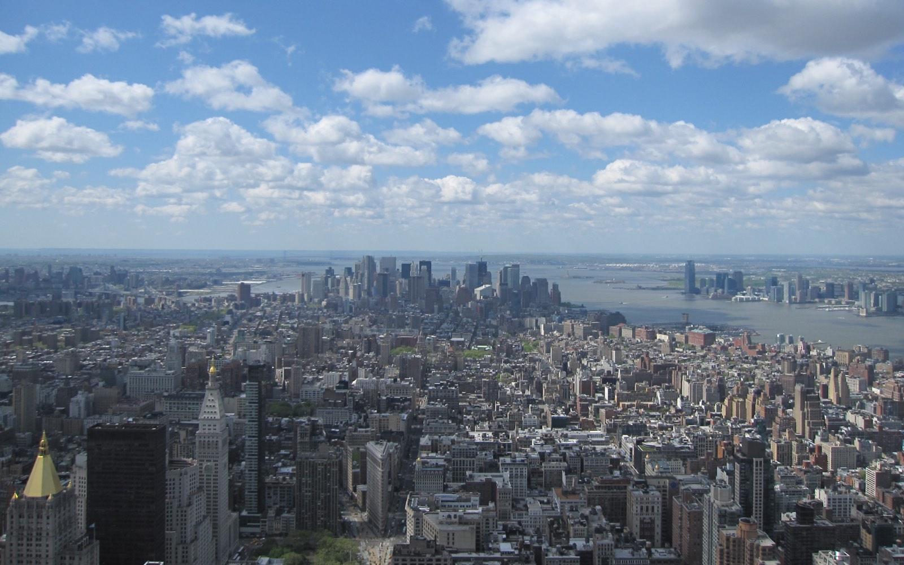
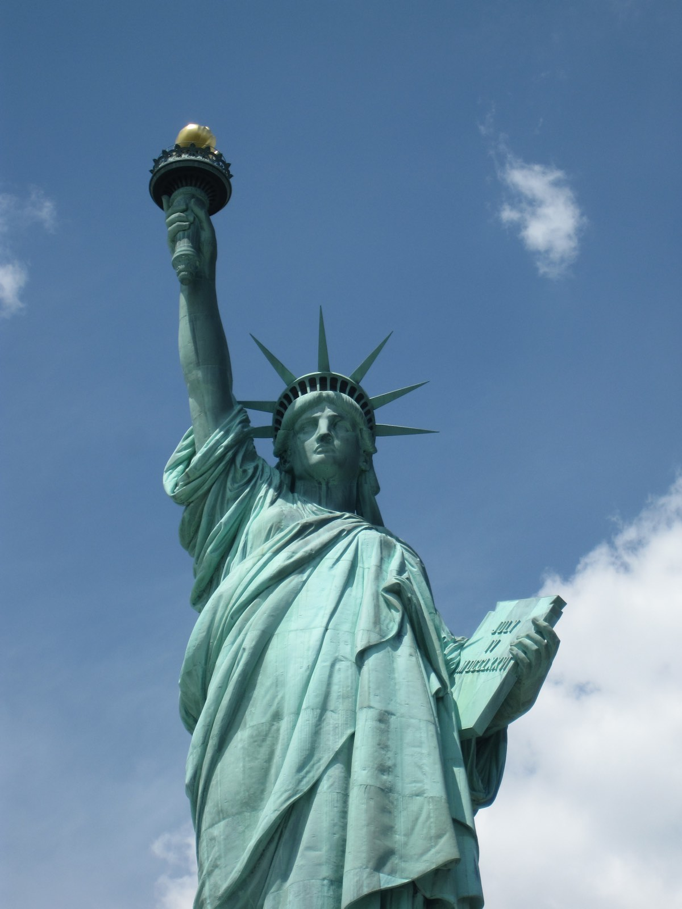
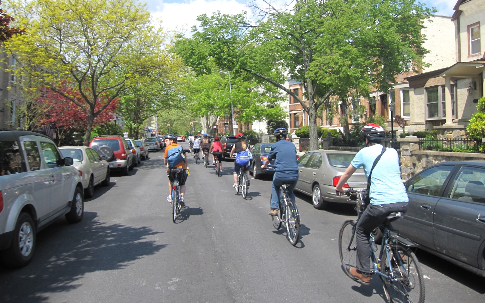
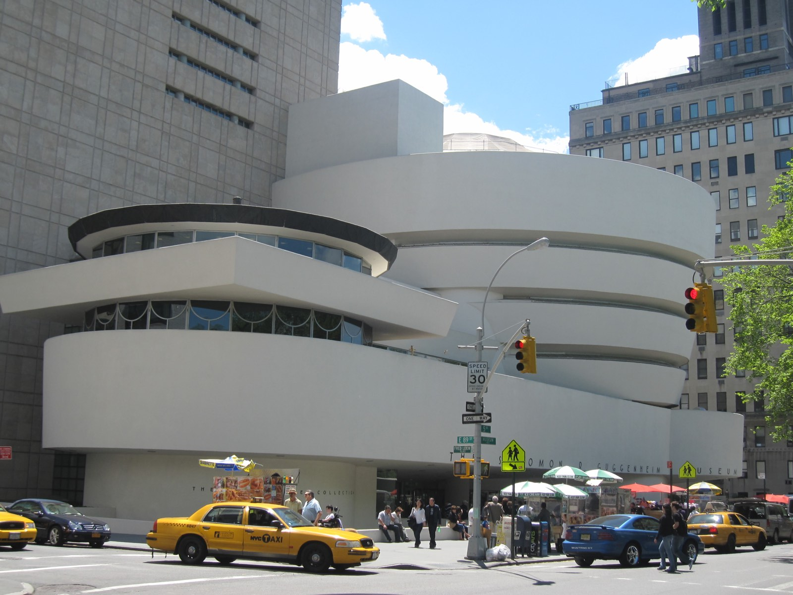
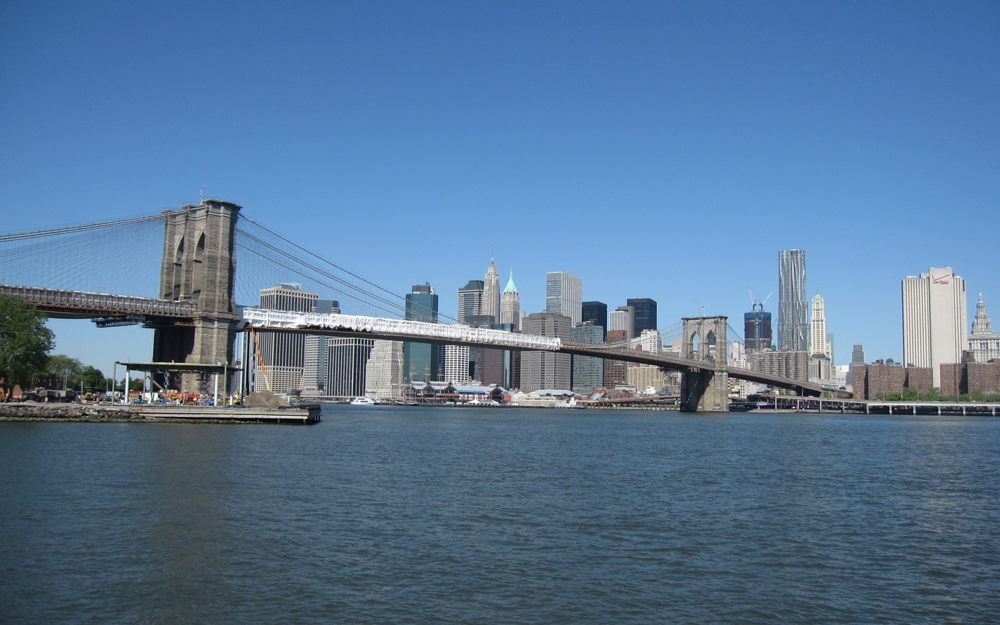
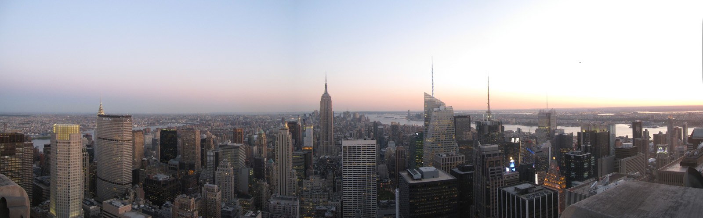

Een stedentrip in mei 2011 naar New York, een reisverslag.

## 3 mei | Times Square

In de ochtend vertrekken we naar Schiphol. Hier vandaan zullen we het Air France vliegtuig nemen richting Parijs. Parijs is een tussenstop op weg naar New York. Een vlucht boeken met een tussenstop was aanmerkelijk goedkoper dan een rechtstreekse vlucht naar New York. Na een korte pauze vliegen we door naar New York ook nu hebben we weer een Air France vliegtuig. Air France is een grote meevaller uitstekend vliegtuig en eten. We komen uiteindelijk om 15:45 plaatselijke tijd aan op Newark. Dit vliegveld ligt niet ineens in de staat New York maar New Jersey. Dit is dus wel een eindje weg van de eind bestemming. We kopen op het vliegveld een ticket voor de [NJTransit](https://en.wikipedia.org/wiki/New_Jersey_Transit "NJTransit") naar New York. Hiermee kunnen we dan eerst de air train nemen naar het [treinstation](https://en.wikipedia.org/wiki/Newark_Liberty_International_Airport_(NJT_station)) op de luchthaven om vanuit daar een in en half uur naar New York te reizen. We komen daar uit op het [Penn station](https://en.wikipedia.org/wiki/Pennsylvania_Station_(New_York_City)) (direct onder Madison Square Garden) van daaruit nemen de metro naar Broadway 50th Street alwaar ons hotel is. Het [Crowne Plaza](https://en.wikipedia.org/wiki/Crowne_Plaza_Hotel,_Times_Square) hotel is groot! We hebben een kamer op de 30ste verdieping. Het hotel telt wel 46 verdiepingen. Met een uitzicht op Broadway een prima kamer. De afstand naar [Times Square](https://en.wikipedia.org/wiki/Times_Square) is ongeveer 100meter. De eerste avond gaan we daar rondkijken, wat een licht reclame. Je kunt blijven kijken alsof het brandend vuur is. Die avond eten we dan ook maar in de Mac Donalds om het New York gevoel helemaal compleet te maken. `youtube:https://www.youtube.com/embed/uQ3WGupgCvs`

## 4 mei | Musuem of Modern Art, Public Library, Broadway

Regen! Nee he. De dag begint met regen en valt met bakken uit de hemel. We besluiten naar het [Museum of Modern Art](https://en.wikipedia.org/wiki/MoMA) (MoMA) te gaan.  Gelukkig hadden we in Nederland de [New York city pass](http://www.citypass.com/new-york) gekocht hierdoor hoeven we niet buiten in de rij te staan. De New York city pass bevat een aantal toegangstickets voor een vriendelijke prijs. We zijn hier tot in de middag daarna gaan we via de [public library](https://en.wikipedia.org/wiki/New_York_Public_Library) (bekend van de film The Day After Tomorrow) terug naar Times Square om kaartjes te kopen voor een echte Broadway show. De kaartjes die je kunt kopen onder de tribune op Times Square zijn voor ongeveer voor de helft afgeprijsd. Als we in de rij staan, hebben we nog geen idee naar welke show we gaan. Er zijn nog voor heel veel shows kaartjes te krijgen. Er worden ook fly-ers uitgedeeld, op een van fly-ers staat [Jim Parsons](https://en.wikipedia.org/wiki/Jim_Parsons) ([Sheldon Cooper](https://en.wikipedia.org/wiki/Sheldon_Cooper) in [The Big Bang Theory](https://en.wikipedia.org/wiki/The_Big_Bang_Theory)) en we besluiten naar de voorstelling te gaan waarin hij mee speelt. Na het eten gaan we op weg naar het [Golden theater](https://en.wikipedia.org/wiki/John_Golden_Theatre). Het blijkt een klein theater te zijn. We zitten op rij 3!! we kunnen het zo wel heel erg goed zien. Jim Parsons heeft een bijrol in de voorstelling maar hetgeen wat hij doet, doet soms denken aan Sheldon. De voorstelling die 2 uur duurt met een kwartier pauze tussendoor is een verhaal over de opkomst van aids in de jaren tachtig in New York. Het is een aangrijpend verhaal zonder het traditionele happy end. Als we weer naar het hotel teruggaan na de voorstelling is er drukte bij het theater ernaast. Een bekend iemand hier te zien? Ja! Het is [Kiefer Sutherland](https://en.wikipedia.org/wiki/Kiefer_Sutherland), [Jack Bauer](https://en.wikipedia.org/wiki/Jack_bauer) uit [24](https://en.wikipedia.org/wiki/24_(TV_series)), hij deelt handtekeningen uit. Als hij naar binnen gaat komt de volgende naar buiten van die voorstelling. Hij lijkt ook bekend maar ik ken hem niet. Terwijl we daar staan vragen we ons af of dat bij ons theater ook zou zijn. We lopen dus weer terug. Er staan inderdaad een aantal mensen te wachten buiten. Na even te wachten komt ook Jim Parsons naar buiten. Hij neemt voor iedereen rustig de tijd. En ik ga dan ook met hem op de foto :-) . Vakantie kan nu al niet meer stuk.

## 5 mei | Empire State Building, Staten Island

Vandaag is het weer mooi weer. We besluiten om naar het [Empire State Building](https://en.wikipedia.org/wiki/Empire_State_Building) te gaan. Hier kunnen we ook weer binnen met de New York city pass. De wacht rij is al aanzienlijk. Er wordt ook gecontroleerd alsof het een vliegveld is. Eenmaal bovenop is het uitzicht prachtig. Vandaag is [Obama](https://en.wikipedia.org/wiki/Obama) in New York. Hij komt naar Ground Zero. Wij gaan dus ook die richting op in de hoop Obama te kunnen zien. Helaas na 2 uur wachten tussen veel andere mensen geen Obama te zien. Daarna nemen we de gratis ferry naar [Staten Island](https://en.wikipedia.org/wiki/Staten_island) (te vinden bij metrohalte South Ferry). We nemen deze veerpont vanwege het uitzicht op de boot over de skyline van Manhattan. Na een tocht van ongeveer 20 minuten komen we aan op Staten Island (ook nog steeds New York). Al snel blijkt dat daar niet veel te doen is en na een klein rondje lopen nemen we de ferry weer terug naar Manhattan. Opnieuw kunnen genieten van de skyline van New York. We eten in de wijk [Nolita](https://en.wikipedia.org/wiki/Nolita). Door te gaan eten in een wijk waar je normaal niet zou komen zien we nog meer van de stad is het idee. Een die dat in Madrid prima werkte. Aangekomen bij het in de Lonely Planet uitgezochte restaurant blijkt dat dit helemaal vol zit. Dus gaan we zelf maar op zoek naar een ander restaurant in de buurt. Het wordt een vrij sjiek restaurant in de Kenmare street.

## 6 mei | Vrijheidsbeeld, Ellis Island, Ground Zero

We gaan vandaag naar het [Vrijheidsbeeld](https://en.wikipedia.org/wiki/Statue_of_Liberty). De eerste boot naar Liberty Island vertrekt om 8:30. Als we rond 10:30 aankomen om de rij te gaan staan  Liberty de rij is enorm. Uiteindelijk staan we een uur in de rij. Ook hier hadden weer de tickets al voor met city pass. De boot is vervolgens over vol. We hebben geen kaartje om in het Vrijheidsbeeld te gaan. Kaartjes voor in kroon moeten ver van te voren worden gereserveerd blijkbaar. Liberty Island is niet heel groot, dus we lopen het helemaal rond om vervolgens de boot weer te nemen naar [Ellis Island](https://en.wikipedia.org/wiki/Ellis_Island). Ellis Island is een immigratie eiland. Hier kwamen alle immigranten binnen voordat ze naar vasteland mochten. Van daaruit nemen we de boot weer naar Manhattan. Vanuit het Battery park lopen we naar [Ground Zero](https://en.wikipedia.org/wiki/World_Trade_Center_site). Een enorme bouwput is dit inmiddels. ‘s Avonds gaan we eten in [East Village](https://en.wikipedia.org/wiki/East_Village,_Manhattan). Dit is een beetje een alternatieve wijk. Je ziet hier zomaar tatoe shops. We gaan eten bij een Mexicaans restaurant in [St. Marks place](https://en.wikipedia.org/wiki/St._Marks_Place_(Manhattan)). Deze keer hebben het restaurant niet uit de Lonely Planet maar uit een Nederlandse reisgids. Het restaurant is erg sfeervol en het eten is prima.

## 7 mei | Brooklyn, Stand-up comedy

Het is vandaag zaterdag en we gaan fietsen door [Brooklyn](https://en.wikipedia.org/wiki/Brooklyn). Dit hebben we in Nederland al regelt. In Brooklyn is niet heel veel te doen terwijl het wel heel groot is. Daarom hebben we bedacht om er doorheen te fietsen met [bike the Big Apple](http://bikethebigapple.com/). Er zijn nog 4 andere mensen die mee fietsen naast twee begeleiders. Vanuit het prospect park fietsen we eerst naar het op een na hoogste punt in Brooklyn, van waaruit we ook weer zicht hebben op Manhattan. Daarna gaan we in een streep door naar de kust. Hierbij fietsen we door het China Town van Brooklyn.  We fietsen en hele tijd langs de kust. Uiteindelijk komen uit bij [Coney Island](https://en.wikipedia.org/wiki/Coney_island). Coney Island is een bijzonder stukje van Brooklyn. Er staat een eeuwig durende kermis met als hoogtepunt het Wonder Wheel. Ook is hier het wereldberoemde jaarlijkse vreetfestijn van de hotdogs. Vanuit Coney Island fietsen we langzaam weer terug. Hierbij komen we langs allerlei oud Nederlandse gebouwen. De begeleiders hebben dit erg goed voorbreidt. Als we terug gaan naar het hotel kopen we Times Square kaartjes voor een stand-up comedy show, de [Comic Strip Live](https://en.wikipedia.org/wiki/Comic_Strip_Live). Eddie Murphy is er ooit begonnen. De comic strip is in de wijk Upper East. We gaan dan ook maar eten in deze wijk. We komen uiteindelijk uit bij een Japanner. Sushi!! Voor de Comic Strip hadden we goedkope kaartjes, maar er zijn vervolgens wel twee consumpties verplicht met een minimaal totaal van 20 dollar pp. dikke afzetterij dus. Dit doet echter niks af aan de show die is geweldig. Er is een komiek die alles aan elkaar praat en daar tussen geven andere komieken hun show.

## 8 mei | Guggenheim, Central Park, Metropolian Museum

Onze city pass geeft nog recht op verschillende musea. Vandaag gaan we daar even doorheen lopen. Te beginnen met [Guggenheim](https://en.wikipedia.org/wiki/Solomon_R._Guggenheim_Museum). Dit ligt naast het [Central Park](https://en.wikipedia.org/wiki/Central_park). Het is een relatief klein museum. Het gebouw is soort spiraal waarin je naar boven loopt. Na het Guggenheim gaan we het Central park in.  Het is prachtig weer deze zondag en half Manhattan zit hier lijkt het wel. We gaan ook even langs [Strawberry Fields](https://en.wikipedia.org/wiki/Strawberry_Fields_(memorial)) waar een plaquette is om John Lennon te herdenken. Na een lunch in de wijk Upper West lopen we door het Central Park naar het [Metropolitan](https://en.wikipedia.org/wiki/Metropolitan_Museum_of_Art) museum dat helemaal in het Central Park ligt. Dit is een groot museum, het grootste in New York, hier kunnen we onmogelijk alles zien. We gaan ervoor om alleen alle moderne kunst proberen te zien en wat andere Nederlandse kunst zoals de Rembrants die er hangen. Eten doen we vandaag in de wijk [Greenwich](https://en.wikipedia.org/wiki/Greenwich_Village). We willen naar een Belgisch restaurant, maar dat blijkt niet meer te bestaan. Er zit wel een Italiaan waar we dan maar gaan eten. Greenwich is een wijk die je prima kunt missen. Tot nu toe was de East Village de leukste wijk om te eten.

## 9 mei | China Town, Harlem, Roosevelt Island, Rockefeller center Top of the Rock

Elke dag hebben we al veel gezien, maar er is nog een hele lijst van dingen die ook nog willen zien. aangezien dit de laatste vol dag is wordt dit een dagje met metro. we beginnen ‘s ochtends vroeg in Brooklyn. in het [Dumbo park](https://en.wikipedia.org/wiki/Dumbo,_Brooklyn).  Hier vandaan heb je een mooi uitzicht over Manhattan met op de voor grond de Brooklyn bridge. Hierna lopen de via de Brooklyn bridge naar Manhattan. om daar uit te komen bij de City Hall. We lopen door naar [China Town](https://en.wikipedia.org/wiki/China_Town,_New_York_City) en [Little Italy](https://en.wikipedia.org/wiki/Little_Italy,_Manhattan). ontzettend grappig om te zien hoe mensen daar hun eigen cultuur vasthouden. van daaruit gaan we met de metro naar [Grand Central Terminal](https://en.wikipedia.org/wiki/Grand_Central_Terminal). een enorm groot treinstation. We lopen van daaruit weer verder naar het gebouw van de Verenigde Naties. Dit blijkt in verbouwing te zijn. Het gebied van de Verenigde Naties beslaat zo'n 5 blokken, wat erg groot is. we stappen weer de metro in om nu naar [Harlem](https://en.wikipedia.org/wiki/Harlem) te gaan. we stappen uit bij 116th street om te lopen naar 126th street. we lijken hier wel de enige blanken. maar het komt totaal niet bedreigend of intimiderend over. We nemen weer de metro om naar the [Bronx](https://en.wikipedia.org/wiki/Bronx) te gaan. We stappen uit bij het [Yankee Stadium](https://en.wikipedia.org/wiki/Yankee_Stadium). Helaas zijn er deze week gen wedstrijden hier. Na rond het stadion te hebben gelopen nemen we de metro weer. We gaan nu met een kabelbaan nar [Roosevelt Island](https://en.wikipedia.org/wiki/Roosevelt_island). Een eiland dat tussen Manhattan en Brooklyn ligt. Hierna hebben even pauze om net voor zonsondergang naar het [Rockefeller center](https://en.wikipedia.org/wiki/Rockefeller_center) te gaan. Je kunt bij het Rockefeller center naar de [Top of the Rock](http://www.topoftherocknyc.com/) gaan. Dit is 69 verdiepingen hoog gebouwd met uitzicht over Manhattan en Central Park. We zien van hier de zon ondergaan in New York.

## 10 mei

De laatste ochtend staat in het teken van shoppen. De hele week hebben we al Staples en Best Buy winkels bezocht. Vandaag moet er dan toch iets gekocht worden. Een tablet, de Motorola Xoom met Android Honeycomb om 14:30 vertrekken we weer richting de luchthaven op dezelfde manier als we kwamen. Deze keer hebben een rechtstreekse vlucht van Delta. De vlucht is van iets mindere kwaliteit van de Air France vlucht, maar deze is dan weer wel rechtstreeks naar Amsterdam. New York was een top vakantie!

