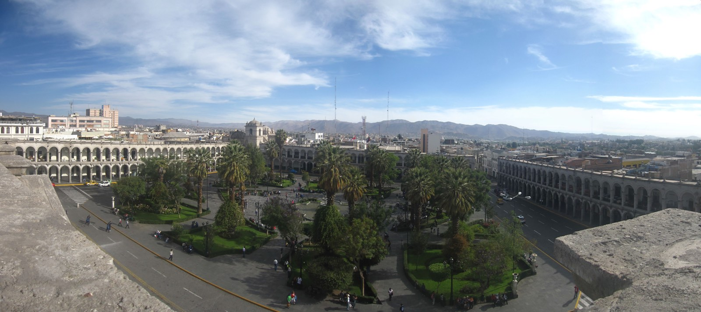

# Reisverslag Peru

Dit reisverslag door Peru is onderdeel van een rondreis door Peru en [Bolivia](./bolivia). Op de route liggen hoogtepunten als de Colca Canyon, Machu Picchu ([Inca Trail](./inca-trail)), La Paz, Potosí, Cuzco en Nazca lijnen.

## Dag 1 Amsterdam - Lima

Vandaag begint de reis naar Peru en Bolivia. We vliegen met Iberia Airlines van Amsterdam naar Madrid. De vlucht is vroeg, 8 uur, dus dat is zorgen dat we om 5u al op Schiphol zijn. Dit nachtbraken moet ergens op de dag zijn tol gaan eisen, maar dat zien we dan wel weer. Aangekomen in Madrid kunnen rustig naar de volgende vertrekhal, want het volgende vliegtuig van Iberia staat al weer klaar om ons naar Lima te brengen. We vertrekken om 12u35, zodat we om 17u35 lokale tijd aankomen in Peru. Aangekomen in Peru, staat de reisleider, Daniel, op ons te wachten op het vliegveld. Als we er allemaal zijn vertrekken we naar ons eerste hotel in Lima. In dit hotel zullen we maar één nacht verblijven om de volgende ochtend meteen door te reizen. In het hotel aangekomen, maken we kennis met iedereen en krijgen we te horen dat we dag er na al weer vroeg vertrekken naar Ica.

## Dag 2 Lima - Pisco - Ica | Ballestas-eilanden

Vroeg in de ochtend vertrekken we op weg naar Ica. Onderweg komen we langs Pisco. Bij deze kust plaatst maken we een stop. We gaan hier naar de Islas Ballestas. Hier leven voornamelijk zeevogels en zeeleeuwen. Op dit bijzondere eiland wordt eens in de vijf jaar alle vogelpoep van het eiland gehaald en verkocht als mest. Dat er genoeg mest aanwezig is, kun je vanaf de boot al ruiken.  Na de boottocht rijden we door naar de eindbestemming van vandaag, Ica. Ica, ligt aan de Peruaanse woestijn. Onderweg naar Ica is dit ook al goed te merken, er is weinig te zien onderweg. Aangekomen bij het hotel, blijkt dit een kleine oase te zijn. Er is zelfs een zwembad aanwezig bij het hotel. ‘s Middags gaan we de woestijn in. Ik ga sandboarden vanaf de enorme zandduinen. Met een buggy crossen we de duinen omhoog. Aangekomen bovenop de duinen hebben we een prachtig uitzicht over Ica en de zandduinen. In drie etappes gaan we naar beneden sandboarden. Dit gaat echt ontzettend hard naar beneden. Als we klaar zijn, gaan we nog naar een mooie zonsondergang kijken in de woestijn.

## Dag 3 Ica – Nazca | Kerkhof Chauchilla

De dag gaat vandaag van Ica naar Nazca. Aangekomen proberen meteen te gaan vliegen. Na een uur wachten blijkt dat het vandaag te hard waait om te vliegen. Het gaat vandaag niet door. We gaan daarna nog wel naar het [Chauchilla kerkhof](https://en.wikipedia.org/wiki/Chauchilla_Cemetery "Chauchilla kerkhof"). Hier liggen mummies, soms nog in perfecte staat, met huid en haar. Helaas waait het hier ook erg hard. We worden op het kerkhof gezandstraald. Echt goed naar de mummies kijken, is er dus helaas niet bij.

## Dag 4 Nazca - Arequipa | Nazcalijnen

Vandaag is het weer een stuk rustiger dan gister. In de ochtend gaan we vliegen over de Nazcalijnen. We zien de astronaut, spin, kolibrie, aap en handen. Na de vlucht nemen een openbare bus naar Arequipa (+/-2300m). Dit is wel een luxe touringcar bus met zelfs WiFi aan boord. De WiFi werkt wel alleen als we in de buurt zijn van dorpjes, daar buiten heeft de bus zelf ook geen bereik. De busreis duurt ruim 10 uur en we komen dan ook laat in de avond aan in Arequipa.

## Dag 5 Arequipa

Vandaag zijn we een volledige dag in Arequipa. We gaan de stad verkennen en komen zo langs een klooster, [Santa Catalina](http://www.santacatalina.org.pe "Santa Catalina"). Dit klooster bestaat uit mooie kleine straatjes met daarin de verblijven van het klooster. Het gedeelte waar we doorheen lopen, is niet meer in gebruik door de nonnen, maar is opengestelde voor publiek. Daarna gaan we ook nog een kijkje nemen in de Basílica Catedral, deze ligt aan het centrale plein in Arequipa. Vanaf het dak heb je een mooi uitzicht over het plein. ‘s Avonds gaan we gezellig uit eten en daarna drinken we nog wat pisco sours op het centrale plein. De pisco sour is de nationale drank van Peru. Het bestaat uit Pisco, limoensap, rietsuikerstroop en geklopt eiwit. Dit laatste is natuurlijk best gevaarlijk, maar dat zou later in de reis nog wel blijken. De pisco sour was deze avond heerlijk.

## Dag 6 Arequipa - Chivay

Vandaag gaan we naar [Chivay](https://nl.wikipedia.org/wiki/Chivay "Chivay") (3635m). Onderweg komen we over het hoogste punt van deze reis, 4920m. Als voorbereiding hierop adviseert de reisleider om veel water te drinken en [coca](https://nl.wikipedia.org/wiki/Coca_(plant) "coca") te eten. De coca blaadjes laat ik aan me voorbij gaan, maar de cocasnoepjes zijn prima te eten. Dat deze hoogte toch iets met me doet, is hier wel merkbaar. Mijn hoofd voelt toch iets lichter aan. Op het hoogste punt hebben we een plas-en-foto pauze. Aangekomen in Chivay, blijkt dit wel een toeristisch oord te zijn. We gaan eten in een restaurant specifiek voor toeristen en kinderen staan op straat in klederdracht en een lama. Om een er een foto van te maken, vragen ze om een Nuevo Sol. Ik voel me niet helemaal kiplekker en houd ‘s middags rust. Er is ook de mogelijkheid om naar hot springs te gaan, maar dat laat ik even aan me voorbij gaan. ‘s Avonds gaan we eten in het stadje. Het is echter zelfs in het Italiaans restaurant waar we gaan eten koud (de bediening loopt zelfs in een jas). We eten snel ons eten op en vertrekken snel weer naar ons verblijf.

## Dag 7 Chivay - Puno | Colca Canyon

Het programma van vandaag is de [Colca Canyon](https://nl.wikipedia.org/wiki/Colca_Canyon "Colca Canyon"). Hier zullen we naar verwachting [Andescondors](https://nl.wikipedia.org/wiki/Andescondor "Andescondors") zien. Deze roofvogels hebben een spanwijdte van rond de 3 meter. De vogels zijn hier in grote getalen aanwezig. We kunnen zeker een uur lang van deze vogels genieten alvorens we weer verder gaan op deze reis.  Het volgende punt in de reis is Puno (3820m) en ligt aan het Titicacameer. De middag is een lange busreis. De omgeving is prachtig. Aangekomen in Puno zijn we blij dat we er zijn en doen we niet veel meer.

## Dag 8 Puno | Uroseilanden

De dag in [Puno](https://nl.wikipedia.org/wiki/Puno_(stad) "Puno") gaan we per boot naar de Uros eilanden. Deze zijn eilanden zijn helemaal van riet gemaakt en er wonen afstammelingen van de mensen die gevlucht zijn voor de Spanjaarden. De eilanden die drijven, zijn zo'n drie meter dik en het grootste deel ligt onder water. Het riet groeit in het Titicacameer en is heel lang. Eens in de twee weken leggen ze een nieuwe laag op het riet, want aan de onderkant vergaat een deel, en die nieuwe laag droogt dan weer langzaam. Als je er op loopt voel je het helemaal meegeven. Heel grappig. Maar het zijn hele stevige eilanden. Er staat zelfs een uitkijktoren op een eiland. De mensen sporten , rennen, koken, kortom leven er ook echt op. Er staan ook scholen op. De huisjes die erop staan zijn ook van riet en hun vervoersmiddelen, boten, ook. Die boten zijn echt heel erg mooi: met een mooie staart eraan en een kop voorop van een dier. De reis gaat verder in [Bolivia](./bolivia) of lees verder over de [Inca Trail](./inca-trail).
