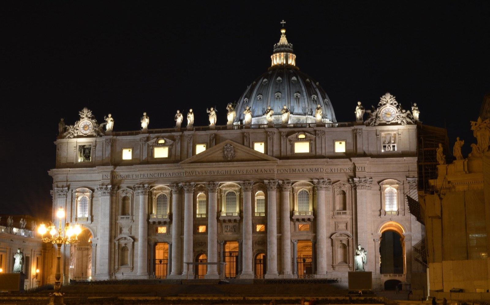

Een stedentrip in april 2013 naar Rome, een reisverslag.

## 24 april | Eindhoven - Rome

Vanuit Eindhoven vliegen we met Ryanair FR9616 naar Rome [Ciampino](https://nl.wikipedia.org/wiki/Luchthaven_Rome_Ciampino "Ciampino"). Dit vliegveld ligt ten zuiden van Rome en is niet heel groot. Bij het aan vliegen van Rome komen we over de stad en zien al het Colosseum en de Sint Pieter. Nadat we geland zijn, staan binnen 30min buiten. We nemen daar voor 30,- de taxi naar het hotel. Dit is verreweg de makkelijkste en snelste optie om in het centrum van de stad te komen. Ook al gaan we midden in de spits. Het hotel, [Relais Le Clarisse](http://www.booking.com/hotel/it/relais-le-clarisse.nl.html?aid=1293335&no_rooms=1&group_adults=1) ligt in de wijk [Trastevere](https://nl.wikipedia.org/wiki/Trastevere "Trastevere"). Vanuit deze gezellige wijk met smalle straten ligt het meeste op een steenworp afstand voor de komende dagen. ’s Avonds eten we dan ook in onze eigen wijk bij [Gino](http://www.tripadvisor.nl/Restaurant_Review-g187791-d802124-Reviews-Gino_in_Trastevere-Rome_Lazio.html "Gino in Trastevere"). Niet heel bijzonder, maar wel een echte Italiaan, waar we dus ook maar een Pizza eten.

## 25 april | Colosseum | Forum Romanum | Spaanse Trappen | Trevifontein

We bezoeken vandaag het [Colosseum](https://nl.wikipedia.org/wiki/Colosseum "Colosseum"). Dit ligt op loop afstand van ons hotel. Het is vandaag ook mooi weer, enigszins bewolkt maar soms ook zonnig met een temperatuur van ongeveer 27 graden. Na het Colosseum bezoeken we ook de er naast gelegen [Forum Romanum](https://nl.wikipedia.org/wiki/Forum_Romanum "Forum Romanum"). Het was in de oudheid het centrum van Rome. Het forum was in de gloriedagen van het Romeinse Rijk zowel het politieke en juridische als het religieuze en commerciële centrum van de stad. De wandeling gaat verder naar de [Spaanse trappen](https://nl.wikipedia.org/wiki/Spaanse_Trappen "Spaanse trappen") en de [Trevifontein](https://nl.wikipedia.org/wiki/Trevifontein "Trevifontein"). Twee bezienswaardigheden in Rome. Bij beide locaties is het ontzettend druk. Bij de Spaanse Trappen staat ook een [Obelisk](https://nl.wikipedia.org/wiki/Obelisken_van_Rome "Obelisken van Rome"). Deze staan zoals we nu al opmerken overal in Rome. Deze ‘naalden’ komen namelijk oorspronkelijk uit Egypte. De Romeinen namen deze mee uit Egypte na weer een overwinning op de Egyptenaren. Onderweg lopen we ook nog langs [Via Veneto](https://en.wikipedia.org/wiki/Via_Veneto "Via Vittorio Veneto"), een van duurste straten van Rome. 's Avonds eten we op het [Piazza Navona](https://nl.wikipedia.org/wiki/Piazza_Navona "Piazza Navona"). Daarna gaan we nog gezellig wat drinken op [Piazza Campo de’ Fiori](https://nl.wikipedia.org/wiki/Campo_de'_Fiori "Piazza Campo de' Fiori").

## 26 april | Vaticaan

Het is vandaag een stuk minder mooi weer dan gister. 7 graden minder en regelmatig een bui. We besluiten om naar het [Vaticaans museum](https://nl.wikipedia.org/wiki/Vaticaanse_Musea "Vaticaans museum") te gaan. Daar blijkt een enorme rij te staan. Dit hadden we kunnen voorkomen door van te voren online tickets te kopen. Maar helaas hebben dat niet gedaan. In de rij wordt er wel door Indiërs en andere figuren aangeboden om bij hun kaartjes te kopen waarmee je de rij voorbij kunt lopen, deze zwart handelaren vragen 32,- of soms zelfs meer voor een kaartje terwijl de officiële prijs 16,- is. Pure afzetterij dus, daar doen we dan ook niet aan mee. Als we uit het museum komen, is het al laat en eten even een pizza punt om vervolgens naar de [Sint Pieter](https://nl.wikipedia.org/wiki/Sint-Pietersbasiliek "Sint Pieter basiliek") te gaan. Nu ben ik wel eens in kopie van deze [basiliek in Oudenbosch](https://nl.wikipedia.org/wiki/Basiliek_van_de_H.H._Agatha_en_Barbara "basiliek in Oudenbosch") geweest, maar dit is toch een stuk indrukwekkender. Helaas zijn we vandaag te laat om ook nog in de koepel te gaan. Het is ook geen mooi weer dus die bewaren we voor later. 's Avonds gaan we eten op Vicolo Santa Maria in Trastevere bij restaurant [Sabatini](http://www.tripadvisor.nl/Restaurant_Review-g187791-d716392-Reviews-Sabatini-Rome_Lazio.html "Sabatini"). Het eten is er heerlijk, maar wel prijzig. We besluiten dan ook om een ijsje te halen bij de [Blue Ice](http://www.tripadvisor.nl/Restaurant_Review-g187791-d787819-Reviews-Blue_Ice-Rome_Lazio.html "Blue Ice") op het plein. Terwijl we het ijsje op eten is er ook een straat artiest bezig op het plein. Een super leuk pleintje dus.

## 27 april | Engelenburcht | Pantheon | La Bocca della Verità

We lopen weer naar de Sint Pieter in de hoop om in de koepel te kunnen. Na de wandeling naar de Sint Pieter blijkt dat er een enorme rij staat, het hele plein rond. We besluiten om later maar terug te gaan en nu eerst naar de vlakbij gelegen [Engelenburcht](https://nl.wikipedia.org/wiki/Engelenburcht "Engelenburcht") te gaan. Dit is een eeuwenoude burcht langs de [Tiber](https://nl.wikipedia.org/wiki/Tiber "Tiber"). Vanuit Engelenburcht is er ook heel mooi uitzicht over de stad en naar de Sint Pieter. Als we uit Engelenburcht komen, lopen we naar het [Pantheon](https://nl.wikipedia.org/wiki/Pantheon_(Rome) "Pantheon"). Dit is kerk uit de tijd van de Romeinen. Je kunt er voor de verandering vrij in lopen. We gaan dan toch weer terug naar de Sint Pieter om in de rij te staan, deze is nu een half Sint Pieter plein rond en het wachten valt nog redelijk mee, na een half uur zijn we binnen. We kunnen echter weer niet de koepel in. De koepel is gesloten en ook een deel van de basiliek is afgezet. Vandaag nog een bezienswaardigheid waar we langs gaan, de [La Bocca della Verità](https://nl.wikipedia.org/wiki/La_Bocca_della_Verit%C3%A0 "Mouth of truth"). Dit is een gezicht in de vorm van een steen. De legende zegt dat als je je hand in de mond stopt en je hebt gelogen, dat je hand er wordt af gebeten. Als we in rij staan, komen we er achter dat dit om 17:30 dicht gaat. Het is kantje boord, maar we kunnen er nog net in. Vlak achter ons gaat het hek dicht. 's Avonds eten we bij [Alle di Fratte di Trastevere](http://www.tripadvisor.nl/Restaurant_Review-g187791-d696629-Reviews-Alle_fratte_di_trastevere-Rome_Lazio.html "Alle di Fratte di Trastevere"). Dit is werkelijk om de hoek van het hotel. Het eten is er prima.

## 28 april | Sint Pieter | Vittorio Emanuele II monument

Het is zondag we gaan in ochtend even langs bij het Sint Pieter plein. Het is er ontzettend druk. Het is ook niet mogelijk om de basiliek in te gaan. We besluiten om een dagkaart voor de metro te nemen. Een metro kaart heb je in Rome niet nodig voor het historische centrum. Maar voor spots iets daar buiten zoals Piazza Popolo is het erg handig. Vanuit het hotel in Trastevere gaan we naar het Vittorio Emanuele II monument. Als we daar even rustig zitten, komen er opeens de een naar de andere politieauto voorbij gescheurd. Ze rijden met loeiende sirenes door de mensenmassa die zich op straat bevinden. Agenten hangen half uit hun auto en proberen de mensen met hun pannenkoek aan de kant te dirigeren. Er moet zich wel iets ernstigs voorgedaan hebben. Na zo'n 15 politieauto beginnen er ook ambulances met hoge snelheid voorbij te sjeesden. Midden in Rome is er natuurlijk geen internet, dus wat er gebeurd is komen we later wel achter. we lopen vanuit het Vittorio Emanuele II monument naar het Colosseum onderweg komen we weer langs Forum Romanum. Bij het Colosseum kunnen we de metro nemen naar termini, het treinstation van Rome. Op Termini stappen we over naar San Giovanni, daar staat de [tweede kerk](https://nl.wikipedia.org/wiki/Sint-Jan_van_Lateranen "San Giovanni in Laterano") van Rome. Ook deze is mega groot, bijna vergelijkbaar met de Sint Pieter. Daarna hoppen we weer de metro in naar het Republica plein. Op dit plein is ook weer een basiliek! Maar er is ook een Macdonalds waar we even broodje eten. Dit is ook een van de eerste die we tegenkomen, er blijken maar 7 Macs in Rome te zijn. Daarna nemen we de metro weer om naar [Piazza del Popolo](https://nl.wikipedia.org/wiki/Piazza_del_Popolo "Piazza del Popolo") te gaan. Er zijn een paar fonteinen en weer een obelisk, verder is dit een rustig plein. Totdat de Italiaanse Michael Jackson het plein op komt. Hij zet de muziek aan en gaat dansen als Michael. Binnen de kortste keren staat het helemaal vol rondom hem. We wachten in spanning zijn moonwalk af, maar die komt maar niet. Nummers als Beat It, Thriller en Bad komen voorbij, tot het laatste nummer waar hij op danst daar is ie dan, de moonwalk. En hij doet het nog goed ook. Zo goed dat er zelfs mensen met hem op foto willen! Met een imitator! We gaan de metro weer in op naar het Sint Pieter plein, het wordt poging 4 om de koepel in te gaan. We stappen uit bij metro halte Ottaviani. Van daaruit is het maar een klein stukje naar de Sint Pieter. De rij is zelfs niet heel lang. Het beste moment om naar de koepel te gaan is dus zondag middag, ruim na de zondagsmis. Om boven te komen op de koepel zijn er twee opties, helemaal met de trap voor 5,- of een gedeelte met de lift voor 7,-. We lopen natuurlijk helemaal naar boven. Een eitje na de [Inca Trail](./inca-trail "Inca Trail") van vorig jaar. Het uitzicht boven is magnifiek. Je kunt heel mooi het Sint Peterplein zien en er is een mooi zicht op de rest van het Vaticaan. Het wordt al later en we besluiten de laatste avond in Rome te gaan eten op Piazza Campo de’ Fiori. We hier al eerder wat gedronken op dit gezellige plein, maar nu gaan we er ook eten. We gaan via metrohalte Barberini. De afstand tussen Vaticaan en Piazza Campo de’ Fiori is even groot, maar het is een route waar we nog niet geweest zijn. In de deze route komen we langs [Palazzo Chigi](https://en.wikipedia.org/wiki/Palazzo_Chigi "Palazzo Chigi") op het [Piazza Colonna](https://nl.wikipedia.org/wiki/Piazza_Colonna "Piazza Colonna"). Er staat een verslaggever van de RAI. Niet spannend aangezien daar de ambtswoning van de president staat. Als we op Piazza Campo de’ Fiori gaan eten bij [Il Baccanale](http://www.tripadvisor.nl/Restaurant_Review-g187791-d1627378-Reviews-Il_Baccanale_Ristorante-Rome_Lazio.html "Il Baccanale") hebben we een WiFi signaal en komen we er al snel achter wat er deze dag allemaal gebeurd is in Rome. Er blijkt een [schietpartij bij de ambtswoning van de president](http://www.nu.nl/buitenland/3409516/schietpartij-rome-tijdens-beediging-regering-.html "schietpartij bij de ambtswoning van de president") te zijn geweest. Er zijn 3 drie gewonden. Daar waren dus alle politieauto’s vanochtend voor en daarom stond er een verslaggever bij de ambtswoning. In de avond maken we nog een voettocht langs het Pantheon, de Trevifontein, Vittorio Emanuele II monument en het Colosseum voor nacht foto's. Een dag waarin we veel gezien hebben van Rome. Vandaag eindigt de stedentrip in Rome, morgen vertrekken we in richting van Sorrento. [Lees hier over het vervolg van de reis door Zuid-Italië](./zuid-italie "Zuid-Italië").
