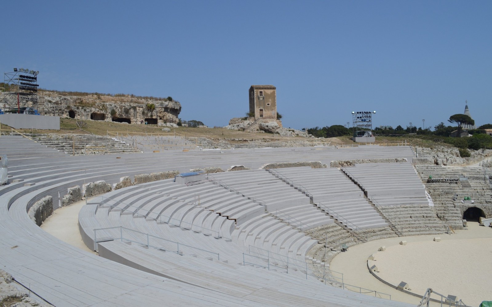
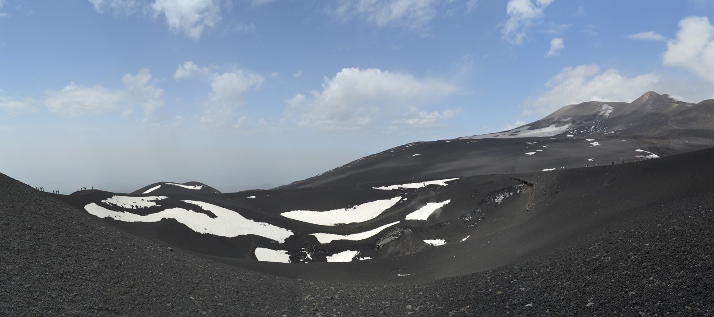
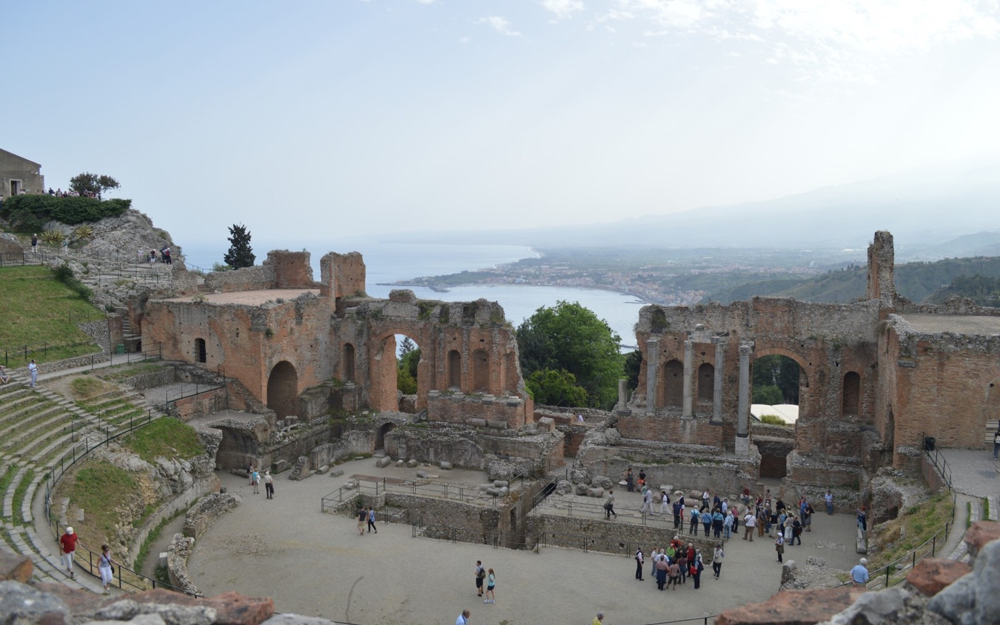
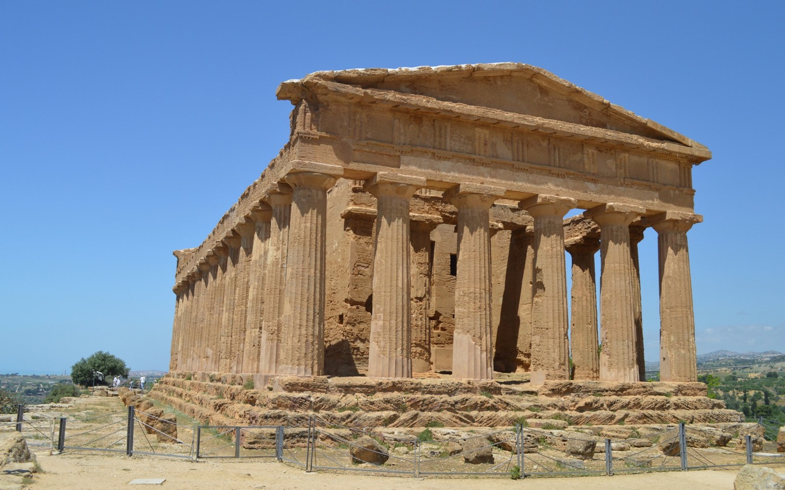
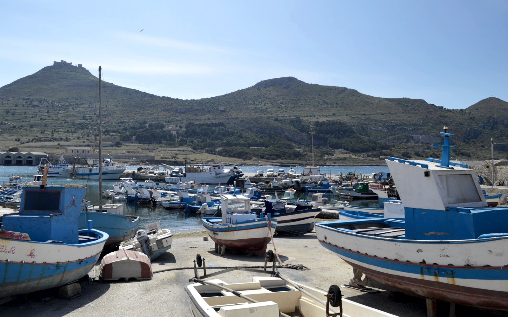

Een rondreis in mei 2013 door Sicilië, een reisverslag.

## 4 mei | Siracusa | Catania

In de ochtend ontbijten we nog in Tropea. Wat we al dachten blijkt echt zo te zijn. We zijn de enige gasten in het hotel. Er is een tafel gedekt voor het ontbijt, dat verder wel prima is. Dat de economische crisis in dit deel van Italië is toegeslagen, is wel duidelijk. Vorig jaar op deze tijd zaten er volgens de eigenaar nog busladingen vol met Duitsers in het hotel. We gaan op weg naar Catania. Catania is de volgende locatie waar we zullen overnachten. Aangezien dit prima te rijden is, behalve het eerste stuk van de A3 natuurlijk. Kilometers lang zijn er weer wegopbrekingen. Tussen [San Giovanni](https://nl.wikipedia.org/wiki/Villa_San_Giovanni "Villa San Giovanni"), het uiterste puntje van het vaste land en Messina op Sicilië nemen we de veerboot. Dit gaat verrassend makkelijk, ticket kopen, boot vaart elk half uur en binnen een half uur ben je over. Na deze meevaller rijden we Catania in eerste instantie voorbij om naar [Siracusa](https://nl.wikipedia.org/wiki/Syracuse_(Itali%C3%AB) "Siracusa") te gaan. Hier zijn nog overgebleven Griekse ruïnes. Het meest bijzondere dat we zien in Siracusa is de [Teatro Greco](https://nl.wikipedia.org/wiki/Grieks_theater_van_Syracuse "Teatro Greco"). Een Grieks theater, tot onze verbazing is het in een soort ombouw. Over een week wordt er een Griekse drama opgevoerd. Hiervoor wordt het hele theater met hout ingepakt. Het theater blijft wel in de oorspronkelijke vorm. Als we dat gezien hebben, ver teken we op weg terug naar Catania. Het hotel dat we daar hebben, [Hotel Catania Town](http://www.tripadvisor.nl/Hotel_Review-g187888-d1464347-Reviews-Hotel_Catania_Town-Catania_Province_of_Catania_Sicily.html "Hotel Catania Town"), ligt midden in de stad. Een beetje lastig als je met auto komt. Als er dan ook nog een markt is, wordt het nog lastiger. Na een korte stop en bij het hotel langs gaan, kunnen we parkeren in een nabij gelegen parkeergarage. Als we het hotel binnen stappen, breekt er voor de deur een vechtpartij uit. Van achter de hotel deur zien hoe iemand even een paar rake klappen krijgt. Gelukkig is het weer snel voorbij. Zo gaat het leven op Sicilië er dus aan toe. Hoe zuidelijker we komen, hoe ongestructureerder het is en hoe moeilijker het de mensen het hebben in het dagelijks leven. ‘s Avonds gaan we eten bij [Trattoria I Vecchi Sapori](http://www.tripadvisor.nl/Restaurant_Review-g187888-d2271299-Reviews-Trattoria_I_Vecchi_Sapori-Catania_Province_of_Catania_Sicily.html "Trattoria I Vecchi Sapori"). Een erg gemiddeld restaurant vergeleken bij waar we deze reis al eerder hebben gezeten.

## 5 mei | Etna | Taormina

De weersverwachting is vandaag niet super, maar vandaag is wel de dag dat de trip naar [Etna](https://nl.wikipedia.org/wiki/Etna_(vulkaan) "Etna") op het programma staat. Vanuit Catania rijden we naar Rifugio Sapienza, hier is een soort base camp voor de verdere beklimming van de Etna. We kunnen hier ook nog makkelijk onze auto parkeren. Het uitzicht vanuit deze plek is al prachtig, met een hoogte van 1923m zitten we ook al op een hoogte die buiten de Etna ongeëvenaard is op Sicilië. Vanuit Rifugio Sapienza nemen we de kabelbaan naar 2500m. Er was een optie om van daar uit verder te gaan met trucks naar het hoogst toegestane punt op de Etna, 2920m, maar wij gaan lopend. We doen de beklimming van de Etna vanuit de zuid kant. Deze tocht is erg indrukwekkend. Lopend over lavagruis naar de kraters van de Etna. Her en der ligt zelfs nog sneeuw van afgelopen winter. Als je stil bent hoor je het ijs zelfs smelten. Bij de krater aangekomen, zien we rookpluimen komen uit de krater. Het waait er ook flink, maar gelukkig is het droog gebleven. Het uitzicht is prachtig op dit punt. Een groot deel van de oostkust van Sicilië is te zien. Na een kleine pauze bij de krater lopen we weer naar beneden, langzaam wordt het ook weer warmer. Bovenop de Etna is het toch ongeveer 18 kouder dan in het dal. Als we weer bij de auto komen, besluiten we door te rijden naar [Taormina](https://nl.wikipedia.org/wiki/Taormina "Taormina"). Dit is een kustplaats aan de oostkant van Sicilië. Het ligt echter op een rots, om bij het strand te komen heeft men een kabelbaan aangelegd. We parkeren aan de rand van Taormina om van daaruit met een shuttlebus naar het centrum te gaan. Hier is ook weer een Grieks theater waar we een kijkje gaan nemen. Dit hebben oude Grieken toch wel erg goed gedaan, als je op de tribune zit, heb je op de achtergrond uitzicht op de zee en het plaatsje. Na het theater is het tijd voor een biertje op een gezellig pleintje. 's Avonds gaan we weer in Catania eten bij La Collegiata in een zijstraat van de enige gezellige straat van Catania, Via Etnea.

## 6 mei | Agrigento | Segesta | Trapani

Vandaag staat een van de langste reis dagen gepland. Met 400+ km hebben we een lange dag voor de boeg. We gaan van Catania naar Trapani en dan ook nog eens via een aantal tussen punten. Vanuit Catania rijden we naar [Agrigento](https://nl.wikipedia.org/wiki/Agrigento_(stad) "Agrigento"). In Agrigento ligt de [Valle dei Templi](https://nl.wikipedia.org/wiki/Akragas "Valle dei Templi"). Een reeks aan Griekse tempels. We lopen hier tussen allerlei mooie tempels. Het gebied staat sinds 1997 op de Werelderfgoed lijst van de UNESCO. Het is ook een relax moment. Na Agrigento gaan we via een hele mooie route naar Segesta. Deze route loopt via plaatjes als Santa Stefano en [Corleone](https://nl.wikipedia.org/wiki/Corleone "Corleone"), naar [Segesta](https://nl.wikipedia.org/wiki/Segesta_(stad) "Segesta"). Hier staat op een hele bijzondere locatie weer een tempel. We hebben ze nu bijna allemaal gezien Sicilië. Na een korte stop rijden we door naar [Trapani](https://nl.wikipedia.org/wiki/Trapani_(stad) "Trapani"). Deze trip rijden ruim 400km. In het begin van de avond komen we aan bij het Hotel, [Hotel Moderno](http://www.tripadvisor.nl/Hotel_Review-g494955-d1395124-Reviews-Albergo_Moderno-Trapani_Province_of_Trapani_Sicily.html "Hotel Moderno"). Het hotel ligt werkelijk midden in het oude centrum van Trapani. We kunnen er wel heen met de auto. Deze kunnen we ook parkeren op de binnenplaats van het hotel. De auto past ook maar net in. 5cm breder en het was niet gelukt. We relaxen wat en gaan eten in het gezellige centrum gaan Trapani. Trapani heeft een bijzondere vorm. Het oude centrum bevindt zich op een schiereiland. Dit is ook het leuke deel van Trapani, daar buiten is industrie.

## 7 mei | Egadi | Favignana

Het is alweer de laatste dag van deze vakantie. Dit wordt een relax dagje. We gaan een boottocht maken naar een nabij gelegen eiland, Favignana. Er varen elk uur boten naar dit eiland. De boot brengt ons aan het eind van ochtend naar Favignana. Daar aangekomen gaan we eerst wat eten op een van de pleintjes in het kleine dorpje op dit eiland. We zien al snel dat fietsen huren hier het ding is. Dus na het eten gaan we ook op zoek naar een fietsverhuurder. Eenmaal een gevonden, wat niet meevalt, want veel mensen houden hier een siesta, of hoe ze dat in Italië ook noemen. We gaan een rondje fietsen over het eiland. Als we in een donkere tunnel fietsen, gaat het helemaal fout met mijn fiets. Het versnellingsapparaat slaat midden in het wiel. Na wat reparatiewerk kan ik toch weer verder. De weg gaat wel op en af, waardoor versnellingen gebruiken wel handig is. Bij een volgende schakeling gaat het weer fout, nu is zelfs de ketting van de tandwielen gelopen. Nog meer te fixen dus, en daarbij ook nog eens handen met smeer eraan. Een relaxdag dus..niet dus. Dan maar weer terug fietsen naar het centrum en de fietsen inleveren. De fietsverhuurder hoort mijn verhaal aan over de  fiets, maar ik had het verhaal ook tegen een muur kunnen vertellen. We gaan nog maar even op het terras zitten voordat de boot terug gaat. We bestellen het drankje dat we de hele vakantie gezien hebben, maar niet wisten wat het was. De [Aperol Spritz](https://nl.wikipedia.org/wiki/Aperol "Aperol Spritz"), een oranje Italiaanse drankje. ‘s Avonds gaan we eten bij een restaurant dat in de Lonely Planet staat, [Tentazioni di Gusto](http://www.tripadvisor.nl/Restaurant_Review-g494955-d1371288-Reviews-TENTAZIONI_DI_GUSTO-Trapani_Province_of_Trapani_Sicily.html "Tentazioni di Gusto"). Het eten is hier erg goed. Morgenochtend vliegen we vanuit Trapani weer terug naar Eindhoven.  Daarmee kwam de reis ten einde. Dit reisverslag is [onderdeel van een reis](./italie "Reisverslag Italië") van [Rome](./rome "Reisverslag Rome") naar Sicilië. Onderweg ligt ook Sorrento, Matera en Tropea. [Lees ook dit uitgebreide reisverslag](/zuid-italie "Reisverslag Zuid-Italië").