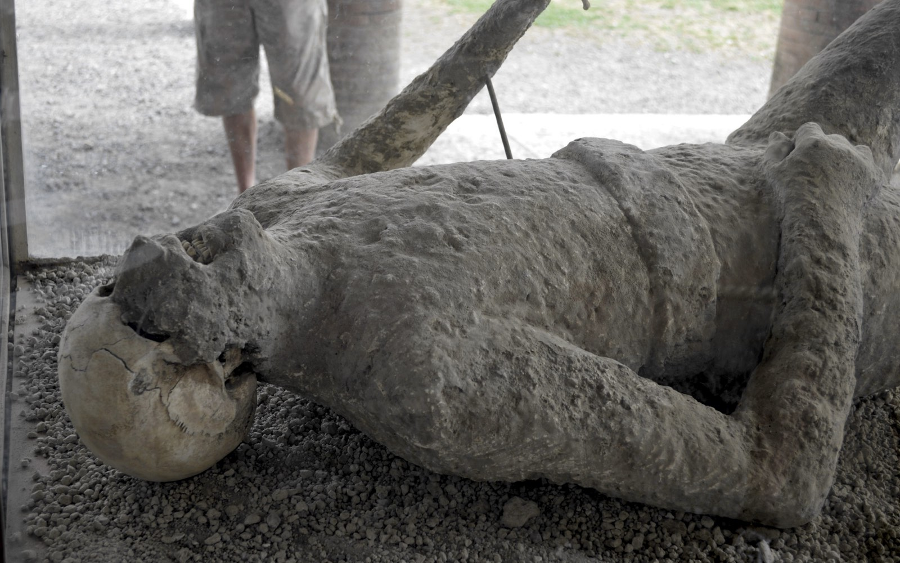
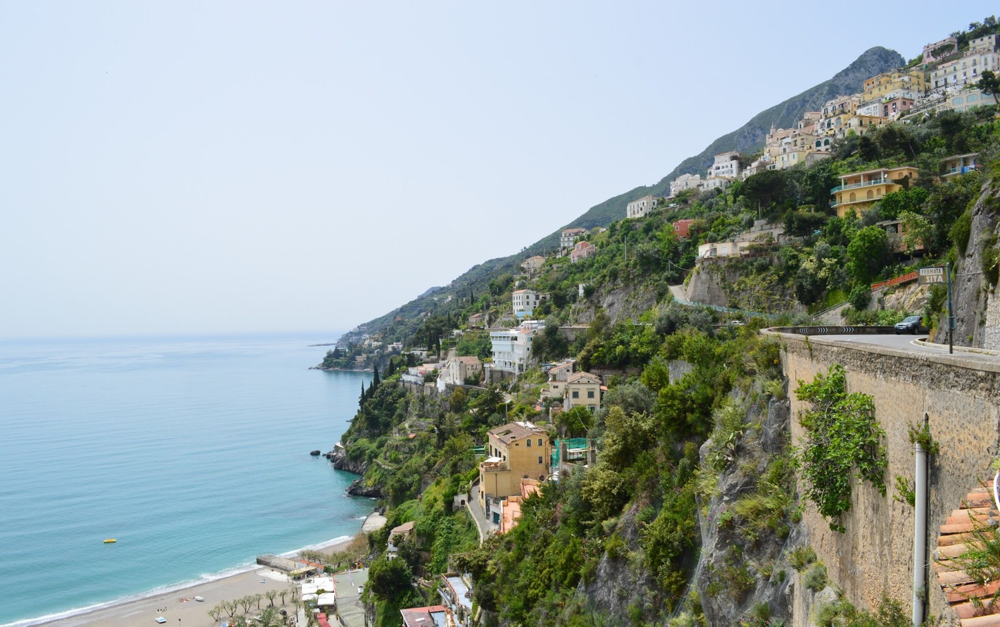
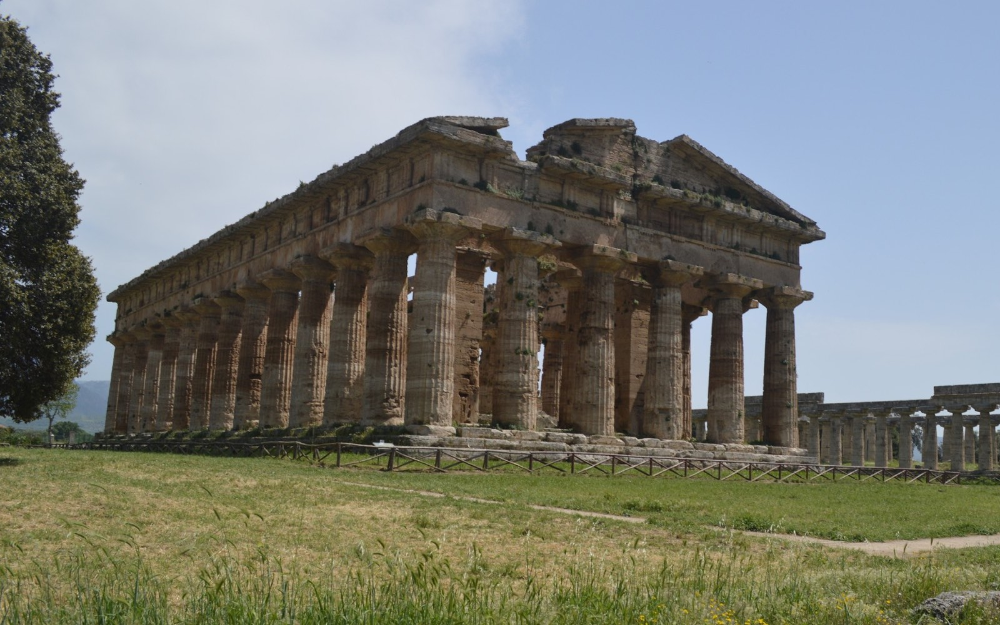
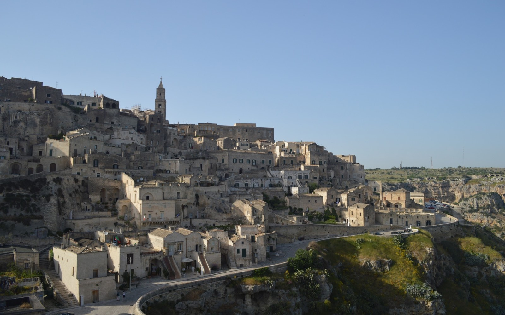

Een rondreis in mei 2013 door Zuid-Italië, een reisverslag.

## 29 april | Sorrento

Vroeg in de ochtend nemen we de taxi vanuit Rome naar het vliegveld, Ciampino. Dit blijkt toch het beste vervoer middel te zijn naar het vliegveld. Op Ciampino staat er een shuttlebus klaar om naar de auto verhuur bedrijven te gaan. Alle autoverhuurders zitten gezamenlijk op een kilometer van het vliegveld. De auto waarmee we deze vakantie in gaan rijden is een Peugeot 3008. Hij is nog spiksplinternieuw, met nog maar 4 km op te teller. De rit naar Sorrento kan beginnen. Deze gaat grotendeels over de A1, onderweg stoppen we alleen in het plaatje Cassino om wat te eten. Daarna rijden we in een keer door naar [Sorrento](https://nl.wikipedia.org/wiki/Sorrento_(Itali%C3%AB) "Sorrento"). De wegen zijn erg goed, maar het zijn dan ook tolwegen. Als we eenmaal in de buurt van Napels zijn, verlaten we de snelweg en gaan een B-weg op. Hier is af en toe de mooie kustlijn al te zien en in de verte zien Sorrento ook al liggen. Sorrento ligt op een schiereiland net onder Napels. In Sorrento aangekomen, is het even zoeken, onze navigatie software stuurt ons door (te) smalle straatjes. Uiteindelijk komen bij het hotel, [Grand Hotel de la Ville](http://www.tripadvisor.nl/Hotel_Review-g187782-d291098-Reviews-Grand_Hotel_De_La_Ville-Sorrento_Province_of_Naples_Campania.html "Grand Hotel de la Ville"). Het is een prachtig hotel. Een van de mooiste waar ik misschien wel ooit in heb verbleven. Vanuit het balkon hebben we uitzicht op de kust en kunnen we richting Napels kijken. 's Avonds gaan we de gezellige smalle straatjes van Sorrento verkennen. In deze tijd van het jaar, begin mei, lijken er vooral bejaarden toeristen naar dit plaatje te komen. We eten bij een heel toeristisch restaurant, er is zelfs een toeristen menu! Een afrader blijkt achteraf. Daarna drinken we wat bij de [Fauno bar](http://www.tripadvisor.nl/Restaurant_Review-g187782-d1200454-Reviews-Fauno_Bar-Sorrento_Province_of_Naples_Campania.html "Fauno bar"). Deze bar wordt benoemd in de Lonely Planet, maar lijkt meer op een bejaarden soos.

## 30 april | Pompeï | Amalfikust

De eerste dag in de omgeving van Napels. Er is hier veel te zien. We gaan eerst met de auto naar Pompeï. Hiervoor nemen we de weg richting Napels. Dit is een vrij drukke weg, we komen een half uur later dan de navigatie aangeeft in Pompeï. De auto parkeren is hier goed te doen. We kopen de kaartjes voor de ruïnes. Het is zo vroeg in de ochtend ook nog niet zo druk. Gelukkig is het ook niet heel warm. Dit voelt als een plek waar het ontzettend heet kan worden. Pompeï heeft in het jaar 79 naar Christus een uitbarsting van de Vesuvius niet overleeft. De vulkaan uitbarsting was zo groot dat de as wel 20km de lucht in geschoten is. Deze as is een dag later in Pompeï neer gekomen en bedekte de stad met zon 6m aan as. De mensen hebben niet kunnen vluchten waardoor hun dagelijks leven van toen is stil komen te staan. Erg indrukwekkend! Vanuit Pompeï gaan we richting Salerno om van daaruit een route langs de [Amalfikust](https://nl.wikipedia.org/wiki/Amalfikust "Amalfikust") te rijden. Ons hotel in Sorrento zal het eindpunt zijn. Tijdens deze rit langs de kust komen we langs verschillende kust plaatsjes als Cetara, [Maiori](https://nl.wikipedia.org/wiki/Maiori "Maiori"), Minori, [Ravello](https://nl.wikipedia.org/wiki/Ravello_(Salerno) "Ravello"), [Amalfi](https://nl.wikipedia.org/wiki/Amalfi_(Itali%C3%AB) "Amalfi") en [Positano](https://nl.wikipedia.org/wiki/Positano "Positano"). In Maiori stoppen om wat te eten, vooral plaatjes als Amalfi en Positano zijn erg bijzonder en interessant om te stoppen. We rijden langs deze route met de auto, dat maakt het niet altijd makkelijk. De wegen zijn soms ontzettend smal en met tegen liggers wordt het er niet makkelijker op. Maar de uitzichten tijdens deze route langs de kust is geweldig. Als we bij Positano zijn steken we het schiereiland over om zo direct in Sorrento uit te komen. In de avond eten we bij een [Latino restaurant](http://www.tripadvisor.nl/Restaurant_Review-g187782-d1549291-Reviews-Cafe_Latino_Sorrento-Sorrento_Province_of_Naples_Campania.html "Latino restaurant"). Ook deze staat in de Lonely Planet. De setting van het restaurant is erg leuk ook al is het in een achtertuin.

## 1 mei | Napels

Vandaag gaan we naar [Napels](https://nl.wikipedia.org/wiki/Napels_(stad) "Napels"). Omdat Napels bekend staat als chaotisch en is aangeraden om dit niet met de auto te doen, nemen we de boot vanuit Sorrento. Deze veerboot brengt ons in ongeveer 35 min naar Napels. Napels is op het eerste gezicht een vieze stad. Het heeft een gezellige straat in het oude centrum, de Via Tribunali, de gebouwen zijn hier oud en in vervallen toestand. Na wat gegeten te hebben, gaan we weer terug naar Sorrento. Het is nog mooi weer en gaan nog even naar het zwembad op het dak van ons hotel. 's Avonds gaan we eten bij [La Fenice](http://www.tripadvisor.nl/Restaurant_Review-g187782-d1222270-Reviews-La_Fenice-Sorrento_Province_of_Naples_Campania.html "La Fenice"). Dit ligt in een zijstraat op het einde van het voetgangers gebied van de belangrijkste van Sorrento. Het eten is hier goed. Ik heb hier lekker mosselen met friet gegeten. Het is ook nog eens het goedkoopste restaurant dat we tot nu toe gehad hebben. Als we naar het hotel terug lopen is er op een centraal plein een talentenjacht bezig, niet goed, maar wel erg vermakelijk om naar te kijken. Maar we gaan op tijd terug naar hotel. Morgen is er een lange reisdag.

## 2 mei | Paestum | Matera

Vanuit Sorrento gaat de reis vandaag naar eindbestemming Matera. Om dat de Amalfikust zo mooi was eergister begint de route nu weer langs de Amalfikust. Aan het einde van deze mooie kuststrook ligt Salerno. Dit is ook wel het einde van het mooie van de kust strook. We rijden snel nog zuidelijker, daar ligt [Paestum](https://nl.wikipedia.org/wiki/Paestum "Paestum"). Dit is een plaatsje dat bestaat dankzij de ruïnes die er gevonden zijn. Paestum was een belangrijke stad in de tijd van de Oude Grieken, maar een stad is het nu helemaal niet meer. Er zijn mooi overgebleven tempels te zien. Na deze stop gaan we in één stuk door naar [Matera](https://nl.wikipedia.org/wiki/Matera_(stad) "Matera"). Matera ligt in de regio Basilicata en heeft een wijk die grotendeels uit de rotsen is gehakt, de [Sassi](https://nl.wikipedia.org/wiki/Sassi_di_Matera "Sassi") zoals het genoemd wordt. Het hotel, [Caveoso Hotel](http://www.tripadvisor.nl/Hotel_Review-g187772-d656960-Reviews-Caveoso_Hotel-Matera_Province_of_Matera_Basilicata.html "Caveoso Hotel") ligt ook middenin de Sassi en is ook daadwerkelijk uit de rotsen gehakt. Elke hotelkamer is een oude grot waarin heel lang geleden woonden. We blijven hier één nacht. ‘s Avonds willen we een restaurant opzoeken, maar op de centrale pleinen van de Sassi zijn er helemaal geen restaurants die open zijn. Uiteindelijk komen we in [restaurant Francesca](http://www.tripadvisor.nl/Restaurant_Review-g187772-d1775591-Reviews-Ristorante_Francesca-Matera_Province_of_Matera_Basilicata.html "Restaurant Francesca") terecht, we zijn voor de lange tijd de enige gasten in het restaurant. Blijkbaar is het nog geen hoogseizoen.

## 3 mei | Tropea

Weer een lange reisdag op het programma vandaag. Vanuit Matera gaan we naar [Tropea](https://nl.wikipedia.org/wiki/Tropea "Tropea"). Een rit van ongeveer 400km. We maken kennis met de Italiaanse manier van wegomleggingen. Het begint al vroeg in de ochtend als we over een B-weg rijden. Deze houdt ineens op. Zonder verdere aanwijzingen hoe om te rijden. Gelukkig hebben een navigatie systeem bij ons. Deze stuurt ons wel door de meest achteraf gelegen weg, dat het soms lijkt alsof je zo bij een boer het land op gaat rijden. Na de omleiding komen we via Lago di Monte Cotugno uiteindelijk uit op de [A3](https://nl.wikipedia.org/wiki/A3_(Itali%C3%AB) "A3"), een snelweg. Het is een snelweg die vol zit met wegwerkzaamheden. Als leesvoer had ik een paar Quest bladen meegenomen in een van deze bladen werd de niet af zijnde A3 veroorzaakt door de nog steeds actief zijn maffia. Het lijkt dan ook een bouwproject waar voorlopig geen einde zal komen. De weg heel tientallen bruggen en tunnels. Als we de snelweg verlaten komen we langs Pizzo. Een klein plaatsje, dat vooral bekent is om zijn [Tartufo di Pizzo](https://en.wikipedia.org/wiki/Tartufo "Tartufo"). Het is een soort grote bonbon gevuld met truffelIjs en een hart van warme chocolade gehuld in een dikke laag van cacao. Uiteraard hebben wij deze specialiteit niet aan ons voorbij laten gaan. Na deze korte stop is ons eindpunt van de dag dichtbij. Onderweg op deze weg begint op te vallen dat er veel afvalbergen langs de weg liggen. Ook dit is werk van de maffia. Deze is dus nog zichtbaar actief in Zuid-Italië en specifiek in Calabria. Als we aankomen bij het Hotel, [Hotel La Pineta](http://www.tripadvisor.nl/Hotel_Review-g194939-d241734-Reviews-La_Pineta-Tropea_Province_of_Vibo_Valentia_Calabria.html "La Pineta"), begint de eigenaar te vertellen over voetballen, belastingen en overheidsregels. Daarna gaan we het centrum in. Hiervoor moeten we wel enkele honderden traptreden omhoog. Het historisch centrum van Tropea ligt namelijk boven op een rots. Boven op de rots zijn het smalle gezellige straatjes. Vanaf een aantal punten op de rots is er een prachtig uitzicht op het strand en de omgeving. Tropea heeft een klein zandstrand, daar zijn we helaas te laat voor, maar we besluiten op het terras een biertje te gaan drinken. Na een paar biertjes gaan we lekker eten met uitzicht van de zonsondergang boven zee. Als we terug komen bij het hotel staat de eigenaar van het hotel buiten, het lijkt bijna alsof hij ons staat op te wachten. We maken weer een gezellig praatje met de beste man. We krijgen langzaam de indruk dat er niet veel andere gasten in het hotel zitten. Dat blijkt ook wel de volgende ochtend bij het ontbijt als er maar één tafel gedekt is in de grote ontbijtzaal. We zijn de enige gasten. De reis gaat verder naar Sicilië. [Lees het uitgebreide verslag daarvan](./sicilie "Sicilië"). Dit reisverslag is onderdeel van een reis van [Rome](./rome "Reisverslag Rome") naar Sicilië.
