Een reis die van te voren al tot de verbeelding spreekt! Een avontuurlijke kampeerreis met een route door vier landen. Met daarin grote wildparken zoals Chobe en Etosha: ideale plekken om de Big 5 en ander wildlife te zien. Maar ook langs watervallen, moerassen, woestijn en spectaculaire canyons. Met bungeejumpen en (bijna) skydiven. Over zoutvlakten en hoge zandduinen. Tot aan Kaapstad met Robben eiland en de Tafelberg. Alles zit in deze reis. Een avontuur dat ik moest beleven!

## Dag 1 – Vertrek vanaf Schiphol naar Johannesburg

Na een soepele vlucht ontmoeten we de groep bij de bagageband. En bij de uitgang van het vliegveld staan onze 2 gidsen al op ons te wachten. Eén is de reisleider/kok, de ander is de chauffeur. We laden onze bagage in de truck waarmee we de hele route zullen gaan rijden. Dit is een soort tot bus omgebouwde vrachtwagen. Na wat uitleg van de reisleider gaan we al snel richting de eerste camping bij Pretoria

## Dag 2 – Soweto – Pretoria

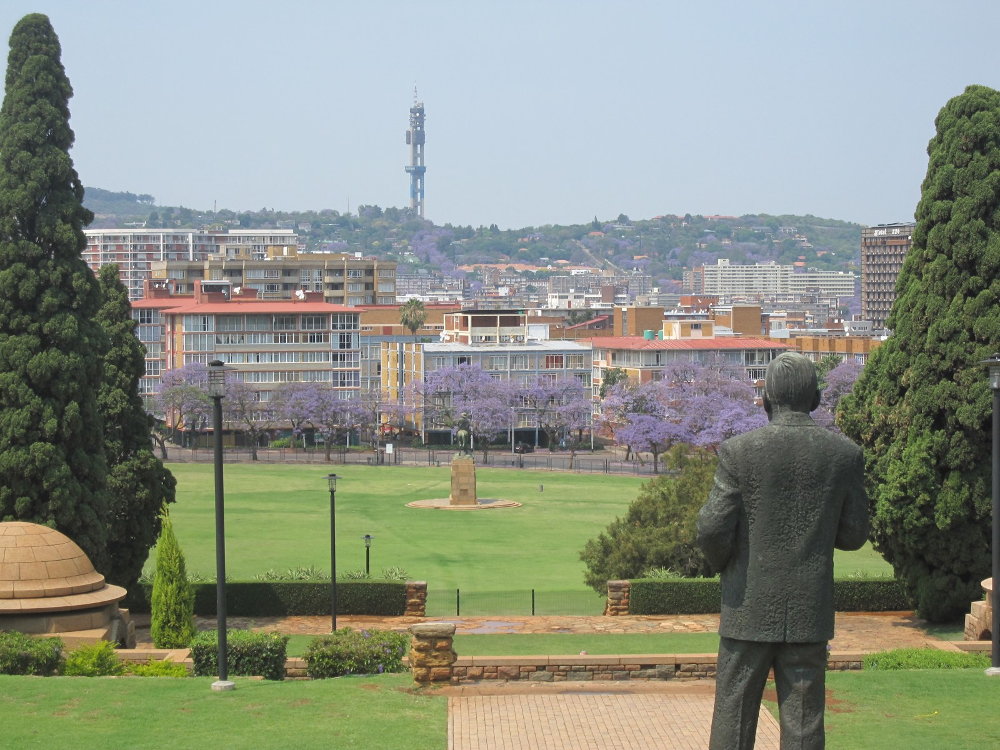We beginnen met een rustige dag, eerst gaan we naar Pretoria een rondje door de stad maken. Het is opvallend hoeveel bomen met paarse bloemen hier staan, echt prachtig! Verder zien we de regeringsgebouwen en kijken we nog even in het centrum van Pretoria. ’s Middags gaan we naar [Soweto](https://nl.wikipedia.org/wiki/Soweto "Soweto") een krottenwijk in Johannesburg. We bezoeken hier het [Hector Pieterson museum](https://en.wikipedia.org/wiki/Hector_Pieterson_Museum "Hector Pieterson museum"), genoemd naar een 12 jarig jongetje die omkwam bij een protest tegen het apartheidsregime. Hierna rijden we door de straat waarin zowel Nelson Mandela als Desmond Tutu hebben gewoond.

## Dag 3 – Pretoria – Tshipise

Vandaag is de eerste echte reisdag. We gaan naar het noorden van Zuid-Afrika, kort aan de grens met Zimbabwe verblijven we in Tshipise. Dit is een tussenstop locatie om de volgende dag naar Bulawayo te kunnen gaan. Op de camping in Tshipise moeten voor het eerst de tenten worden opgezet. Dit valt erg mee en binnen een paar minuten staan alle tenten overeind. Verder kunnen we hier naar het zwembad. Daar zien we het eerste 'wildlife', het loopt er vol met [mangoesten](https://nl.wikipedia.org/wiki/Mangoesten "Mangoesten"). Als de zon onder gaat begint het steeds donkerder te worden. We spannen maar extra zeiltjes over de tenten. Maar als het noodweer los barst blijkt dat niet voor alle tenten goed genoeg te zijn en enkele tenten worden dan ook drijfnat.

## Dag 4 – Tshipise – Bulawayo

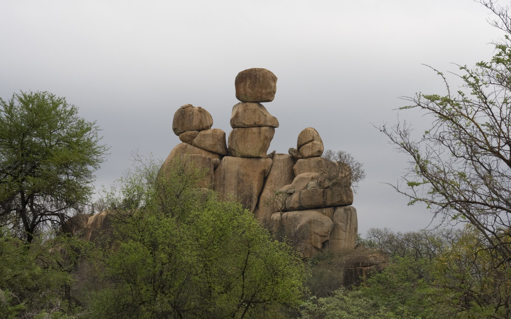Dat er de dag hiervoor een tussenstop was vlak aan de grens met Zimbabwe is een handige keuze. De grensovergang van Zuid-Afrika naar Zimbabwe is trager dan traag. Dit duurt uren. Maar als we dan uiteindelijk door mogen, rijden we in één stuk door naar Bulawayo. We komen hier wel wat later aan dan verwacht, maar we kunnen nog wel de game-drive doen door het [Matopos Nationaal park](https://en.wikipedia.org/wiki/Matobo_National_Park "Matopos Nationaal park") zoals gepland. Tijdens de game-drive zien we vooral giraffes, maar ook neushoorns. Een leuk begin van al het wild-life dat we verwachten tijdens deze reis.

## Dag 5 – Bulawayo – Victoria Falls

Vandaag gaan we naar wat een van de hoogtepunten van deze reis moet worden, de [Victoria Falls](https://en.wikipedia.org/wiki/Victoria_Falls "Victoria Falls"). Onderweg merken we weer dat we in Zimbabwe zijn. We worden zes keer aangehouden! En we krijgen drie bekeuringen, een terecht, twee waarschijnlijk onterecht, maar we nemen het maar op de koop toe. Het land is zo arm als het maar zijn kan, maar de politie rijdt in een dikke BMW. Onderweg komen we helemaal niets tegen. Geen dorpjes, af en toe een hutje, maar dat is het dan ook. Aangekomen in Victoria Falls, gaan we meteen naar het excursie boekingskantoor. Ik kom buiten met een bungeejump vanaf de brug tussen Zimbabwe en Zambia. Ik vertrek meteen naar de brug om te springen.

Wat ontzettend gaaf is dat! Niet zo eng als in mijn dromen, maar vind ik niet erg. ’s Avonds eten we bij ons verblijf, waar een van Belgen afstammende kok ons eten bereidt.

## Dag 6 – Victoria Falls

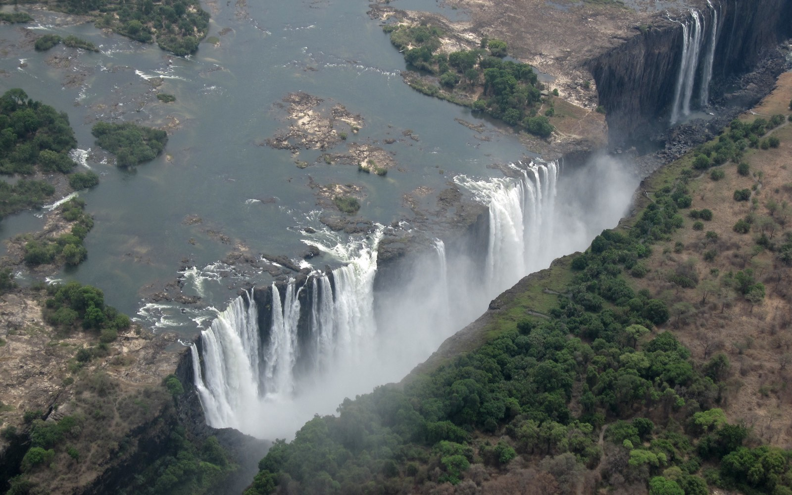De tweede dag in de Victoria Falls is wat rustigere dag. Al beginnen we 's ochtends wel gelijk met een helikoptervlucht over de watervallen. Na opstijgen draaien we een aantal rondjes over de watervallen, erg mooi om vanaf daar foto's te kunnen maken! Na een kwartiertje cirkelen boven de Falls wordt de landing al weer ingezet. Al met al is de korte vlucht zeker lang genoeg om de watervallen goed te kunnen zien.

Na een rondje door het dorpje Victoria Falls gaan we 's middags naar het nationale park. Van hier uit kunnen met zo’n 16 viewpoints de watervallen gezien worden. Op sommige viewpoints wordt je wel doorweekt door het opspattende water. Omdat het net voor het regenseizoen is staat de rivier nog redelijk droog, hierdoor kunnen we goede waterval foto's maken. Met hogere waterstand kan dat wel eens problemen geven... Na het park rondgelopen te hebben, gaan we op zoek naar een [GeoCache](http://www.geocaching.com "Geocaching"). Deze 'caches' (vaak kleine doosjes met daarin wat spullen) liggen overal ter wereld verspreid op de meest bijzondere plaatsen. In het nationale park ligt ook een cache, één van de weinige in Zimbabwe. Na wat zoeken tussen de apen wordt de cache gevonden en kan deze gelogd worden.

’s Avonds eten we koloniaal in het te sjieke Victoria Falls Hotel.  Hier staan bijzondere dingen op de menukaart. Om eens wat anders te eten bestellen we krokodillenstaart.

## Dag 7 – Victoria Falls – Kasane

We gaan vandaag Zimbabwe weer uit en naar het volgende land, Botswana. Deze grensovergang gaat een stuk soepeler. Botswana is duidelijk een vriendelijker land. De eindbestemming voor vandaag ligt net over de grens.

Nadat we aangekomen zijn, gaan we op een bootsafari op de Chobe rivier. Hier zien we ontzettend veel dieren. Een kleine opsomming; olifanten, buffels, nijlpaarden, [visarenden](https://nl.wikipedia.org/wiki/Visarend "Visarenden"), [impala’s](https://nl.wikipedia.org/wiki/Impala "Impala's"), [koedoe’s](https://nl.wikipedia.org/wiki/Koedoe "Koedoe") en nog veel meer. Dit is echt een overweldigende safari. Met als klapper op het einde een kudde olifanten die de rivier oversteken.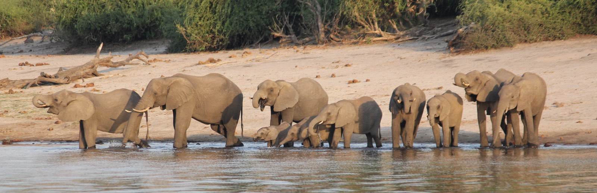

## Dag 8 – Kasane – Maun

We reizen weer door, midden door Botswana, langs de [Kalahari woestijn](https://nl.wikipedia.org/wiki/Kalahari "Kalahari woestijn"). We gaan vandaag over bizar slechte wegen. Gelukkig zit mijn eten veilig, anders was het er zeker uitgekomen deze rit. Onderweg maken we een tussenstop bij een aantal [Baobab](https://nl.wikipedia.org/wiki/Baobab "Baobab") bomen. Dit zijn grote dikke bomen met een vreemd uitziende stam. Naast zo'n boom lijk je erg klein. Na de korte stop rijden we door naar de camping in de buurt van Maun. Op de camping is een heerlijk verkoelend zwembad aanwezig.

## Dag 9 – Maun – Okavango Delta

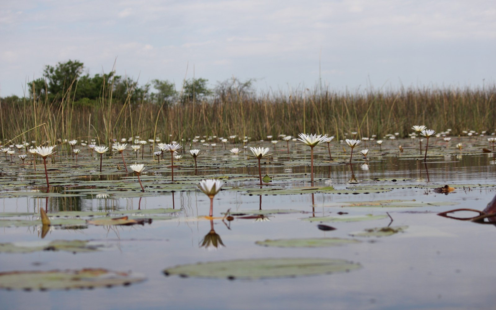We gaan vandaag naar de [Okavango Delta](https://nl.wikipedia.org/wiki/Okavangodelta "Okavango Delta"). Het gaat hier kamperen worden midden tussen de natuur. We zullen hier ook geen douche hebben en een provisorische wc. Na vertrek vanuit de camping met een open truck rijden we eerst naar de delta toe. Daar staan onze polo's (locals die de boten vooruit duwen met een stok) al te wachten. We maken kennis met de polo's, die de volledige 2 dagen in de delta bij ons zullen blijven. Daarna is het op weg richting het kamp. Dit ligt op een eilandje in de delta. We gaan er heen met langwerpige boten, waar twee passagiers en een polo in kunnen. De polo staat achterop de boot en stuurt deze met een stok goed door het moeras heen. Na een paar uur varen komen we aan op ons kamp. We zetten de tenten op en krijgen uitleg over de wc, wat niet meer is dan een stukje bos met daarvoor een schep in de grond. Als de schep weg is, is de wc bezet! En is er de mogelijkheid om wilde dieren tegen te komen. Let dus altijd goed op (vooral 's nachts) of je geen ogen ziet die je aankijken. Maar er zijn nog geen wilde dieren te zien dus vermaken we ons maar met een kaartspelletje, klaverjassen. Tegen zonsondergang gaan we weer op de boot en varen we naar een ander eiland. Hier doen we te voet een safari. Onderweg komen we een olifant tegen. Deze lijkt wat agressief tegen ons te zijn. We gaan dan ook snel verder. Later zien we vooral zebra’s en het skelet van een buffel. Als we terug varen word ik opgeschrikt door een springende vis. Een vis van twintig centimeter probeert over de boot heen te springen, maar komt halverwege tegen mijn borst. Gelukkig valt de vis terug in het water en blijft onze boot recht. Terug aangekomen is de visafdruk op mijn t-shirt het bewijs van dit bizarre voorval. 's Avonds tijdens het eten worden we vermaakt door onze polo’s die liedjes voor ons zingen.

## Dag 10 – Okavango Delta – Maun

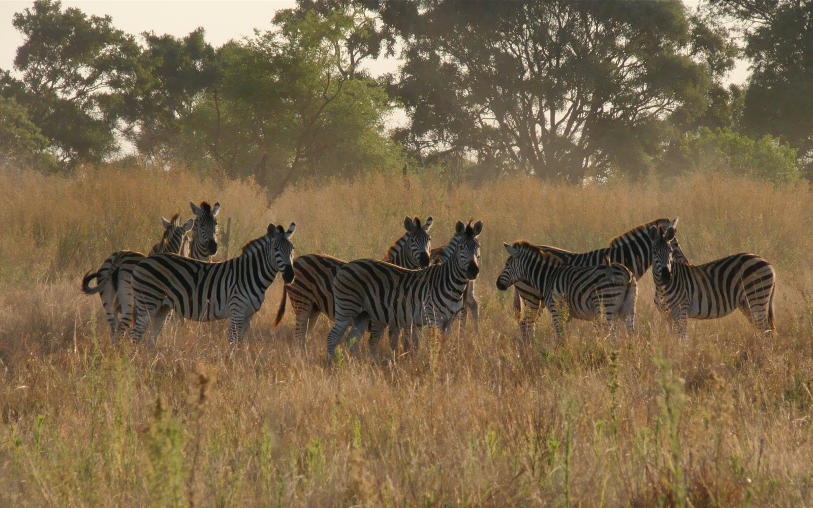’s Ochtend maken we wederom een safari te voet, deze keer op ons eigen eiland. Weer zien we zebra’s, verder is het vrij rustig op het eiland. Later vertrekken we weer met de boten richting Maun. Het is vooral oppassen niet te verbranden in de hete zon. Bij aankomst kunnen we weer lekker relaxen aan het zwembad van de camping. En het is ook wel weer prettig om normale douches en wc's te hebben!

## Dag 11 – Maun – Bagani

Vandaag een korte rit. We gaan Botswana uit en naar Namibië. De grensovergang Botswana uit is onvergetelijk. In tegenstelling tot de vorige grensovergangen gaat het deze keer ontzettend relaxt. Er zitten twee overvriendelijke vrouwen en die zwaaien ons zelfs uit. In Bagani verblijven we op een campsite ([Ngepi Camp](http://www.ngepicamp.com/ "Ngepi Camp")) met bijzondere voorzieningen. Geen enkele wc of douch heeft een dak en ze zijn allemaal omringt door planten en bomen. Naast deze bijzondere voorzieningen is er ook een zwembad in de rivier. Dit is in feite een kooi in het water, omdat er nijlpaarden in het water kunnen zitten... Terwijl de meesten lekker gaan relaxen ga ik samen met een aantal anderen een frisbee wedstrijd doen. Al spelende gaan we over de hele camping over. 's Avonds wordt er voor ons weer heerlijk eten gemaakt door onze reisleider.

## Dag 12 – Bagani – Etosha

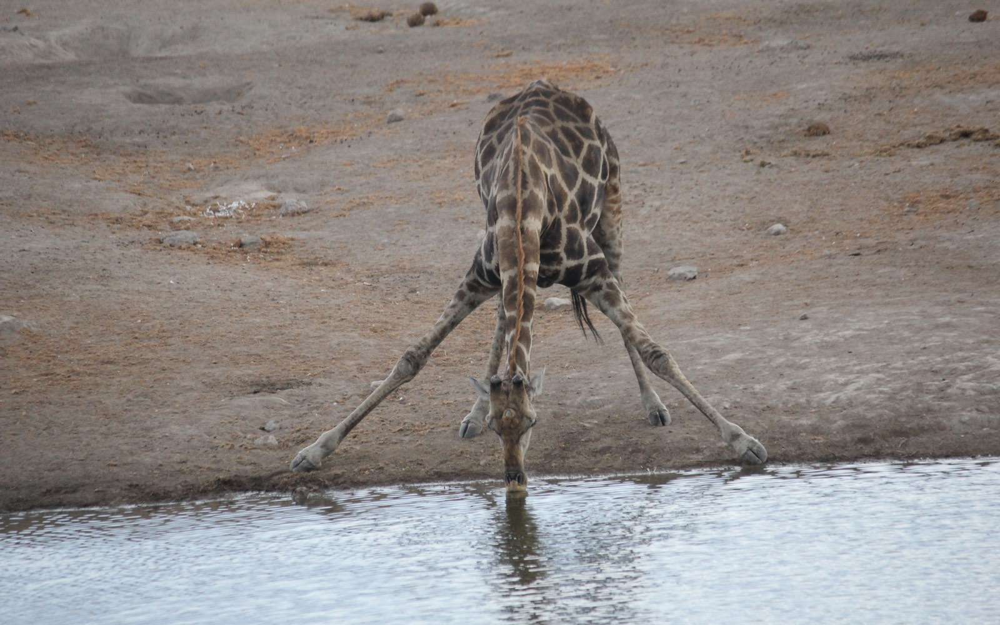Vandaag reizen we door naar het natuurpark van de vakantie, [Etosha](http://www.etoshanationalpark.co.za/ "Ethosa National Park"). Bij aankomst maken we meteen de eerste game-drive. We zien giraffes, gnoes en zebra’s.

## Dag 13 – Etosha

Etosha is een groot reservaat en we reizen daarom vandaag ook van het oosten naar het zuid-westen van Etosha. Dit doen door vrijwel de hele rit langs de zoutvlakte te rijden. Hier komen we een kudde gnoes tegen die opgejaagd worden door 5 á 6 leeuwen. We staan wel een half uur naar dit adembenemende tafereel te kijken. Uiteindelijk vertrekken de leeuwen zonder een poging gedaan te hebben. Maar dit schouwspel geeft ons wel het gevoel dat we nu het echte wild-life gezien hebben. Het National Geographic gevoel was hier wel aanwezig. We gaan ook de zoutvlakte op. Dit lijkt een eindeloze vlakte. Weer een wow moment deze vakantie. 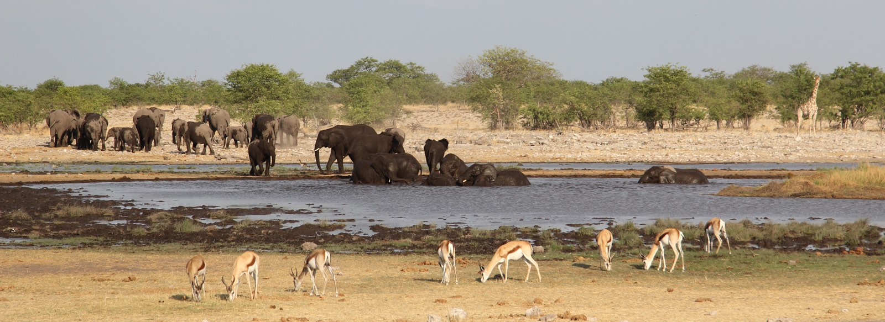

## Dag 14 – Etosha – Twyfelfontein

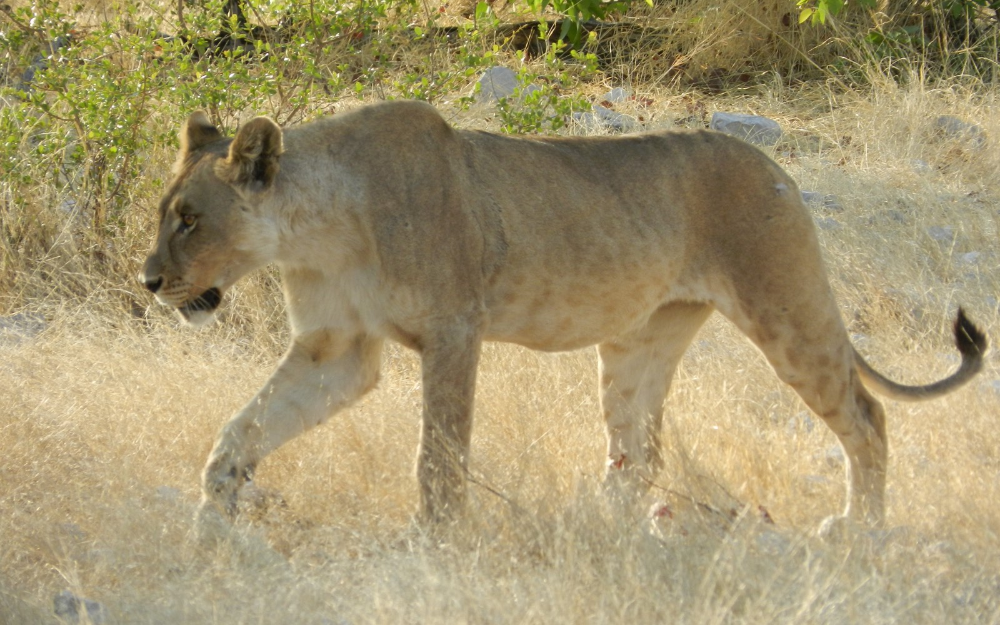 ’s Ochtends maken we nog een kleine game drive door Etosha. We zien hier een leeuw van heel dichtbij. Later rijden we door naar [Twyfelfontein](http://whc.unesco.org/en/list/1255 "Twyfelfontein"). Daar aangekomen, maken we een excursie naar de tekeningen die daar op de rotsblokken ongeveer 6000 jaar geleden zijn getekend. Deze tekeningen staan op de Unesco werelderfgoed lijst. Na de excursie lopen we terug naar de campsite.

## Dag 15 – Twyfelfontein – Swakopmund

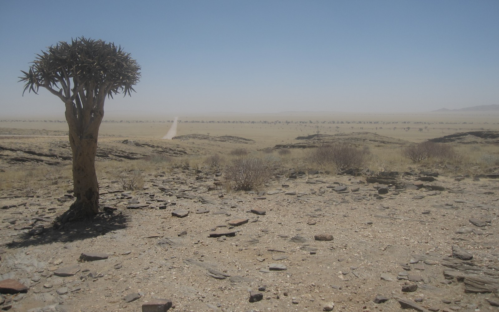Vanuit Twyfelfontein rijden we vandaag naar Swakopmund. De ruit van de truck is al enkele dagen stuk, maar vandaag is het niet leuk meer. Op weg naar Swakopmund waait er een koude zeewind die de truck binnenkomt. Het is zowaar koud en dan ook nog stoffig. We rijden immers door een grote zandvlakte. Aangekomen in Swakopmund, gaan we meteen door naar een excursiebureau. Er zijn hier heel veel mogelijkheden. Ik ga ervoor om morgen te gaan skydiven. Later die dag gaan we een rondje door Swakopmund lopen. Swakopmund is een plaats die heel Duits is. Je kunt er zelfs apfelstrudel eten. ’s Avonds eten we bij Napolitano en gaan daar ook stappen tot in de late uurtjes.

## Dag 16 – Swakopmund

Vandaag kan ik uitslapen. ’s Middags staat de skydive pas gepland. Om twee uur vertrekken we naar een zandvlakte, waar vandaan het vliegtuig zal opstijgen en ook zullen landen met de parachute. Helaas, helaas gaat het uiteindelijk niet door, wegens te veel wind. ’s Avonds gaan we nog gezellig eten in The Lighthouse.

## Dag 17 – Swakopmund – Sesriem

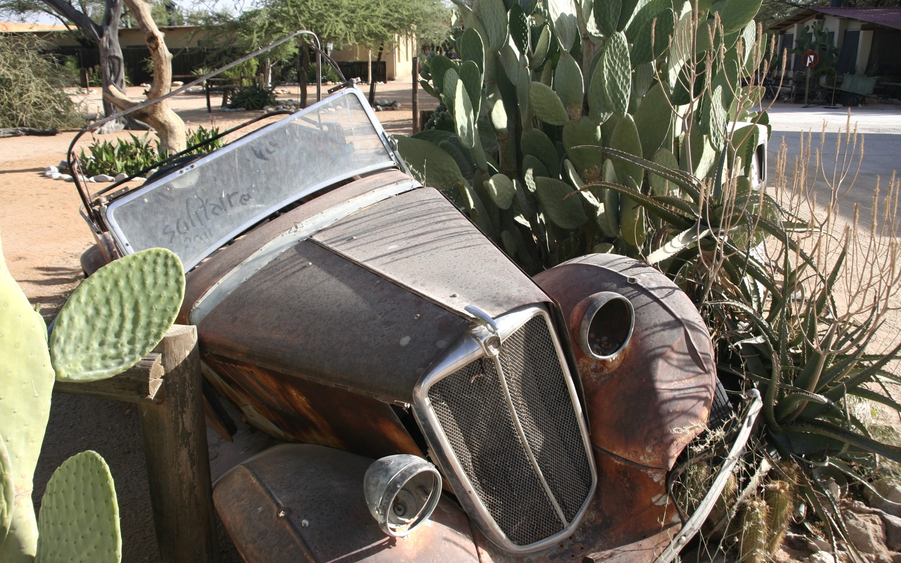Vandaag staat een lange rit op het programma door een bijna verlaten gebied. Maar eerst rijden we naar Walvisbaai, een voor Namibië behoorlijk grote stad. En een stad waar veel gebouwd wordt! Dit schijnt vooral te komen doordat niemand minder dan Brad Pitt en Angelina Jolie hier een huis hebben gekocht. Sindsdien loopt het aantal villa's in Walvisbaai snel op. Bij de baai lopen we een ronde, maar heel veel vogels zien we hier niet. Na de korte stop begint de lange route. Langs zandduinen en rotsige gebieden waar niemand in de verste verte woont. Zo passeren we ook de steenbokskeerkring, hiervan is ook niet veel meer te zien dan een enkel bord langs de kant van de weg. Na lang rijden komen we dan toch uit in een dorpje: Solitaire. Zoals de naam al zegt is het hier voor de inwoners best eenzaam. Er is een restaurant, een bakker en het belangrijkste: een tankstation. Over het mini plaatsje is zelfs een [boek](http://www.tonvanderlee.nl/soli.html "Solitaire boek") verschenen. De eindbestemming van vandaag is Sesriem, dat aan de voet van de [Sossusvlei](https://nl.wikipedia.org/wiki/Sossusvlei "Sossusvlei") ligt. We komen daar net op tijd aan om nog af te dalen in de canyon. Al snel moeten we er weer uit zodat we hier nog de mooie zonsondergang kunnen zien.

## Dag 18 – Sesriem – Fish river canyon

[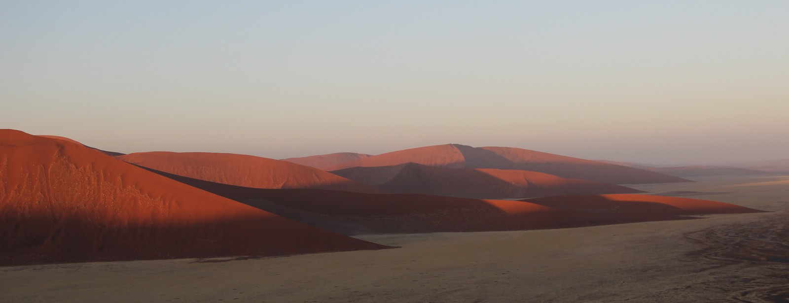](./sossusvlei.jpg)We staan erg vroeg op (4:30) om de zonsopkomst te kunnen zien bij Dune 45. Het is fantastisch om hier te zijn. We blijven net zolang tot de zon echt helemaal op is. Vervolgens ontbijten we aan de voet van Dune 45. What a place!. Later rijden we door naar de Sossusvlei. Van daar uit gaan we door de , naar Afrikaans zeggen de grootste canyon ter wereld. Ze vergeten hier maar even de Grand Canyon. We komen weer maar net op tijd om de zon onder te zien gaan.

## [Dag 19 – Fish river canyon – Oranje rivier](#)

’s Ochtends gaan we nog een keer terug naar het viewpoint van Fish river canyon, om er ook de zonsopgang te kunnen zien. Dit is nog mooier dan de zonsondergang. 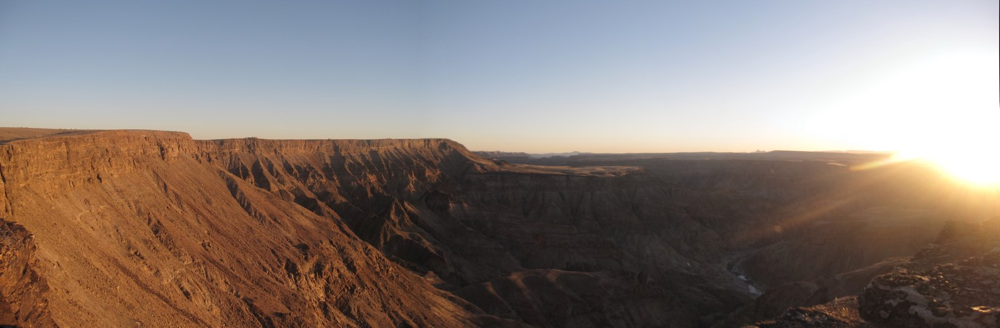 Daarna rijden we door naar Oranje rivier. Dit is de grens rivier tussen Namibië en Zuid Afrika. De camping zit aan de Zuid-Afrikaanse kant, we steken dus eerst de grens over. Op deze camping kunnen we lekker relaxen aan de Oranje rivier.

## Dag 20 – Oranje rivier – Kaapstad

We vertrekken vandaag naar de eindbestemming van deze reis, Kaapstad. Als we naar het zuiden rijden valt het op dat het landschap steeds groener wordt. Van de woestijn komen we uit in het wijngebied. Opeens zien we overal mooie groene velden met wijnranken. Aan het eind van de dag komt dan uiteindelijk de eindbestemming van de reis in zicht: Kaapstad. Gelijk valt de Tafelberg al op, zelfs al hangt de mist er boven. Het wordt afwachten of we nog een dag zon hebben om de berg op te kunnen. 's Avonds gaan we met de hele groep eten bij een typisch Afrikaans restaurant. Hierna gaan we uit in het centrum van Kaapstad. Daar nemen we afscheid van de gidsen. Wij zullen de laatste dagen in een hostel zitten.

## Dag 21 – Kaapstad

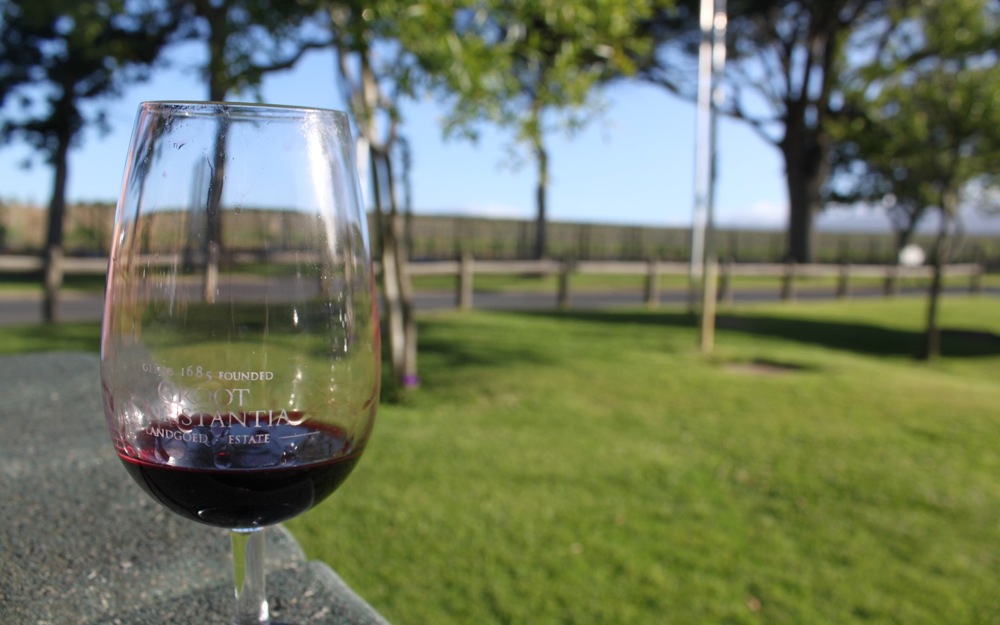Voor vandaag hebben we een excursie naar Kaap de Goede Hoop geboekt. We hebben een Nederlandse excursieleider. Hij leidt ons langs de kust van het zuidelijkste puntje van Afrika. Dit gebied doet absoluut niet Afrikaans aan, eerder Mediterraan. We stoppen bij een aantal uitzichtspunten, maar daar is het wel oppassen niet weg te waaien! Vooral op het strand voel je dat je door de wind gezandstraald wordt. Uiteindelijk komen we bij Kaap de Goede Hoop. Daar is het vooral wachten tot alle Japanners weg zijn en snel een fototje maken van het bord dat er staat. Op de terugweg zien zien we een pinguinkolonie op het stand en sluiten we af bij de wijnproeverij van [Groot Constantia](http://www.grootconstantia.co.za/ "Groot Constantia"). Een wijnhuis dat ook wijn verkoopt bij de Gall & Gall in Nederland. Al met al een zeer aan te bevelen excursie!

## Dag 22 – Kaapstad

Deze ochtend gaan we naar Robbeneiland. De gevangenis waar Nelson Mandela jarenlang gevangen zat. Indrukwekkend om te zien hoe klein de ruimtes zijn waarin de gevangenen zaten. Bij terugkomst eten we op het Waterfront, een toeristisch gedeelte van Kaapstad. Vervolgens gaan we op weg naar de Tafelberg, die geheel in de zon ligt. De kabelbaan brengt ons naar boven. We drinken een biertje (helaas geen Tafelbier hier…) en lopen een rondje over de berg. Het is inmiddels al weer bijna voorbij, we gaan nog een keer eten op het Waterfront om vervolgens terug te lopen naar ons hostel dat in Greenpoint ligt.

## Dag 23 – Kaapstad – Schiphol

Maar 's avonds is de vakantie dan echt afgelopen. We worden opgehaald door een bus die ons naar het vliegveld brengt van waar we net voor middennacht terug vliegen naar Nederland.
